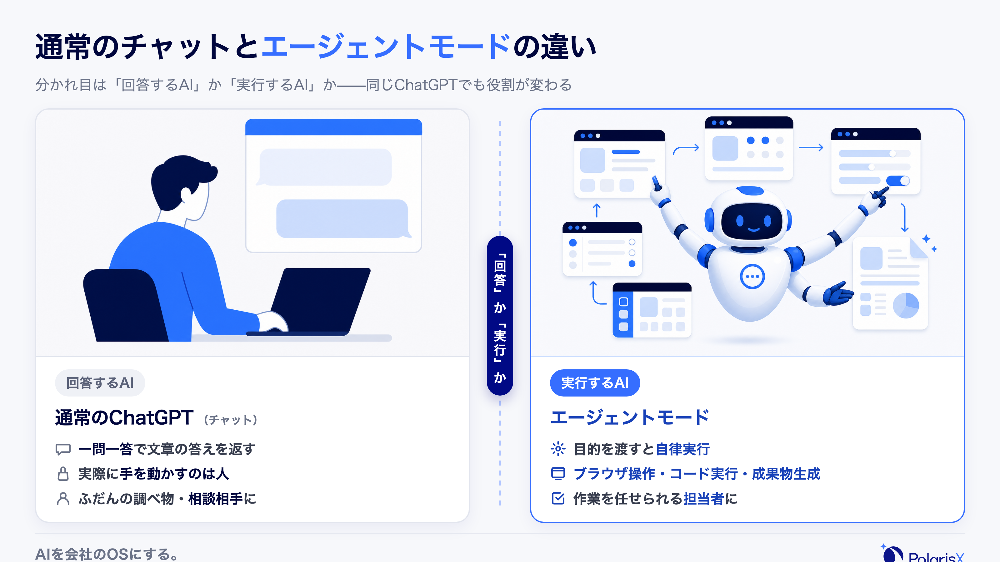
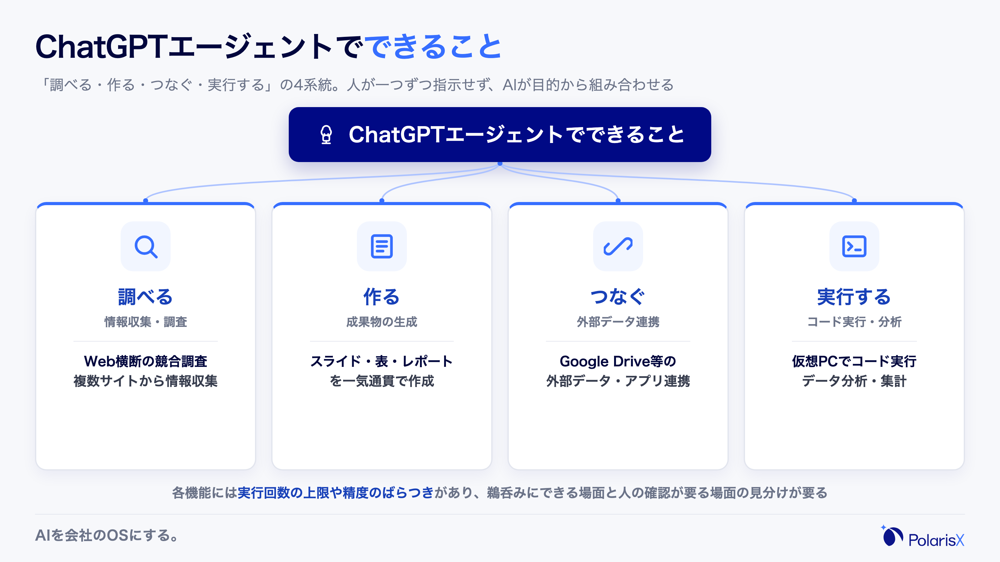
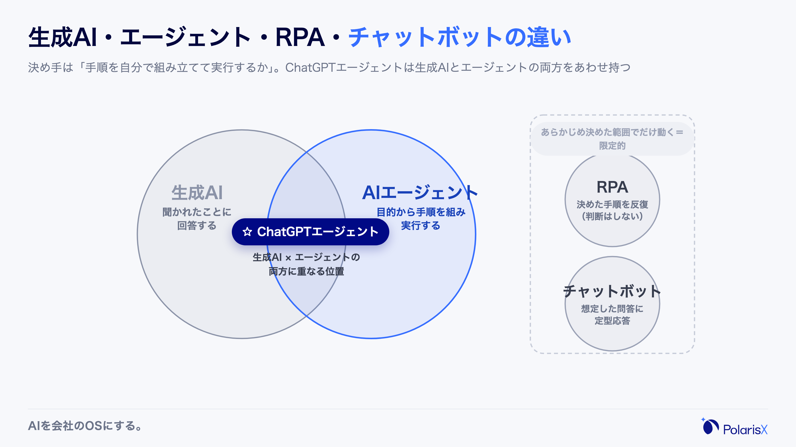
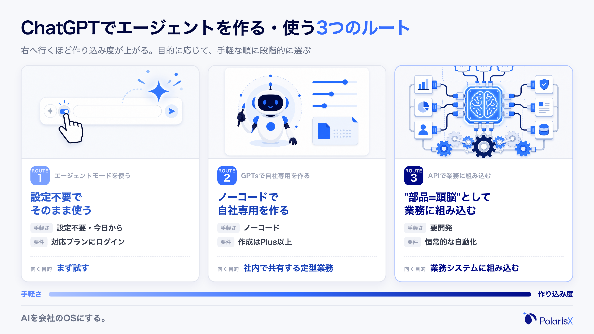
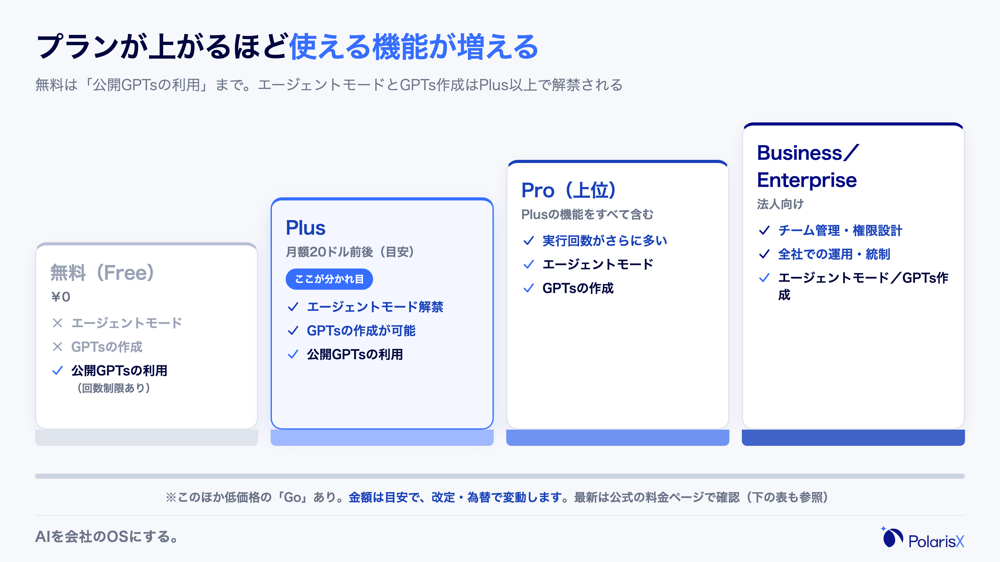
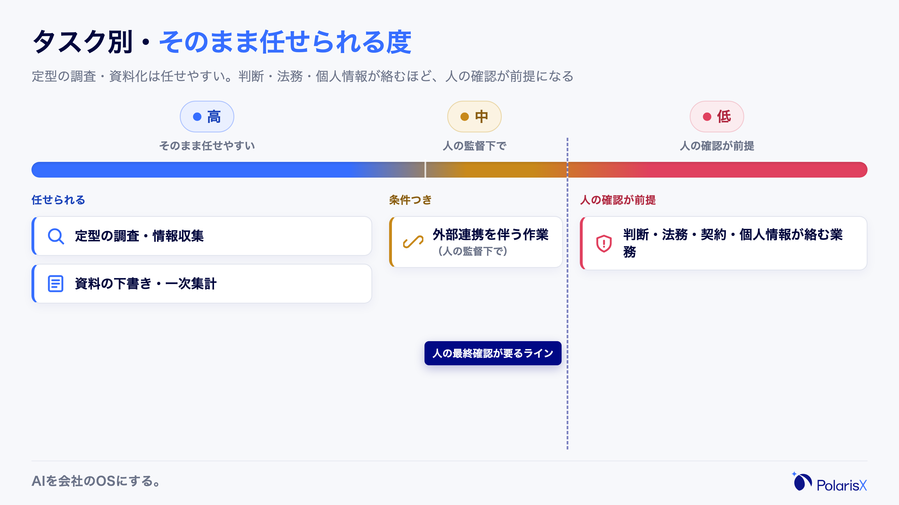

ChatGPTのAIエージェントとは、ChatGPTが目的を受け取ると自らブラウザを操作し、調査から資料作成まで複数のステップを続けて実行する「エージェントモード」と、ChatGPTを頭脳にして自社の業務を担うエージェントを組み立てる使い方の総称です。質問に答えるだけの通常のチャットと違い、"考える"だけでなく"手を動かす"ところまで踏み込むのが特徴です。

この言葉が分かりにくいのは、指す範囲が一つに定まっていないからです。OpenAIが公式に提供する「エージェントモード」という機能を指すこともあれば、GPTsで作る自社専用アシスタントや、APIでChatGPTを業務システムに組み込む実装を指すこともあります。さらに「ChatGPTだけで業務が全部自動になる」という期待とセットで語られることも多く、できることとできないことの線引きが曖昧なまま広まりました。まずは定義と範囲をそろえるところから始めましょう。

> **一言でいうと**：ChatGPTのAIエージェントとは、目的を渡すと「調べる・作る・つなぐ・実行する」までを自分で段取りして進めるChatGPTの使い方です。1回の質問に1回答える通常のチャットとは、"実行まで担うか"で分かれます。
>
> **よくある3つの誤解**
> 1. 通常のChatGPT（チャット）と同じもの — チャットは回答を返すだけ。エージェントモードは仮想のPC上で自らブラウザやコードを動かし、成果物まで作ります。
> 2. 無料プランでもフルに使える — エージェントモードとGPTsの作成は有料プラン（Plus以上）が対象で、無料では使えません。
> 3. ChatGPTだけで業務が全自動になる — 定型の調査・資料化は任せられますが、判断・法務・個人情報が絡む業務は人の確認が前提です。

**執筆**: PolarisX 編集部（AI活用の実務者チーム）— AI社員「Polaris AI」の開発と、ChatGPTとClaudeを併用する自社AI社員組織の運用に携わるメンバーが執筆しています。

## ChatGPTのAIエージェントとは — 一言でいうと「ChatGPTが自ら手を動かすエージェントモード」

ChatGPTのAIエージェントの中核が、2025年7月17日にOpenAIが発表した「エージェントモード（ChatGPT agent）」です。これは、ChatGPTに目的を伝えると、専用の仮想コンピューター上で自らブラウザを開き、情報を集め、コードを実行し、スライドやスプレッドシートといった成果物まで一気通貫で作る仕組みです。従来のChatGPTが「質問に答えるAI」だとすれば、エージェントモードは「頼まれた仕事を最後までやり切るAI」に近づきました。ポイントは、人が一手ずつ指示しなくても、AIが自分でタスクを分解し、必要な操作を選んで実行する点です。ただし何でも全自動になるわけではなく、対象プランや実行回数には制限があり、重要な判断には人の確認が要ります。この記事では、この機能を軸に、通常のチャットとの違い・できること・料金・作り方・限界までを順に整理します。

### 通常のChatGPT（チャット）との違い（"回答するAI"と"実行するAI"）

通常のChatGPT（チャット）とエージェントモードの違いは、「回答するAI」か「実行するAI」かという一点に集約されます。チャットは、質問を投げると文章で答えを返してくれますが、実際にWebサイトを開いて申し込んだり、複数の資料を横断して集計したりはしません。手を動かすのは常に人間です。一方エージェントモードは、目的を渡すと自分で段取りを立て、ブラウザ操作・検索・コード実行・ファイル生成といった作業を連続してこなし、レポートや表といった"納品物"まで用意します。言い換えると、チャットは「相談相手」、エージェントは「作業を任せられる担当者」に近い存在です。ふだんの調べ物や壁打ちはチャットで十分ですが、複数ステップの手作業をまとめて肩代わりしてほしいときにエージェントモードが効きます。

### いつ・何が変わったのか（2025年7月発表・Operatorとdeep researchを統合）

エージェントモードは、2025年7月17日にOpenAIが「Introducing ChatGPT agent」として発表した機能です（[OpenAI公式](https://openai.com/index/introducing-chatgpt-agent/)）。それまで別々に提供されていた、Webサイトを操作する「Operator」と、多段階の調査に強い「deep research」、そして対話に強いChatGPT本体を、1つの自律実行システムに統合したものです。Operatorはクリックや入力といったブラウザ操作が得意な一方で深い分析や長文レポートは苦手、deep researchは情報の統合に強い一方でサイトを操作して結果を詰められない——この2つの弱点を補い合う形で1つにまとめられました。Operatorの機能はエージェントモードへ統合され、単体ツールとしての役割からChatGPT本体へと引き継がれています。発表以降もアップデートは続いており、2026年7月には時間のかかる作業をまとめて任せる新しい働き方を打ち出した「ChatGPT Work」も発表されるなど、機能の枠組み自体が動き続けています。最新の対応範囲は公式のリリースノートで確認するのが確実です。

## ChatGPTエージェントでできること

ChatGPTのエージェントモードでできることは、大きく「調べる・作る・つなぐ・実行する」の4系統に整理できます。調べるは、複数のサイトを横断した競合調査や情報収集。作るは、スライドやスプレッドシート、レポートといった成果物の生成。つなぐは、Google Driveなどの外部データやアプリと連携して自社の情報を取り込む動き。実行するは、仮想コンピューター上でコードを走らせてデータ分析や集計を行う処理です。これらを人が一つずつ指示するのではなく、AIが目的から逆算して自分で組み合わせるのが特徴です。たとえば「競合3社の料金を調べて比較表にして」と頼めば、検索→情報抽出→表作成までを続けてこなします。ただし各機能には実行回数の上限や精度のばらつきがあり、そのまま鵜呑みにできる場面と、人の確認が必要な場面を見分けることが実務では欠かせません。

### ブラウザ操作・情報収集の自動化（旧Operator由来）

エージェントモードは、仮想の環境上で実際にWebブラウザを操作できます。検索して、リンクをたどり、ページの内容を読み取り、必要ならログインして中身を確認する——これはOperator由来の機能です。人手だと何十分もかかる「複数サイトを見比べて情報を集める」作業を、AIがまとめて進めてくれます。競合の料金調査、複数媒体からの情報収集、フォーム入力を伴う定型作業などが典型的な用途です。一方で、ログイン情報や個人情報を扱う操作は、後述するセキュリティの観点から人の監督下で使うのが前提になります。

### スライド・スプレッドシート生成／データ分析

集めた情報を、そのまま成果物に落とすところまで担えるのがエージェントモードの強みです。調査結果をスライドにまとめる、数値を整形してスプレッドシートにする、アップロードしたデータをコード実行で集計・可視化する、といった作業が対象です。「資料の下書き」「一次集計」まではAIが用意し、人は中身の確認と仕上げに集中できます。ただし、生成された数字やグラフが常に正しいとは限りません。特に財務・実績など誤りが許されないデータでは、元データとの突き合わせを人が行う運用が安全です。

### カレンダー・メール連携／コード実行

外部サービスとの連携（アプリ連携。以前は「コネクター」と呼ばれていた機能）を使うと、Google Driveなどに置いた自社の資料を参照させたり、カレンダーの予定をもとに朝のブリーフィングを作らせたり、といった業務にも広がります。仮想コンピューター上でのコード実行を使えば、データの前処理や簡単な分析の自動化も可能です。ここまで来ると、ChatGPTは「賢い相談相手」から「自社の情報を参照して手を動かす担当者」に近づきます。ただし、どのサービスと接続するか、どこまで権限を渡すかは、情報管理の観点から慎重に設計する必要があります。連携できる範囲や対応アプリは更新されるため、最新は公式ヘルプで確認してください。

## AIエージェントと生成AI・RPA・チャットボットの違い

AIエージェントは、生成AI・RPA・チャットボットと混同されがちですが、役割がはっきり異なります。生成AI（ChatGPTのチャットなど）は「聞かれたことに答える」ツール、RPAは「決めた手順を正確に繰り返す」自動化、チャットボットは「想定した問答に返す」応答システムです。これに対してAIエージェントは、「目的を渡すと、手順を自分で組み立てて実行する」点が決定的に違います。ChatGPTのエージェントモードは、この生成AIとエージェントの両方の性質を1つのツールで持つ位置づけです。つまり、賢く答えるだけでなく、答えを出すために必要な作業（検索・操作・実行）まで自分で進めます。どれが優れているという話ではなく、決まった手順の反復ならRPA、定型応答ならチャットボット、目的から逆算する複数ステップの仕事ならエージェント、と向き不向きで選ぶのが実務的です。

### 生成AI（回答）とエージェント（実行）の違い

生成AIとAIエージェントの違いは、「答えを出すまで」か「実行まで」かにあります。生成AIは、質問に対して文章・画像・コードなどを生成しますが、そこで止まります。生成された内容を使って実際に作業するのは人間です。AIエージェントは、生成AIを"頭脳"として内部に持ちつつ、その頭脳が立てた計画に沿って、ツールを操作し、複数のステップを実行します。ChatGPTのエージェントモードは、生成AIの賢さ（ChatGPT）に実行力（Operator由来のブラウザ操作やコード実行）を足したもの、と理解すると分かりやすいでしょう。

### RPA（固定手順）・チャットボット（定型応答）との違い

RPAとチャットボットは、どちらも「あらかじめ決めた範囲」で動く点が、AIエージェントと異なります。RPAは、人が定義した画面操作の手順を正確に反復するのが得意ですが、想定外の画面変化や例外には弱く、判断は行いません。チャットボットは、用意したシナリオやFAQの範囲で応答しますが、その外の質問には答えられません。AIエージェントは、手順を固定せず、状況に応じて次の一手を自分で選びます。裏を返せば、毎回まったく同じ処理を大量に回すならRPAのほうが安定し、限定された定型応答ならチャットボットのほうが軽い、という住み分けになります。

### ChatGPT・Claude・Gemini・Difyなど、他エージェントの中での位置づけ

AIエージェントを実現する手段は、ChatGPTだけではありません。Claude・Geminiといった他社のモデルにも同種のエージェント機能があり、Difyのようにノーコードでエージェントや業務フローを組めるツールもあります。ChatGPTのエージェントモードは、その中で「対話の使いやすさと、ブラウザ操作・成果物生成を1つのUIで完結できる手軽さ」に強みがあります。ただし、どのツールが自社に最適かは、扱うデータ・既存の環境・求める作り込みの深さで変わります。本記事はChatGPTに絞って仕組みと見極めを解説する立場のため、ツール横断の比較・選定は別記事に譲ります。ここでは「ChatGPTは数あるAIエージェントの選択肢の一つで、手軽さに強い」という位置づけだけ押さえておけば十分です。

## ChatGPTでAIエージェントを作る・使う3つのルート

ChatGPTでAIエージェントを使う・作る方法は、手軽な順に3つのルートがあります。ルート1は、標準の「エージェントモード」をそのまま使う方法。設定は不要で、対応プランなら今日から試せます。ルート2は、「GPTs」で自社専用のアシスタントをノーコードで作る方法。役割・指示・参照ファイルを設定すれば、社内向けの専用エージェントを用意できます（作成は有料プランが必要）。ルート3は、APIや外部連携でChatGPTを業務システムに組み込む方法。開発は要りますが、ChatGPTを"完成品"ではなく"部品（頭脳）"として自社の業務フローに埋め込めます。目的が「まず試す」ならルート1、「社内で共有する定型業務を任せる」ならルート2、「業務システムに恒常的に組み込む」ならルート3、と段階的に選ぶのが現実的です。ここでは各ルートの考え方までを示し、具体的な作成手順は作り方の専門記事に譲ります。

### ルート1: エージェントモードを使う（起動・"表示されない"時の確認）

最も手軽なのが、ChatGPT本体のエージェントモードを使う方法です。対応プランにログインし、入力欄付近のツール（機能）メニューからエージェント系の機能を選び、目的を伝えるだけで動き始めます。プロンプトは「何を・どこまで・どんな形で」を具体的に書くほど精度が上がります。「エージェントモードが表示されない・使えない」ときは、まず有料プラン（Plus以上）で利用しているかを確認し、次にアプリやブラウザを最新版に更新、設定でベータ機能や新機能の有効化を確認します。地域や順次提供の都合で表示が遅れることもあります。UIや呼び名は更新されるため、最新の起動手順は公式ヘルプで確認するのが確実です。

### ルート2: GPTsで自社専用エージェントをノーコードで作る

GPTs（ジーピーティーズ）は、役割・口調・守ってほしいルール・参照させたい資料を設定して、自社専用のアシスタントをノーコードで作る仕組みです。「議事録を決まった書式でまとめる」「自社の商品情報に沿って一次回答する」といった、繰り返し発生する定型業務を任せるのに向きます。注意点として、GPTsの"作成"にはPlus以上の有料プランが必要です。無料プランでできるのは、GPTストアで公開されているGPTsの"利用"（回数制限あり）までで、自分で作ることはできません。GPTsはあくまでChatGPT上で動く軽量なアシスタントで、社内の大量データを横断参照する本格的なRAG（社内ナレッジ検索）とは別物です。ステップごとの具体的な作成手順は、作り方の専門記事に譲ります。

### ルート3: API・外部連携で業務に組み込む（ChatGPTを"部品=頭脳"として使う）

3つ目が、APIや外部連携でChatGPTを自社の業務システムに組み込むルートです。ここではChatGPTを"完成品のツール"としてではなく、業務フローの中で判断や文章生成を担う"部品（頭脳）"として使います。たとえば、問い合わせ管理システムに組み込んで一次回答の下書きを作らせる、社内ナレッジベースと接続して自社の文脈を踏まえた回答をさせる、といった構成です。私たちPolarisX自身も、ChatGPTとClaudeを用途で使い分けながら、複数のAIエージェントを自社の業務に組み込んで運用しています。この段階になると、"ChatGPT単体で何ができるか"よりも、"どの業務に、どのモデルを、どんな役割で組むか"という設計が成果を左右します。開発工数はかかりますが、恒常的に発生する業務を仕組みとして自動化したい場合の本命です。

## ChatGPTエージェントの料金の目安と無料でできる範囲

ChatGPTのエージェントモードとGPTsの"作成"は、有料プランが対象です。無料プランでできるのは、公開されているGPTsを回数制限つきで"使う"ところまでで、エージェントモードやGPTsの作成は利用できません。有料プランは執筆時点（2026年7月）で、低価格のGo、標準のPlus（月額20ドル前後）、上位のPro、法人向けのBusiness／Enterpriseなどに分かれます。エージェントモードはPlus以上で利用でき、実行できる回数はプランによって異なります（上位プランほど多い）。GPTsの作成にも有料プランが必要です。料金の具体額や対応範囲は改定・為替で変わるため、契約前に必ず公式の料金ページで最新を確認してください。要点は「無料は"公開GPTsの利用"まで、エージェントモードとGPTs作成はPlus以上の有料が前提」という線引きです。

| プラン | エージェントモード | GPTsの作成 | 公開GPTsの利用 |
|---|---|---|---|
| 無料（Free） | × | × | ○（回数制限あり） |
| Plus（月額20ドル前後） | ○ | ○ | ○ |
| Pro（上位） | ○（実行回数が多い） | ○ | ○ |
| Business／Enterprise（法人） | ○ | ○ | ○ |

※このほかに低価格の「Go」プランがあります。Goで使える機能の範囲は変更されることがあるため、エージェントモード・GPTs作成の可否を含め、詳細は必ず[公式の料金ページ](https://openai.com/chatgpt/pricing/)で確認してください。ChatGPT以外も含めて「無料でどこまで始められるか」を横断で比べたい場合の選び方は、別記事で扱います。

## ChatGPTエージェントの注意点 — 「ChatGPTだけで全自動」という誤解

エージェントモードは強力ですが、「ChatGPTだけで業務が全自動になる」わけではありません。限界は主に3つあります。第一に、セキュリティと責任です。ブラウザ操作や外部連携で機密・個人情報に触れる可能性があるため、権限の設計と人の監督が欠かせません。第二に、実行回数・処理速度・品質のばらつきです。プランごとに実行できる回数に上限があり、複雑なタスクは時間がかかり、事実に基づかない出力（ハルシネーション）も起こり得ます。第三に、判断の型が決まっていない業務では成果が出にくいことです。渡せる材料（社内の文脈やルール）がなければ、AIは的外れな作業を"それらしく"進めてしまいます。だからこそ、任せる業務と人が確認する業務を、あらかじめ線引きしておくことが安全に使うコツです。

### セキュリティ・情報漏えい・人の確認が要る理由

エージェントモードは、Webサイトの操作や外部サービスとの連携を伴うため、扱う情報の範囲が広がります。ログイン情報、顧客の個人情報、社外秘の資料などをAIの操作に委ねる場面では、情報漏えいや誤操作のリスクを前提に運用する必要があります。具体的には、どのアカウント・どのデータに接続を許すかを絞り、重要な操作（送信・購入・外部への提出など）は人が最終確認する運用が基本です。国内でも、AIを利用する事業者に対してセキュリティ対策や"AIに任せきりにしない"人間中心の考え方が求められており、業務でAIエージェントを使うほど、この設計の重要度は上がります。

### 回数制限・処理速度・ハルシネーション（品質のばらつき）

エージェントモードには、プランごとの実行回数の上限があり、無制限に使えるわけではありません。また、複数ステップを自律実行する分、単純なチャットより時間がかかることがあります。さらに、生成AIである以上、事実に基づかない情報をもっともらしく出力するハルシネーションはゼロにはできません。集めた情報の出典や、生成された数字・表が正しいかは、人が確認する前提で使うのが安全です。特に、対外文書・契約・財務・法務など、誤りが致命的になる領域では、AIの出力をそのまま採用せず、必ず人のレビューを挟む運用にしてください。

### 現場でよく見る誤解と見極め

ここが、私たちが現場で最も強調したい点です。ChatGPTとClaudeを併用して自社のAI社員組織を運用する中で繰り返し見るのは、「エージェントモードを触れば、そのまま業務が自動化される」という誤解です。実際には、公式のエージェントモードで足りるのは、その場限りの調査や資料の下書きなど、"渡す文脈が少なくても成立する単発タスク"までです。一方、社内の顧客情報や過去のやり取りを踏まえて継続的に判断する業務は、社内ナレッジベースとの接続や、複数の作業を束ねる司令塔の設計が必要になります。私たちが使う見極めはシンプルで、**「毎回、背景情報を人がコピペで説明してからでないと、まともに動かない」なら、それはChatGPT単体では足りないサインです**。その場合に必要なのは、より賢いモデルではなく、自社の文脈をAIに渡す仕組みと、業務ごとの役割設計のほうです。

この線引き——どの業務ならChatGPTのエージェントモードで足り、どこから司令塔設計や社内ナレッジ接続が要るのか——に迷うときは、AI社員組織を自社で運用するPolarisXにご相談ください。「そのまま任せられる業務」と「仕組みが要る業務」の切り分けから、無料相談としてご一緒します（[contact@polarisx.ltd](mailto:contact@polarisx.ltd)）。

## 用語の要点

- **ChatGPTのAIエージェント**とは、目的を渡すと「調べる・作る・つなぐ・実行する」までを自分で段取りするChatGPTの使い方。中核は2025年発表の「エージェントモード」で、通常のチャットとは"実行まで担うか"で分かれる。
- **できることと料金は表裏**：ブラウザ操作・資料生成・データ分析・外部連携まで担えるが、エージェントモードとGPTs作成はPlus以上の有料が前提で、無料は公開GPTsの利用まで。
- **限界を先に知る**：判断・法務・個人情報が絡む業務は人の確認が前提。「毎回コピペで背景を説明しないと動かない」なら、必要なのは賢いモデルより、自社の文脈を渡す仕組みと役割設計。

## よくある質問

**Q. ChatGPTエージェントと通常のChatGPT（チャット）は何が違いますか？**
通常のチャットは質問に文章で答えるだけで、実際の操作は人が行います。エージェントモードは、目的を渡すと仮想PC上で自らブラウザを操作し、検索・コード実行・資料作成まで複数ステップを続けて実行します。「回答するAI」と「実行までやり切るAI」の違いと理解すると分かりやすいです。ふだんの相談はチャット、複数ステップの手作業の代行はエージェント、と使い分けます。

**Q. ChatGPTエージェントは無料プランでも使えますか？**
いいえ。エージェントモードとGPTsの作成は、Plus以上の有料プランが対象です。無料プランでできるのは、GPTストアで公開されているGPTsを回数制限つきで"使う"ところまでで、エージェントモードやGPTsの作成はできません。まず試したい場合は、有料プランの対応状況を公式で確認してください。

**Q. ChatGPTエージェントの料金プランはいくらですか？**
執筆時点（2026年7月）では、無料のほか、低価格のGo、標準のPlus（月額20ドル前後）、上位のPro、法人向けのBusiness／Enterpriseに分かれます。エージェントモードとGPTs作成はPlus以上が対象で、実行回数は上位プランほど多くなります。料金は改定・為替で変わるため、契約前に必ず[公式の料金ページ](https://openai.com/chatgpt/pricing/)で最新を確認してください。

**Q. ChatGPTエージェントが表示されない・使えないときはどうすれば？**
まず、有料プラン（Plus以上）でログインしているかを確認します。次に、アプリやブラウザを最新版に更新し、設定でベータ機能・新機能が有効になっているかを見ます。地域や順次提供の都合で、表示が数日遅れることもあります。UIや呼び名は更新されるため、最新の起動手順は公式ヘルプで確認するのが確実です。

**Q. ChatGPTエージェントを使うときのセキュリティ・情報漏えいの注意点は？**
エージェントモードはブラウザ操作や外部連携で機密・個人情報に触れる可能性があるため、接続先とデータの範囲を絞り、重要な操作（送信・購入・外部提出など）は人が最終確認する運用が基本です。ログイン情報や顧客情報を扱う操作は、人の監督下で使うことを前提にしてください。業務利用では、誰がどのデータにアクセスできるかの権限設計もあわせて整えます。

**ChatGPTを"どの業務に、どう組むか"で迷ったら** — PolarisXは、ChatGPTとClaudeを併用する自社AI社員組織の運用と、司令塔AI社員「Polaris AI」の開発を手がける当事者として、「ChatGPTのエージェントモードで足りる業務」「社内ナレッジ接続や司令塔設計が要る業務」の見極めからご一緒します。まずは無料相談として [contact@polarisx.ltd](mailto:contact@polarisx.ltd) へご連絡ください。サービスの考え方は [polarisx.ltd](https://polarisx.ltd/) をご覧いただけます。

### この記事について

PolarisX編集部（AI活用の実務者チーム）は、司令塔AI社員「Polaris AI」の開発と、自社のAI社員組織（3部門・約20のAIエージェント）の運用実務に携わるメンバーで構成しています。ChatGPTとClaudeを用途で使い分けながらAIエージェントを実運用する立場から、本記事は教科書的な定義解説に、現場で使う判断基準を加えてまとめました。内容のご指摘・ご相談は [contact@polarisx.ltd](mailto:contact@polarisx.ltd) へ。

## 参考文献

- [Introducing ChatGPT agent: bridging research and action（OpenAI、2025年）](https://openai.com/index/introducing-chatgpt-agent/)
- [ChatGPT agent（OpenAI Help Center）](https://help.openai.com/en/articles/11752874-chatgpt-agent)
- [ChatGPT Plans — Free, Go, Plus, Pro, Business, Enterprise（OpenAI）](https://openai.com/chatgpt/pricing/)
