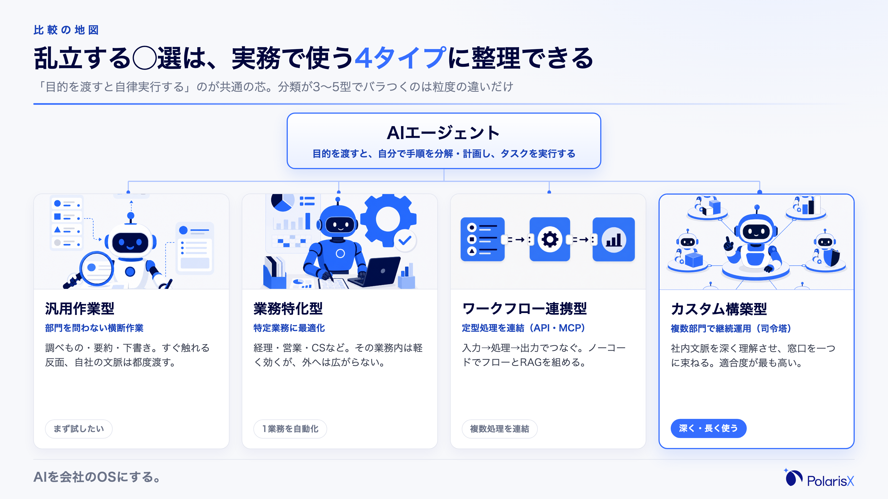
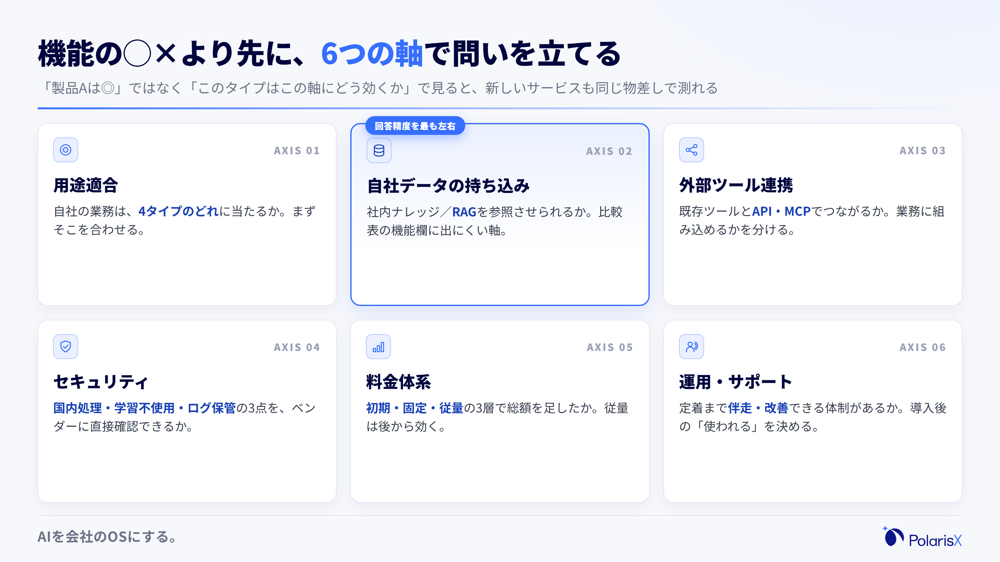
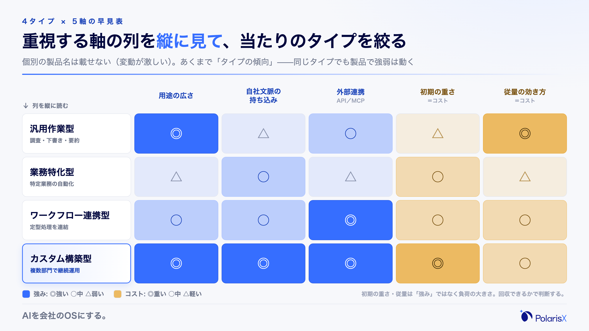
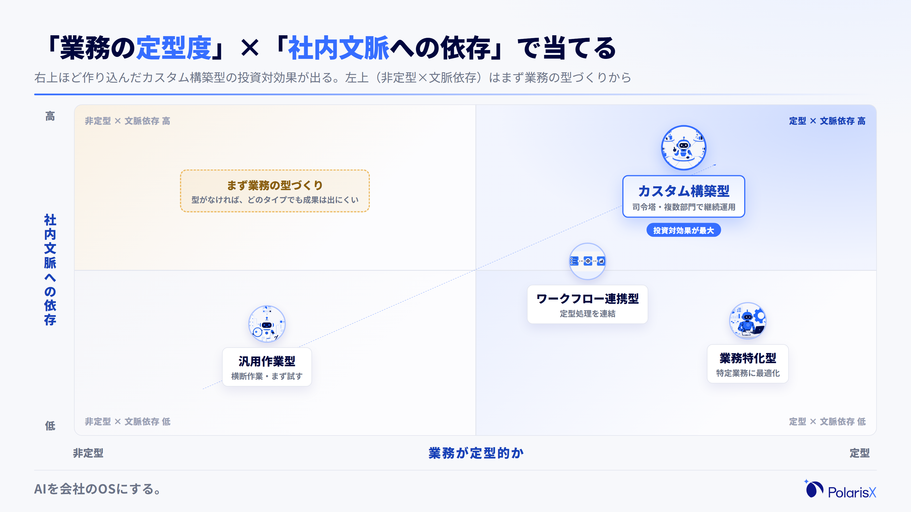
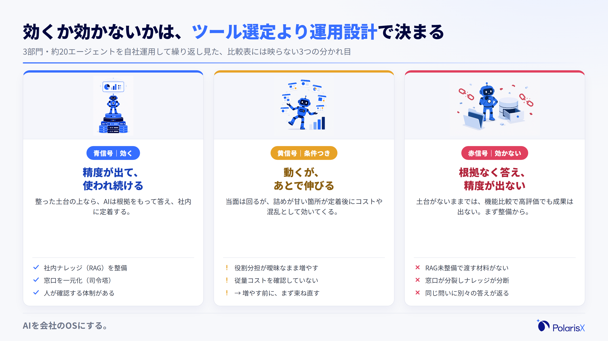
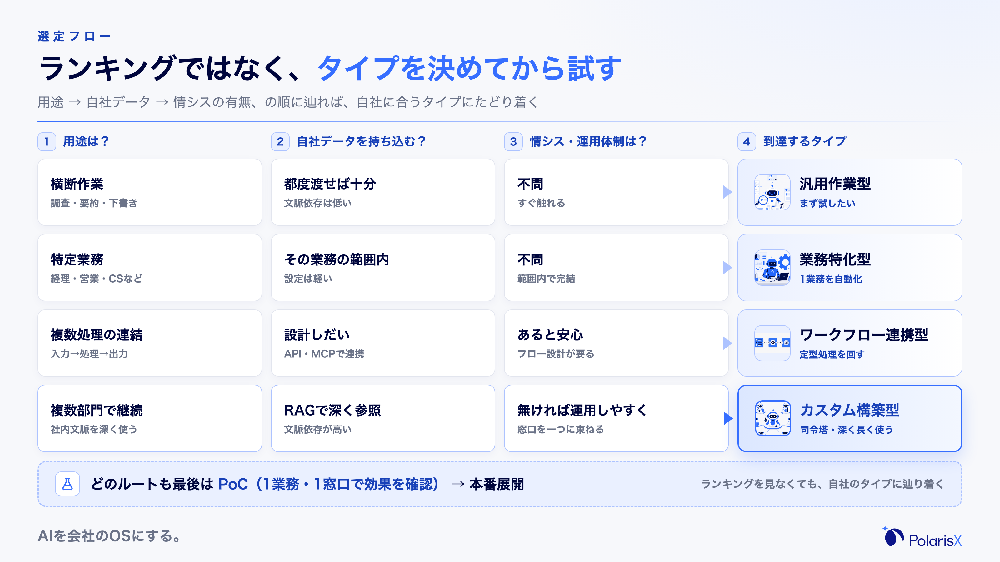

AIエージェントの比較は、載っているツール名を並べる前に「タイプ」で整理すると速く進みます。各社の「おすすめ◯選」は、載っているツールも分類も記事ごとにバラバラで、比較表の◯×を眺めても決め手になりません。この記事は、乱立する分類を実務で使える4タイプに整理し、自社に合うタイプを選ぶ軸と診断、検討フローまでを、AI社員組織を自社で運用する立場からまとめます。

**比較表を開く前に決める3つ（先に結論）**

1. **どのタイプが自社の用途に合うか** — AIエージェントは大きく〔汎用作業型／業務特化型／ワークフロー・連携型／カスタム構築型〕の4タイプに整理できます。まず自社の業務がどれに当たるかを決めます。
2. **自社のデータ・社内文脈を持ち込めるか** — 社内ナレッジ（RAG）を参照させられるかが、回答精度を最も左右します。比較表の機能欄には出にくい軸です。
3. **運用の窓口をどう設計するか** — 1体1業務でツールを増やすのか、司令塔に集約して窓口を一つにするのか。導入後に「使われる／使われない」を分けます。

**執筆**: PolarisX 編集部（AI活用の実務者チーム）— AI社員「Polaris AI」の開発と、自社のAI社員組織（3部門・約20のAIエージェント）の運用に携わるメンバーが執筆しています。

## AIエージェント比較の地図｜4タイプとチャットボットとの違い

AIエージェントの比較は、まず「タイプ」で地図を描くと迷いません。前提として、AIエージェントはチャットボットや生成AIチャットと違い、目的を渡すと自分で手順を考え、ツールを操作してタスクを実行まで進める点（自律性）が特徴です。総務省・経済産業省の「AI事業者ガイドライン」第1.2版（2026年3月）も、特定の目標を達成するために環境を感知し自律的に行動するAIシステムを「AIエージェント」と定義しました（[AI事業者ガイドライン](https://www.meti.go.jp/shingikai/mono_info_service/ai_shakai_jisso/20260331_report.html)）。そのうえで、市場のサービスは大きく〔汎用作業型・業務特化型・ワークフロー連携型・カスタム構築型〕の4タイプに分けられます。各社の分類が3〜5型でバラつくのは、この4つの粒度や組み合わせが違うだけで、軸はおおむね共通です。

### 実務で使う4タイプ（汎用作業／業務特化／ワークフロー連携／カスタム構築）

- **汎用作業型** — 調べもの・要約・下書きなど、部門を問わない横断的な作業を任せる型。例としてChatGPTの「エージェント」機能などがこれに当たります（[OpenAI](https://openai.com/)）。すぐ触れる反面、自社の文脈は都度渡す必要があります。
- **業務特化型** — 経理・営業・カスタマーサポートなど、特定業務にあらかじめ最適化されたサービス。その業務の中では設定が軽く効果が出やすい一方、対象業務の外には広がりません。
- **ワークフロー・連携型** — 複数の定型処理を「入力→処理→出力」でつなぎ、外部ツールとAPIやMCPで連携させる型。DifyのようなノーコードでフローとRAGを組めるツールが代表例です（[Dify](https://dify.ai/)）。
- **カスタム構築型** — 社内文脈を深く理解させ、複数部門で継続運用することを前提に組み上げる型。私たちの司令塔AI社員「Polaris AI」もこの型です。作り込みは重いぶん、自社への適合度が最も高くなります。

「できること・向く用途・代表的な使われ方」で整理すると、乱立する◯選が同じ4象限に収れんして見えてきます。

### 「1体1業務のツールを並べる」比較の限界

比較表がしんどくなるのは、たいてい「1体＝1業務のツールを何個も並べて◯×を付ける」見方をしているときです。この見方は、業務が1つに閉じているうちはうまくいきますが、部門横断で使い始めると窓口が分裂し、「どのAIに何を頼むか」を人間が覚え直すことになります。加えて、各ツールに散らばった社内ナレッジも分断され、同じ質問に別々の答えが返るようになります。ここで効いてくるのが、窓口を一つに集約するカスタム構築型（司令塔型）の存在意義です。比較の地図には、単体ツールの並びだけでなく「窓口をどう束ねるか」という軸を最初から入れておきます。

## 比較表を見る前に決める6つの選定軸

比較表の機能欄を追う前に、評価する「軸」を6つに絞ると判断が速くなります。(1)用途適合（自社の業務にタイプが合うか）、(2)自社データの持ち込みやすさ（社内ナレッジ・RAG連携）、(3)外部ツール連携（API・MCP）、(4)セキュリティ、(5)料金体系、(6)運用・サポート体制。ポイントは、これらを「製品Aは◎、製品Bは△」ではなく「このタイプはこの軸にどう効くか」で一般化して見ることです。個別製品の機能や料金は変動が激しく、比較表は公開直後から古くなります。タイプ単位で軸の効き方を押さえておけば、新しいサービスが出ても同じ物差しで測れます。特に(2)自社データの持ち込みは、比較表の機能欄に載りにくいのに回答精度を最も左右する軸で、ここを外すと「機能は多いのに使えない」状態になります。

### 費用の見方（初期・固定・従量の3層で見る）

料金は「月額いくら」の一点で比べると読み違えます。AIエージェントの費用は、(1)初期費用（設定・接続・カスタマイズ）、(2)月額固定、(3)従量課金（利用量・処理量に応じた変動費）の3層で見るのが実務的です。とくに従量部分は、比較表のプラン欄には「月◯円〜」としか出ないため見落としがちですが、利用が定着して処理量が増えると、想定より膨らむことがあります。単一の相場額を鵜呑みにせず、自社の想定利用量で3層を足し算し、増えたときにどこが伸びるかを先に確認しておきます。個別サービスの正確な料金は変動するため、最終判断は各社の公式料金ページで確かめてください。

### セキュリティの3点確認（国内処理・学習不使用・ログ保管）

セキュリティは、次の3点を具体的に確認します。(1)自社データが国内で処理されるか（処理・保管の所在）、(2)入力した情報がAIの学習に使われないか、(3)操作・アクセスのログがどれだけ保管され、確認できるか。個人情報保護委員会は、個人データをプロンプトに入力する際、提供事業者がそのデータを機械学習に利用しないことを確認するよう求めています（[個人情報保護委員会](https://www.ppc.go.jp/files/pdf/230602_alert_generative_AI_service.pdf)）。また「AI事業者ガイドライン」第1.2版は、権限の適切な設定と人間の判断の介在、操作履歴の定期確認を留意点として整理しています。解説記事の受け売りではなく、この3点をベンダーに直接確認するのが確実です。

## 4タイプ×6軸の早見表

タイプと軸が決まれば、両者を掛け合わせて「どのタイプがどの軸で強い／弱い」を早見表で俯瞰できます。読み方はシンプルで、自社が重視する軸の列を上から見て、◎や○が並ぶタイプに当たりを付けます。ここで個別の製品名は載せません。製品ごとの機能・料金は変動が激しく、表に固定した瞬間から古くなるためです。各タイプの一次情報は、候補が絞れた段階で各社の公式サイトで確認してください。下の表は、あくまで「タイプの傾向」を一般化したもので、同じタイプでも製品によって強弱は動きます。まずは傾向で候補を2つほどに絞り、そのうえで実物を触って確かめる——この順番が、比較表で消耗しないコツです。

| タイプ | 向く用途 | 自社文脈の持ち込み | 外部連携 | 導入の重さ（初期／従量） |
|---|---|---|---|---|
| 汎用作業型 | 調査・下書き・要約など横断作業 | △（都度渡す） | ○ | 軽い／使うほど従量が効く |
| 業務特化型 | 経理・営業など特定業務の自動化 | ○（その業務の範囲内） | △（範囲内） | 中／固定寄り |
| ワークフロー・連携型 | 複数の定型処理を連結 | △〜○（設計しだい） | ◎（API／MCP） | 中／実行量で従量が動く |
| カスタム構築型 | 社内文脈を深く使い複数部門で継続運用 | ◎（RAGで参照） | ◎ | 重い（初期高）／運用で回収 |

## 自社に合うタイプの見つけ方｜ケース別の推奨

「結局どれを選べばいいか」は、ランキングではなく「自社の条件→タイプ」で受けると決まります。目安はこうです。とりあえず触って試したいなら**汎用作業型**、経理や営業など特定業務を自動化したいなら**業務特化型**、複数の定型業務を連結して回したいなら**ワークフロー・連携型**、社内文脈を深く理解させ複数部門で継続運用したいなら**カスタム構築型**です。判断の軸は2つに集約できます。「業務がどれだけ定型的か」と「社内文脈への依存がどれだけ強いか」。定型度が高く文脈依存も強い業務ほど、作り込んだカスタム構築型（司令塔型）の投資対効果が出ます。逆に、その場限りで型のない業務は、どのタイプでも成果が出にくいので、先に業務の型づくりから始めます。

### 中小企業・情シス不在ならどこから始めるか

従業員30〜100名で専任の情シスがいない会社なら、いきなり作り込むより「運用のしやすさ」を優先します。最初は、質問が集中して属人化している1業務・1窓口に絞り、汎用作業型か業務特化型で小さくPoC（試験導入）を回して効果を確かめます。ここで「AIに聞くより自分でやったほうが早い」とならなければ、対象業務を横に広げます。複数部門で継続的に使う段階になって初めて、カスタム構築型や開発会社への依頼を検討すれば十分です。無料枠で試したいなら、まずどのタイプを試すかを決めてから触ると迷いません。ChatGPTでエージェントを作れるかを検討している場合も、この「タイプを先に決める」順番は同じです。

## カタログスペックに出ない運用の落とし穴

ここが、比較表では見えない実運用の話です。私たちPolarisXは、マーケティング・財務・営業の3部門・約20のAIエージェントからなるAI社員組織を自社で運用しています。その現場で繰り返し見るのが、次の3つです。(1)**社内ナレッジ（RAG）が無いと精度が出ない**——機能比較で高評価でも、参照させる自社データが整っていなければ、AIは根拠なく答えます。だから比較軸に「自社データの持ち込み」を必ず入れます。(2)**複数ツールを並べると窓口が分裂し、ナレッジが分断する**——司令塔で一つの窓口に束ね、役割を分担させる設計が効きます。(3)**従量課金は比較表のプラン欄では見えない実運用コストとして後から効いてくる**——定着して処理量が増えた頃に、そこが伸びます。

これらは、ツール選定そのものの巧拙より、ナレッジ整備・窓口設計・運用体制の問題であることがほとんどです。私たちが現場で使う見極めを一つ挙げると——**導入1か月で「エージェントをもっと増やしたい」と感じたら、それはツール選定の失敗ではなく、窓口設計を先に見直すサインです**。数を増やす前に、既存の窓口に社内ナレッジを寄せ、役割を束ね直すほうが、たいてい速く効きます。逆に、窓口を束ねても精度が上がらないなら、原因はナレッジの整備不足を疑います。

## 選定フロー｜タイプを決めてから試す

最後に、ここまでの判断を一本の流れに落とします。**(1)用途は何か**（横断作業か／特定業務か／複数処理の連結か／複数部門での継続運用か）→ **(2)自社データを持ち込むか**（社内ナレッジを参照させるなら文脈依存が高い）→ **(3)情シスの有無と運用体制**（無ければ運用しやすい型を優先）→ **(4)PoCで試す**（1業務・1窓口で効果を確認）。この順で辿れば、ランキングを見なくても自社のタイプにたどり着きます。導入の進め方の全体像も同じ骨格です——目的の明確化 → タイプ選定 → PoC → 本番展開 → 運用改善。作り込みや無料での試し方、ChatGPTでの実装といった各論は、タイプが決まってから個別に深掘りすれば十分です。

タイプは絞れたが、自社の業務やナレッジに落とし込む段階でつまずく——それが最もよくある壁です。**その場合は、AI社員組織を自社で運用するPolarisXに、まずは無料相談としてお問い合わせください（[contact@polarisx.ltd](mailto:contact@polarisx.ltd)）。「どのタイプが効くか」「渡せる社内ナレッジがあるか」の見極めからご一緒します。** サービスの考え方は [polarisx.ltd](https://polarisx.ltd/) でご覧いただけます。

## よくある質問

**Q. AIエージェントとチャットボット（生成AIチャット）は何が違いますか？**
チャットボットや生成AIチャットは、用意した問答や、その場の指示に答える「応答」が中心です。AIエージェントは、目的を渡すと自分で手順を分解・計画し、ツールを操作してタスクの実行まで進める「自律性」がある点が違います。「AI事業者ガイドライン」第1.2版も、特定の目標を達成するために環境を感知し自律的に行動するAIシステムを「AIエージェント」と定義しています。

**Q. AIエージェントの費用・料金相場はどれくらいですか？**
単一の相場額で判断せず、(1)初期費用、(2)月額固定、(3)従量課金の3層で見てください。とくに従量部分は、利用が定着して処理量が増えると膨らみやすく、比較表のプラン欄には出にくい費用です。自社の想定利用量で3層を足し合わせ、伸びる箇所を先に確認するのが安全です。正確な料金は変動するため、候補を絞ってから各社の公式料金ページで確かめます。

**Q. 導入で確認すべきセキュリティのポイントは何ですか？**
最低限、(1)自社データが国内で処理・保管されるか、(2)入力した情報がAIの学習に使われないか、(3)操作・アクセスのログがどれだけ保管・確認できるか、の3点をベンダーに直接確認します。個人情報保護委員会も、個人データを入力する際は提供事業者が学習に利用しないことを確認するよう求めています。権限設定と人間による確認の運用ルールも合わせて決めておきます。

**Q. AIエージェントはどんな業務に使えますか？**
向くのは「判断の型がある程度決まっていて、社内文脈を参照し、繰り返し発生する」業務です。具体的には、調べもの・提案書や議事録の下書き、問い合わせの一次対応、経理・人事などバックオフィスの定型処理、社内ナレッジ検索が典型です。逆に、正解が一つに定まらない経営判断や対人交渉、最終責任が問われる領域は、人の確認とセットにするのが前提です。

**Q. 中小企業に向いているAIエージェントはどう選べばいいですか？**
従業員30〜100名で情シスがいないなら、作り込みより「運用のしやすさ」を優先します。まず属人化している1業務・1窓口に絞り、汎用作業型か業務特化型で小さくPoCを回して効果を確かめ、うまくいけば横に広げます。複数部門で継続運用する段階になって初めて、カスタム構築型や開発会社への依頼を検討すれば十分です。

**自社に合うタイプが絞れたら** — PolarisXは、AI社員「Polaris AI」の開発と自社AI社員組織の運用を手がける立場から、「どのタイプが効くか」「渡せる社内ナレッジがあるか」の見極めからご一緒します。まずは無料相談として [contact@polarisx.ltd](mailto:contact@polarisx.ltd) へご連絡ください。サービスの考え方は [polarisx.ltd](https://polarisx.ltd/) をご覧いただけます。

### この記事について

PolarisX編集部（AI活用の実務者チーム）は、司令塔AI社員「Polaris AI」の開発と、自社のAI社員組織（マーケティング・財務・営業の3部門・約20のAIエージェント）の運用実務に携わるメンバーで構成しています。本記事は、AIエージェントの選定・社内ナレッジ整備・運用の現場で得た判断基準を、教科書的な比較解説に加えてまとめました。内容のご指摘・ご相談は [contact@polarisx.ltd](mailto:contact@polarisx.ltd) へ。

## 参考文献

- [AI事業者ガイドライン（第1.2版）（総務省・経済産業省、2026年）](https://www.meti.go.jp/shingikai/mono_info_service/ai_shakai_jisso/20260331_report.html)
- [生成AIサービスの利用に関する注意喚起等について（個人情報保護委員会、2023年）](https://www.ppc.go.jp/files/pdf/230602_alert_generative_AI_service.pdf)
- 個別のAIエージェント製品の機能・料金は変動します。本文で例示したサービスの最新情報は各社公式サイトをご確認ください。
