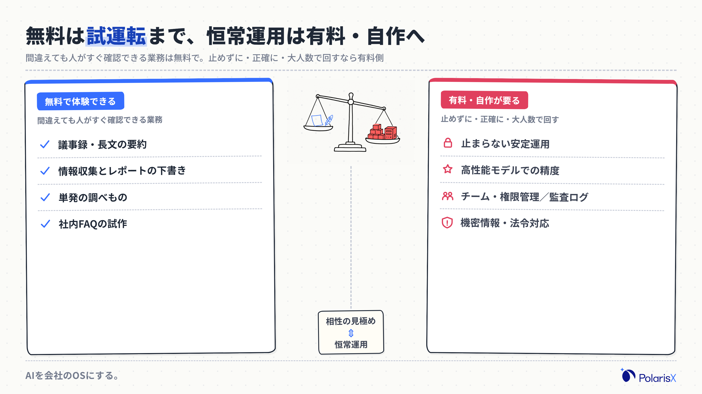
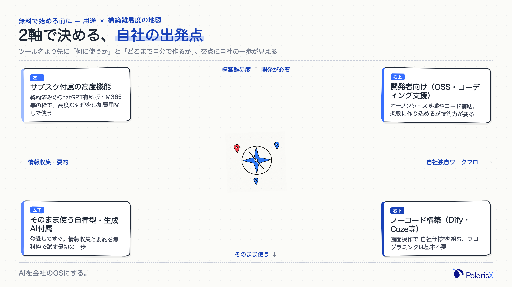
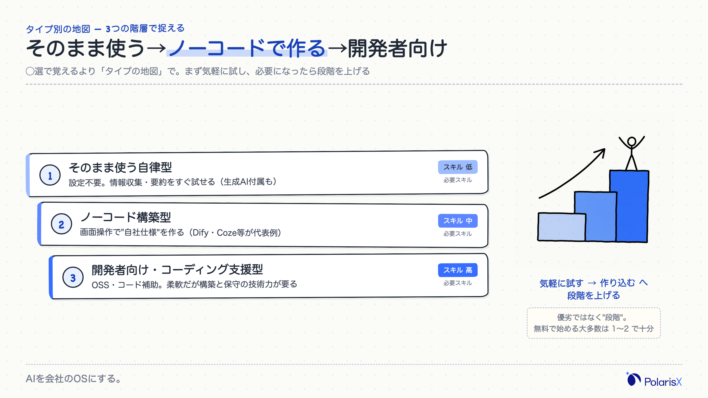
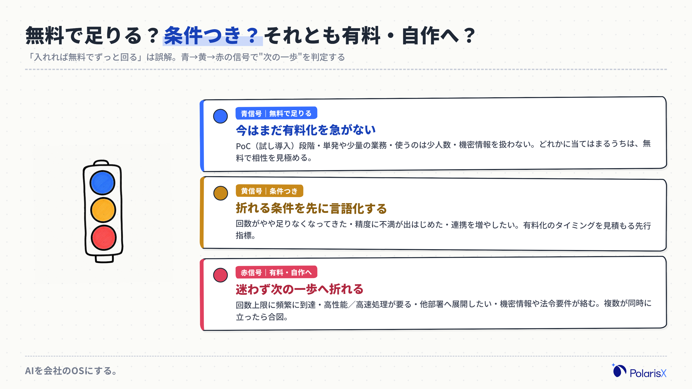
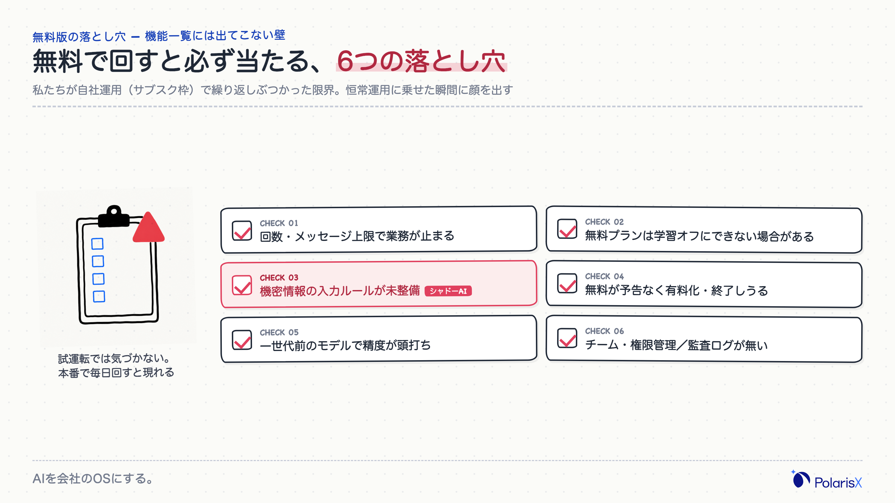
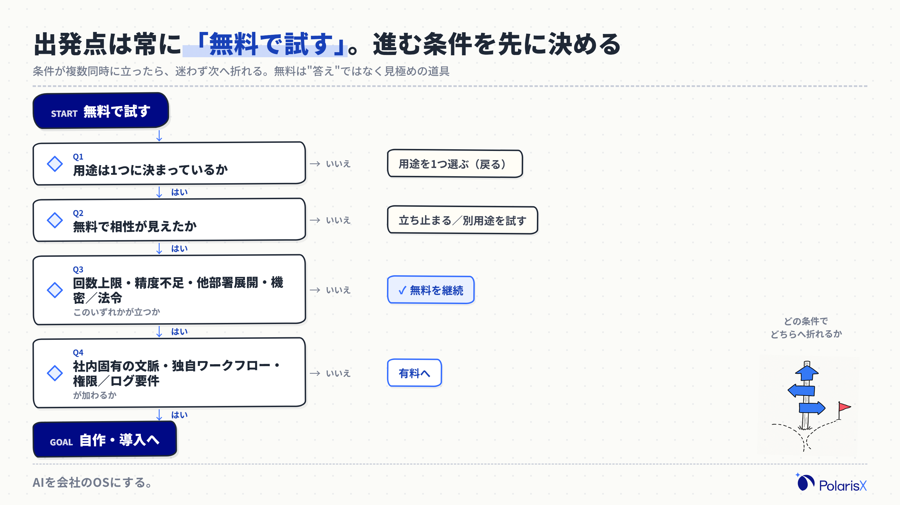

「AIエージェントを無料で試したい。でも、どれを選べばいいのか、無料でどこまでできるのか、法人で使って大丈夫なのかが読めない」——おすすめ◯選の記事を何本読んでも、この不安は消えません。ツールの数を並べても、あなたの会社が「無料で足りるのか、有料に進むべきか」は決まらないからです。この記事は、無料AIエージェントを個社比較する前に、無料期間で確かめるべき判断軸を先に示し、無料で試す→有料や自作に進む道筋を、自己診断と落とし穴チェックリストで整理します。

**無料で試す前に決める3つの判断軸**

1. **何を自動化したいか（用途タイプ）** — 情報収集・要約なのか、定型業務の自動化なのか、社内問い合わせ対応なのか。用途が決まらないと「無料で足りるか」も判断できません。
2. **無料枠のどの制限が先に効くか** — 実行回数・メッセージ数・モデル世代・外部連携数・データ保持。制限の"当たる順番"が、有料化のタイミングを決めます。
3. **そのデータを預けてよいか** — 入力内容が学習に使われないか（学習利用オフの可否）、機密情報・個人情報を入れてよい線引きはどこか。ここは無料プランほど条件が厳しくなりがちです。

生成AIとの一番の違いは「自律実行するか」です。ChatGPTのような生成AIは質問に答える単発の相談相手ですが、AIエージェントは目的を渡すとタスクを自分で分解して実行します。だからこそ「無料でどこまで任せられるか」を試す価値があります。

**執筆**: PolarisX 編集部（AI活用の実務者チーム）— AI社員「Polaris AI」の開発と、自社のAI社員組織（3部門・約20のAIエージェント）を無料枠・サブスク枠で運用する実務の視点で執筆しています。

## AIエージェントは無料でどこまで使える？——3つの経路

AIエージェントは、議事録の要約、情報収集とレポート下書き、定型的な調べもの、簡単な社内質問への回答といった「単発〜準定型の業務」なら、無料でも十分に体験できます。無料で使える経路は大きく3つです。ひとつは商用ツールの無料プラン（機能や回数を絞って無料開放）。ふたつめはオープンソース（自分のPCやサーバーで動かす代わりにソフト自体は無料）。みっつめは、すでに契約しているChatGPTやMicrosoft・Googleなどのサブスクに"含まれている"エージェント機能です。一方で、止まらない安定運用・高性能モデルでの精度・チームや権限の管理・監査ログ・セキュリティ要件は、無料では届きにくい領域です。つまり無料は「相性を見極めるための試運転」に向き、恒常運用は有料や自作の検討に入ります。

### 無料で使える3つの経路（無料プラン／オープンソース／サブスク枠）

無料プラン型は、商用サービスが機能や回数を絞って無料開放するもので、登録すればすぐ使えるのが利点です。オープンソース型は、ソフト自体が無料で、自分の環境で動かす前提。カスタマイズ性は高い反面、構築・保守の手間（＝実質のコスト）がかかります。サブスク枠型は、ChatGPTの有料プランやMicrosoft 365・Google Workspaceなどに含まれるエージェント機能を"追加費用なしで"使う経路です。多くの企業にとって現実的な出発点は、この3つのどれか、あるいは組み合わせになります。どれも「無料で使える」の意味が違うので、後述の判断軸で自社に合う経路を選びます。

### 生成AI・チャットボットとの違い

生成AI（ChatGPTなどの汎用チャット）は、質問に対して回答や文章を"その場で"返す相談相手です。チャットボットは、あらかじめ用意した想定問答の範囲で自動応答します。AIエージェントが両者と違うのは、目的を与えると「手順を自分で分解し、必要な情報を集め、ツールを操作して、最後まで実行する」自律性を持つ点です。たとえば「競合3社の料金を調べて表にまとめて」と頼むと、生成AIは知識の範囲で答えますが、エージェントは調べる→整理する→出力するという段取りを自分で組みます。無料で試す価値の核心はここにあります。単発の回答なら生成AIで足りますが、"作業ごと任せたい"ならエージェントの自律実行を無料期間で見極める意味があります。

### 無料でできること・有料が要ること

無料で体験しやすいのは、議事録や長文の要約、情報収集とレポートの下書き、単発の調べもの、社内FAQの試作など、間違えても人がすぐ確認できる業務です。逆に有料や自作が要りやすいのは、毎日大量に回す業務（回数上限に当たる）、高い精度が要る判断（新しい世代のモデルが要る）、複数人・複数部署での運用（権限やログの管理が要る）、機密情報や法令対応が絡む業務です。無料版は「この業務はAIと相性がいいか」を確かめる試運転として最適で、相性が見えたら有料・自作の投資判断に進む——この順番で考えると、無料期間を無駄にせずに済みます。

## 無料で始める前に決める3つの判断軸

無料AIエージェントを選ぶとき、最初に見るべきはツール名ではなく「自社の条件」です。判断軸は3つ。①何を自動化したいか（用途タイプ）、②無料枠のどの制限が先に効くか、③そのデータを預けてよいか。この3つを先に決めると、◯選記事の膨大な選択肢が一気に絞り込めます。用途が「情報収集・要約」なら、そのまま使える自律型で十分なことが多く、「自社独自の手順を再現したい」なら後述のノーコード構築が要ります。制限は、回数・モデル世代・連携・データ保持のうち"どれに最初に当たるか"を見積もる。データは、学習利用をオフにできるか、機密情報を入れてよい線引きを情シスと合わせておく。この3軸が、無料で試す範囲と有料へ進む境目を同時に決めます。

### 用途タイプで絞る

用途は大きく4つに分けると迷いません。（1）情報収集・要約——ニュースや資料を集めて要点をまとめる。（2）タスク自動化——定型の調べもの・入力・下書きを一連で回す。（3）チャットボット・FAQ——社内外の質問に答える窓口をつくる。（4）コーディング支援——コードの生成やレビューを助ける。無料で試すなら、まず自社で「毎週発生していて、間違えても取り返しがつく」業務を1つ選び、その用途に合うタイプだけを試すのが近道です。全部入りを探すのではなく、1用途で成果が出るかを見る。ここで手応えがあれば、次の判断軸（制限・データ）に進みます。

### 無料枠のどの制限が先に効くか

無料枠には必ず制限があり、業務を止めるのは"最初に当たる制限"です。よく効くのは、実行回数・メッセージ数の上限（毎日回すと数日で頭打ち）、使えるモデルの世代（無料は一世代前で精度が落ちることがある）、外部サービスとの連携数（Slackやドライブに繋げる本数の制限）、データの保持期間（履歴が一定期間で消える）です。**具体的な数値は各ツールで頻繁に変わるため、この記事では断定しません。必ず各ツールの公式料金・プランページで最新を確認してください。** 大事なのは数値そのものより「自社の使い方だと、どの制限に何日で当たるか」を見積もること。ここが有料化のタイミングを決める先行指標になります。

### データを預けてよいか

3つめの軸は、入力するデータの扱いです。確認すべきは主に2点。ひとつは、入力内容がモデルの学習に使われないか（学習利用のオフ設定が無料プランでも可能か）。もうひとつは、機密情報・個人情報を入れてよい線引きを、事前に情シスや管理部門と合わせておくこと。無料プランは、学習オフや管理機能が有料限定になっているケースが少なくありません。「試すのは公開情報・ダミーデータまで、本番の機密は無料版に入れない」というルールを最初に決めておくと、後述の落とし穴（シャドーAI・情報漏えい）をかなり防げます。

## タイプ別の地図——そのまま使う・ノーコードで作る・開発者向け

無料AIエージェントは、個社の◯選で覚えるより「タイプの地図」で捉えると迷いません。大きく3タイプです。（1）そのまま使う自律型——設定不要ですぐ試せる情報収集・要約系。（2）ノーコードで"自社仕様"を作る構築型——画面上の操作で独自のエージェントを組む（DifyやCozeが代表例）。（3）開発者向け・コーディング支援型——オープンソースやコード補助で、柔軟だが技術力が要る。無料で始めるなら、まず（1）で自律実行の感触をつかみ、独自の手順を再現したくなったら（2）へ、エンジニアがいて作り込みたいなら（3）へ——と段階を上げるのが安全です。この地図の上で、前章の判断軸（用途・制限・データ）を当てはめると、自社の出発点が決まります。

### そのまま使う（自律実行・情報収集型）

いちばん手軽なのが、登録すればすぐ動く自律型です。情報収集して要約する、指定テーマで下調べする、といった用途に向き、設定やプログラミングは不要。無料枠の範囲で「自律実行とはどんな体験か」を最短で確かめられます。まずはここから始め、日々の調べものや下書きが本当に楽になるかを体感するのがおすすめです。ここで手応えがなければ、そもそも自社の業務がエージェント向きでない可能性もあり、有料や自作に進む前に立ち止まる判断材料になります。

### ノーコードで"自社仕様"を作る構築型

「そのまま使う型では自社の手順に合わない」となったら、ノーコード構築型の出番です。画面上の操作で、社内の情報源に繋いだり、複数ステップの処理を組んだりして、自社仕様のエージェントを作れます。代表例として[Dify](https://dify.ai/)やCozeなどがあり、無料プランやオープンソース版から試せますが、**無料枠の条件（メッセージ数や連携数など）は変動が激しいため、必ず各公式ページで最新を確認してください。** プログラミングは基本不要ですが、「どんな手順を組むか」を設計する力は要ります。作り込みの手順そのものは奥が深いため、本格的に自作したい場合の詳しいやり方は別記事に譲ります。

### 開発者向け・コーディング支援型（プログラミングは必要？）

社内にエンジニアがいて、より柔軟に作り込みたいなら、オープンソースのエージェント基盤やコーディング支援型が選択肢になります。オープンソースはソフト自体が無料ですが、動かすには環境構築や保守が必要で、そこが実質のコストです。「AIエージェントの利用にプログラミング知識は必要か」という問いには、"タイプによる"が答えです。そのまま使う型やノーコード構築型は不要、開発者向けのオープンソースやコード補助を使い込むなら必要——と分かれます。無料で始める大多数の企業は、プログラミング不要のタイプから入って十分です。

## 無料で足りるか、有料へ進むか、自作すべきか——自己診断

無料・有料・自作のどこに進むべきかは、ツールの機能表ではなく「自社の状態」で決まります。次のサインで自己診断してください。**無料で足りるサイン**は、まだPoC（試し導入）段階、単発・少量の業務、使うのが少人数、機密情報を扱わない——このどれかに当てはまるうち。**有料へ進むサイン**は、無料枠の回数上限に頻繁に当たる、精度不足で高性能モデルや高速処理が要る、他部署へ広げたい、機密情報・法令要件が絡む。**自作すべきサイン**は、社内固有の文脈に強く依存する、独自ワークフローを恒常的に回したい、既製品では権限やログの要件を満たせない。3つのサインは排他ではなく、複数が同時に立ったときが"次の一歩"の合図です。

無料で足りるサインの段階では、無理に有料契約を急がないのが得策です。この段階の目的は「自社のどの業務がAIと相性がいいか」を見極めること。相性が見えないまま有料に進むと、機能ではなく"自社の使い方"が固まっていないために効果が出ません。逆に、下の落とし穴でつまずき始めたら、それが有料・自作へ折れるべき先行指標です。

## 無料版の落とし穴——サブスク枠で実際にぶつかった限界

無料でAIエージェントを運用すると、機能一覧には出てこない壁に必ず当たります。私たちPolarisXは、AI社員組織（3部門・約20のAIエージェント）を、コスト方針として「サブスク枠内での実行を最優先・従量課金は事前確認」という制約で自社運用しています。その当事者として繰り返しぶつかるのが、無料・サブスク枠特有の限界です。回数やレートの上限で処理が途中で止まる、従量課金に切り替えないと現実的な速度が出ない、複数のAIを動かすとチームや権限の管理・ログが無料版には無い、そして無料枠では一世代前のモデルしか使えず精度が伸びない——このあたりが典型です。無料は"試運転"としては最良ですが、恒常運用に乗せた瞬間にこれらが顔を出します。どこで折れるかを先に知っておくと、無料期間を判断材料として使い切れます。

### 無料枠の制限で業務が止まる

無料で運用していて最初に効くのは、たいてい回数やメッセージ数の上限です。少人数の試用では気づかなくても、実際の業務で毎日回し始めると、数日〜数週間で頭打ちになります。処理が途中で止まると、その業務は「AIに任せたはずが人が引き取る」状態になり、かえって手間が増えることもあります。**上限の具体的な数値は各ツールで変わり、しかも改定が頻繁なため、公式の料金・プランページで必ず確認してください。** 見積もるべきは数値そのものより、「自社の頻度だと何日で当たるか」です。ここが有料化の最初の先行指標になります。

### データの学習利用・機密情報

無料版で見落とされがちなのが、入力データの扱いです。無料プランでは、入力内容が学習に使われる設定がオフにできない、あるいはオフが有料限定というケースがあります。自律型エージェントは、指示に応じて外部サービスへアクセスし操作する分、扱う情報の範囲も広がります。OWASPは「[Agentic AI — Threats and Mitigations](https://genai.owasp.org/resource/agentic-ai-threats-and-mitigations/)」でエージェント特有の脅威を整理しており、権限の与えすぎや意図しない操作のリスクを挙げています。法人利用では、総務省・経済産業省の「[AI事業者ガイドライン（第1.2版）](https://www.meti.go.jp/shingikai/mono_info_service/ai_shakai_jisso/20260331_report.html)」が、自律的に行動するAIエージェントについて権限の適切な設定・人間の判断の介在・操作履歴の確認を求めています。無料版に機密情報を入れる前に、まずこの2点を確認してください。

### 現場でよく見る落とし穴

私たちが自社運用で繰り返し見てきた落とし穴を、率直に共有します。第一に「無料で回し始めると、いつの間にか人の確認を挟まない業務が増える」こと——エージェントが自律で動く分、間違いに気づくのが遅れます。第二に「便利さから、ルールなく機密情報を貼り付けるメンバーが出る」シャドーAIの発生。第三に「無料枠のモデル世代差で、同じ指示でも精度が安定しない」こと。反証可能性の観点で、失敗の見分け方を1つ挙げるなら——**回数上限に毎日ぶつかる、または人の確認を挟めない業務が出てきたら、それが「無料の限界＝有料か自作へ進む」サインです。** 逆に、これらが起きていないうちは無料で粘って相性を見極めるのが合理的です。

## 無料から有料・自作へ——次の一歩と費用の考え方

自己診断で「有料へ」または「自作へ」のサインが立ったら、次はコストの考え方です。有料化は多くの場合、月額サブスク（利用量やユーザー数で変わる）。自作は、ソフトが無料のオープンソースでも、構築・保守・運用監視の人件費が乗ります。見落としがちなのは、ツール料金だけでなく、データ整備・権限設計・運用監視まで含めた総コスト（TCO）で比べること。**具体的な金額は各社・各プランで変動が激しいため、本記事では断定せず、各公式ページで最新を確認する前提で考えてください。** 無料で相性が見えた業務から順に、費用対効果が読める範囲で有料・自作に広げるのが、失敗の少ない進め方です。ここで「有料も含めて全体を比較したい」「自社に配属して恒常運用したい」となったら、次のステップに進みます。

無料での試運転を経て、いざ「自社の文脈を理解したAIを、複数部署で恒常的に使える形にしたい」となると、無料ツールの寄せ集めでは権限・ナレッジ・運用監視の壁に当たります。PolarisXは、社内の情報源と接続して"御社を知っている状態"で働く司令塔AI社員「Polaris AI」と、その土台となる社内ナレッジベースの構築を提供しています。無料で相性を見極めた次の一歩を相談したい方は、[contact@polarisx.ltd](mailto:contact@polarisx.ltd) までお気軽にご連絡ください。

## 選定フロー

最後に、ここまでの判断を1本の流れに束ねます。無料で試すところから、有料・自作へ折れる分岐までを決定木で辿ってください。出発点は常に「無料で試す」で構いません。大事なのは、どの条件が立ったら次に進むかを、あらかじめ決めておくことです。

このフローの要点は3つです。第一に、いきなり有料や自作を検討せず、必ず無料の試運転から入ること。第二に、進む条件（回数上限・精度・展開・機密）を先に言語化しておくこと。第三に、条件が複数同時に立ったら迷わず次へ折れること。無料は「答え」ではなく「見極めの道具」です。この道具を使い切れば、有料や自作への投資判断は驚くほど明確になります。

## よくある質問

**Q. 無料のAIエージェントと生成AI（ChatGPT等）は何が違いますか？**
生成AIは質問に対して回答や文章を返す単発の相談相手です。AIエージェントは、目的を渡すと手順を自分で分解し、情報を集め、ツールを操作して最後まで実行する自律性を持ちます。単発の回答が欲しいだけなら生成AIで足り、"作業ごと任せたい"ならエージェントを試す意味があります。無料期間はこの自律実行が自社業務に効くかを見極める場です。

**Q. ノーコードで使える無料AIエージェントはどれですか？**
DifyやCozeなど、画面上の操作で自社仕様のエージェントを作れるノーコード構築型があり、無料プランやオープンソース版から試せます。ただし無料枠の条件（メッセージ数・連携数など）は変動が激しいため、必ず各公式ページで最新を確認してください。プログラミングは基本不要ですが、どんな手順を組むかを設計する力は要ります。作り込みの詳しい手順は専用の記事で扱います。

**Q. 無料AIエージェントに機密情報・個人情報を入れても大丈夫ですか？**
無料版に本番の機密情報を入れるのは、原則として避けるのが安全です。無料プランは入力の学習利用をオフにできない場合があり、権限やログの管理機能も乏しいことが多いためです。OWASPの脅威整理や、総務省・経済産業省の「AI事業者ガイドライン（第1.2版）」は、権限設定・人間の判断の介在・操作履歴の確認を求めています。試用は公開情報やダミーデータにとどめ、機密の線引きを事前に情シスと合わせてください。

**Q. 無料AIエージェントはずっと無料で使い続けられますか？**
無料枠には実行回数・メッセージ数・モデル世代・連携数などの制限があり、業務で本格的に回すと上限に当たります。無料プランやオープンソース版の条件は改定されることも珍しくなく、無料が終了・有料化する可能性もあります。具体的な回数や上限は各ツールで変わり頻繁に更新されるため、公式の料金ページで最新を確認するのが確実です。恒常運用を見込むなら、有料や自作への切り替え前提で設計しておくと安全です。

**Q. 無料から有料版に切り替えるタイミング・判断基準は？**
判断基準は「自社の状態」で決めます。無料枠の回数上限に頻繁に当たる、精度不足で高性能モデルや高速処理が要る、他部署へ展開したい、機密情報や法令要件が絡む——このいずれかが立ったら有料化の合図です。さらに、社内固有の文脈依存や独自ワークフローの恒常運用、権限・ログ要件まで加わると、自作や導入の検討に進みます。無料で相性を見極めてから切り替えると、投資対効果が読みやすくなります。

無料での見極めの次に、有料も含めた全体比較や、自社への配属・恒常運用を検討する段階では、権限設計や社内ナレッジとの接続が論点になります。自社に合う進め方を具体的に相談したい方は、[PolarisX](https://polarisx.ltd/)（[contact@polarisx.ltd](mailto:contact@polarisx.ltd)）へお問い合わせください。無料で相性を確かめた業務から、司令塔AI社員「Polaris AI」で恒常運用に乗せる道筋をご提案します。

### この記事について

PolarisX編集部は、AI社員「Polaris AI」の開発と、自社のAI社員組織（3部門・約20のAIエージェント）の運用実務に携わるメンバーで構成しています。私たちはコスト方針として、サブスク枠内での実行を最優先し、従量課金は事前確認するという制約でAIエージェントを日々運用しており、無料・サブスク枠の限界に当事者としてぶつかっています。本記事は、無料AIエージェントの選定と有料・自作への切り替えを、その現場の判断基準を加えてまとめました。内容のご指摘・ご相談は contact@polarisx.ltd へ。

## 参考文献

- [AI事業者ガイドライン（第1.2版）（総務省・経済産業省・2026年3月）](https://www.meti.go.jp/shingikai/mono_info_service/ai_shakai_jisso/20260331_report.html)
- [Agentic AI — Threats and Mitigations（OWASP GenAI Security Project・2025年）](https://genai.owasp.org/resource/agentic-ai-threats-and-mitigations/)
- [Dify 公式サイト（料金・無料枠の条件は公式で要確認）](https://dify.ai/)
