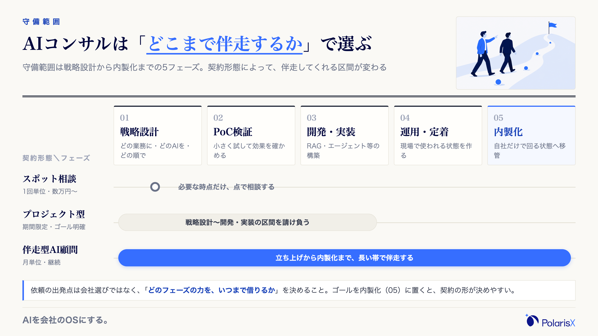
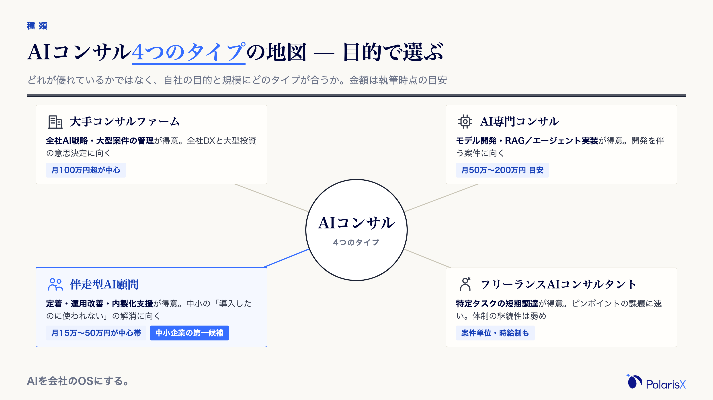
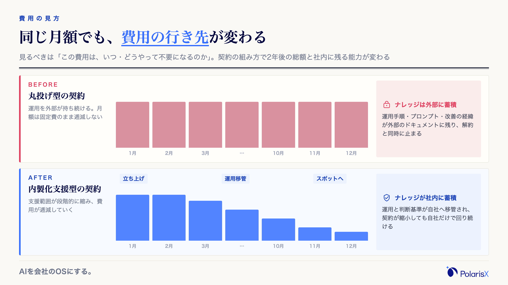
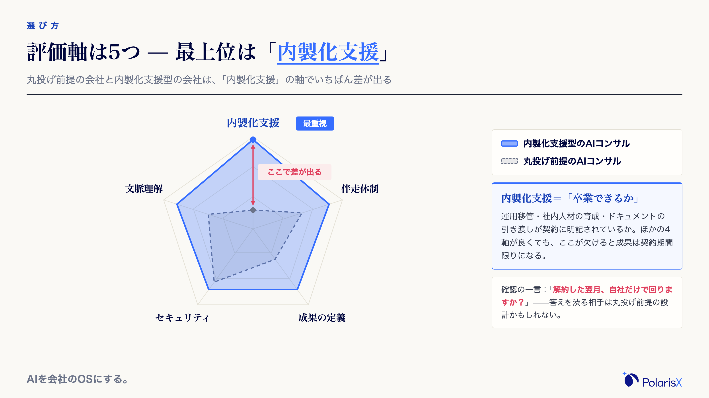
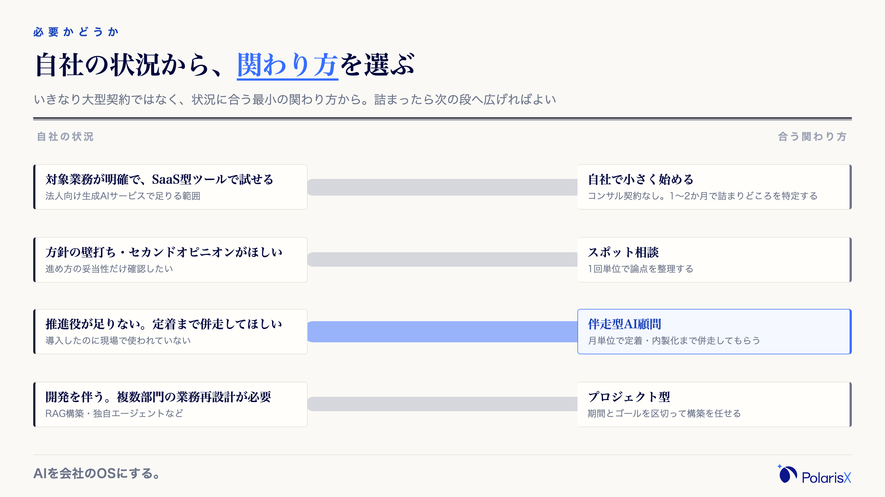
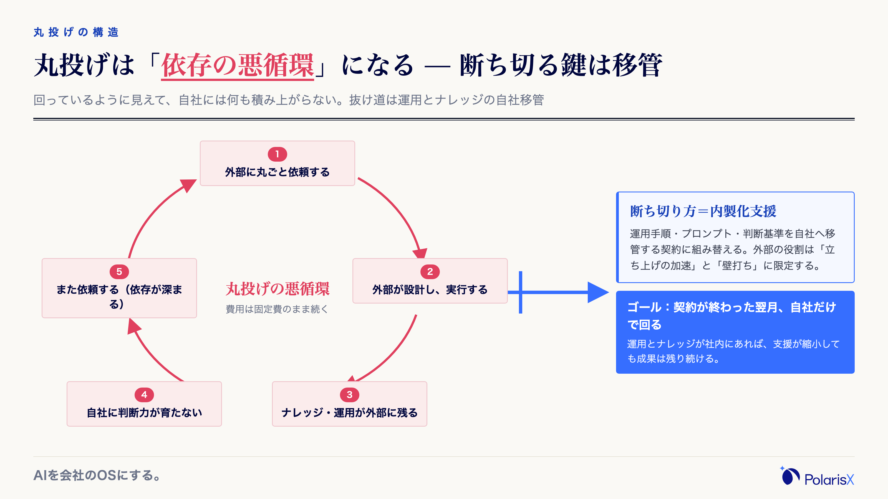

AIコンサル（AIコンサルティング）とは、「自社のどの業務に、どのAIを、どう組み込み、どう定着させるか」という問いに対して、戦略の設計から導入・運用、さらに内製化までを外部の専門家として支援するサービスです。生成AIの業務活用、RAG・AIエージェントといった仕組みの構築、社内人材の育成までを守備範囲に含み、「AIを入れたいが何から手を付けるべきか分からない」企業の設計力と推進力を補う相手です。

なお、この記事はAIコンサルを「依頼する企業側」に向けた解説です。AIコンサルタントという職業を目指す方向けの仕事内容・年収の話は扱いません。

この言葉が分かりにくい原因は、指す相手の幅にあります。数百万円規模で全社戦略を描く大手ファームも、月十数万円で現場に伴走する顧問も、1回数万円のスポット相談も、すべて「AIコンサル」と呼ばれるからです。しかも検索で出てくる紹介記事の多くはコンサル会社自身が書く「おすすめ◯選」で、発注側に立った判断軸はなかなか示されません。そこでこの記事は、全体の地図（種類）と相場観（費用）に加えて、「頼んだあとに自社へ何が残るか」という発注側の見極めの軸を中心に整理します。

> **一言でいうと**：AIコンサルとは、AI活用の設計と定着を支援してくれる外部の専門家です。成果を分けるのは金額や知名度ではなく、「契約が終わったあとも、運用とナレッジが自社に残る形で支援してくれるか」です。
>
> **先に正しておきたい誤解3つ**
> 1. **契約すれば、AIが勝手に業務へ定着する** — 定着に必要な業務知識は自社にしかありません。自社側の関与ゼロで成果が出る契約は存在しません。
> 2. **大手や有名な会社ほど自社に合う** — タイプごとに得意領域と価格帯が大きく違います。全社戦略を必要としない会社にとって、大手ファームは過剰投資になりえます。
> 3. **丸投げすればラクに成果が出る** — 丸投げは、費用が固定費として続き、ナレッジが外部にたまっていく典型的な失敗パターンです。

**執筆**: PolarisX 編集部（AI活用の実務者チーム）— AIコンサルティング事業を提供しつつ、自社でも複数部門・約20のAIエージェントからなるAI社員組織を内製運用するメンバーが執筆しています。

## AIコンサルとは — 戦略設計から運用・内製化まで伴走する外部支援

AIコンサルとは、企業のAI活用を成果につなげるために、①活用戦略の設計（どの業務に・どのAIを・どの順で入れるか）②PoC（小規模検証）の設計と評価 ③導入・実装の支援 ④現場への定着と運用改善 ⑤自社で回すための内製化支援——という一連のフェーズを外部から支援するサービスです。関与する範囲は契約で決まり、初期の戦略設計だけを請け負う会社もあれば、定着・内製化まで長く伴走する会社もあります。発注側から見た本質は「自社に足りない設計力・技術知識・推進力を、期間を区切って外から借りること」です。したがって依頼の出発点は、会社選びの前に「どのフェーズの力を、いつまで借りるか」を決めることになります。

<!-- 図: メッセージ=AIコンサルの守備範囲はフェーズの帯で決まり、契約形態によって伴走区間が変わる。型=roadmap（流れ・時間）。要素: 5フェーズ帯「戦略設計→PoC検証→開発・実装→運用・定着→内製化」＋下段に契約形態別の伴走区間バー（スポット=点、プロジェクト型=区間、伴走型顧問=長い帯で内製化まで）。 -->

### ITコンサル・AI開発会社・生成AI研修との違い

隣接するサービスとの違いは、社名や肩書ではなく「何を頼む相手か」で線を引くと分かりやすくなります。

| 頼む相手 | 主に頼むこと | 主な成果物 |
|---|---|---|
| **AIコンサル** | どの業務をどうAI化し、どう定着させるかの設計と伴走 | 活用戦略・PoC評価・運用設計・社内育成 |
| ITコンサル | 基幹システムやインフラを含むIT全般の企画・導入 | IT戦略・システム導入計画 |
| AI開発会社（受託開発） | 要件が決まったAIシステム・モデルの開発 | 動くシステム・モデル |
| 生成AI研修 | 社員のAIスキル習得 | 研修プログラム・教材 |

ITコンサルはIT全般が守備範囲で、AIはその一部です。AI開発会社は「作ること」が主業務のため、そもそも何を作るべきかの整理は発注側に残りがちです。研修は人のスキルを引き上げますが、業務フローの設計までは踏み込みません。実際にはこれらを兼業する会社が多いので、「AIコンサルもやっています」という言葉ではなく、契約書に書かれる支援範囲で判断してください。
<!-- 将来内部リンク: /blogs/ai-development-company（AI開発会社・発注先の選び方）, /blogs/gen-ai-training（生成AI研修） -->

### なぜいま需要が増えているのか

背景には「方針はできたが、進める人がいない」というギャップがあります。総務省の[令和7年版 情報通信白書](https://www.soumu.go.jp/johotsusintokei/whitepaper/ja/r07/html/nd112220.html)によると、生成AIの活用方針を定めている日本企業は約5割（49.7%・2024年度）まで増えました。一方で、その方針を業務に落とし込める人材は多くの会社にいません。生成AIの登場で「AIを使う」こと自体のハードルは大きく下がりましたが、「自社の業務に組み込み、成果が出る形で定着させる」設計のハードルは残ったままです。ツールの契約は1日でできても、業務フローの見直しと定着には数か月かかります。この「使えるはずなのに成果につながらない」区間を埋める専門家として、AIコンサルの需要が増えています。

## AIコンサルの種類 — 4つのタイプと得意領域

AIコンサルは、①大手コンサルファーム ②AI専門コンサル ③伴走型AI顧問 ④フリーランスAIコンサルタント——の4タイプに大別できます（分類は[Uravation社の整理](https://uravation.com/media/ai-consulting-complete-guide-2026/)などを参考にしています）。押さえるべきは「どのタイプが優れているか」ではなく「自社の目的と規模にどのタイプが合うか」です。全社戦略と大型投資の意思決定なら大手ファーム、モデル開発やRAG実装ならAI専門、現場への定着と内製化なら伴走型顧問、限定タスクの短期調達ならフリーランス——と得意領域がはっきり分かれているため、目的とタイプがずれた発注は金額の大小にかかわらず失敗しやすくなります。

<!-- 図: メッセージ=AIコンサルの4タイプの地図。型=anatomy（構造・関係）。中心ノード「AIコンサル」から4方向へ引き出し【大手ファーム=全社戦略・月100万円超中心】【AI専門=モデル開発・RAG実装】【伴走型顧問=定着・内製化支援・月単位＝中小の第一候補】【フリーランス=特定タスクの短期調達】。各カードに向く企業を一言。※tree はブリーフ指定だが同日並行の ai-development-company / knowledge-management-tools が fig1 に tree を使用したため anatomy へ差替。 -->

### 大手コンサルファーム／AI専門コンサル

- **大手コンサルファーム**：全社のAI戦略策定や経営層向けの構想づくり、大規模プロジェクトの管理が得意です。月額100万円を超える高価格帯が中心で、全社DXとセットの大型案件に向きます。逆に「まず1業務から」という段階の会社には守備範囲が合いません。
- **AI専門コンサル**：機械学習モデルの開発、RAG・AIエージェントの実装といった技術支援が主戦場で、PoCから本番運用まで技術面で踏み込めます。開発を伴う案件、既製ツールでは要件を満たせない案件に向きます。

### 伴走型AI顧問／フリーランスAIコンサルタント

- **伴走型AI顧問**：月単位の契約で現場に入り、ツールの定着・運用改善・社内人材の育成といった「内製化支援」を主目的とします。中小企業の「導入したのに使われない」の解消と相性がよいタイプです。
- **フリーランスAIコンサルタント**：特定タスクをピンポイントに、案件単位で速く頼めます。ただし品質の個人差が大きく、体制の継続性・ドキュメントの引き継ぎは弱くなりがちです。

### タイプ選びの考え方（中小企業の場合）

従業員30〜100名で情報システム部門がない会社なら、最初の相談相手は伴走型顧問かスポット相談が現実的です。理由は2つあります。第一に、この規模のAI活用の論点は「全社戦略」ではなく「どの業務から始めて、どう定着させるか」にあり、大手ファームの得意領域と噛み合いません。第二に、月額100万円を超える固定費は、この規模の粗利構造では回収シナリオが成り立ちにくいからです。具体的なベンダー名の比較は、この「自社に合うタイプ」を絞ってから行うのが順序です。タイプを絞らずに◯選記事を読み始めると、比較軸が価格と知名度だけになり、目的に合わない相手を選びやすくなります。

## AIコンサルの費用相場と料金体系【執筆時点の目安】

AIコンサルの費用は、契約形態で見ると3つに分かれます。スポット相談が1回5万〜30万円程度、月額顧問型が月10万〜100万円程度（中小企業向けの伴走型は月15万〜50万円が中心帯）、プロジェクト型が100万円〜数千万円規模——というのが執筆時点（2026年7月）の複数の調査に共通するレンジです。「AIコンサルの相場は◯円」という単一の答えは存在しません。同じ月額顧問でも大手ファームと伴走型顧問では1桁違うことがあり、金額は会社のタイプ・支援範囲・案件規模で大きく動くからです。見積もりで見るべきは金額そのものよりも、「その金額に何が含まれ、何が含まれないか（支援範囲）」です。

### 契約形態別の相場レンジ

| 契約形態 | 相場レンジ（執筆時点の目安） | 向いている場面 |
|---|---|---|
| スポット相談（単発） | 1回 5万〜30万円程度 | 論点整理・方針のセカンドオピニオン |
| 月額顧問型（継続） | 月10万〜100万円程度。中小向け伴走型は月15万〜50万円が中心帯。大手ファームは月100万円超も | ツール定着・運用改善・内製化までの継続支援 |
| プロジェクト型（期間限定） | 100万〜3,000万円程度。中小のPoC・小規模開発は100万〜500万円が目安 | PoC・システム構築などゴールが明確な案件 |

レンジは[boostx社の料金調査](https://boostx-inc.com/blog/ai-consulting-pricing-cost-breakdown/)・[Uravation社の費用比較](https://uravation.com/media/ai-consulting-complete-guide-2026/)・[renue社の相場ガイド](https://renue.co.jp/posts/ai-consulting-cost-pricing-guide-2026)を突き合わせた目安です。renue社の整理では、フェーズ別に戦略策定40万〜200万円、PoC開発200万〜500万円、本番実装500万〜2,000万円というレンジも示されています。いずれも改定や案件条件で動くため、契約時は必ず個別見積もりで確認してください。

### 費用に見合うかの考え方と、使える助成金

費用対効果を判断する軸は「この費用は、いつ・どうやって不要になるのか」です。丸投げ型の契約では、運用を外部が持ち続けるため月額費用が固定費として続きます。一方、内製化支援型の契約では、支援範囲が「立ち上げ→運用移管→必要なときだけスポット相談」と段階的に縮み、費用は逓減していきます。同じ月30万円の契約でも、2年後も月30万円のままか、スポット費用だけになっているかで、総額と社内に残る能力は大きく変わります。

<!-- 図: メッセージ=契約の組み方で費用の行き先が変わる（固定費が続く vs 逓減する）。型=beforeafter（比較・位置づけ）。上段Before「丸投げ型: 月額バーが12か月同じ高さ・ナレッジは外部に蓄積」→下段After「内製化支援型: 立ち上げ→運用移管→スポットへと月額バーが漸減・ナレッジが社内に蓄積」。 -->

また、AI活用に必要な社員研修（訓練）を伴う場合は、厚生労働省の[人材開発支援助成金（事業展開等リスキリング支援コース）](https://www.mhlw.go.jp/stf/seisakunitsuite/bunya/koyou_roudou/koyou/kyufukin/d01-1.html)を使える場合があります。DX化に伴う訓練が対象に含まれ、[公式の案内（詳細版）](https://www.mhlw.go.jp/content/11800000/001705831.pdf)によると中小企業の経費助成率は75%、賃金助成は1人1時間あたり1,000円です（令和4〜8年度の期間限定制度・訓練開始前の計画届提出が必要）。助成の対象はあくまで「訓練・研修」であってコンサル費用の全般ではない点に注意しつつ、支給要件・上限額は公式の最新案内で必ず確認してください。

## 失敗しないAIコンサルの選び方 — 評価軸の最上位は「内製化支援」

AIコンサル選びで見るべき評価軸は、①内製化支援があるか ②定着までの伴走体制 ③自社・業界文脈の理解 ④成果の定義の明確さ ⑤セキュリティ・データの扱い——の5つです。多くの選び方記事はこの種の軸を横並びに扱いますが、私たちは①を最上位に置くべきだと考えています。②〜⑤がどれだけ優れていても、運用とナレッジが外部に残る契約では、成果が「契約が続いている間だけのもの」になるからです。言い換えると、良いAIコンサルとは「いずれ卒業できるコンサル」であり、その設計が契約に組み込まれているかを最初に確認します。

<!-- 図: メッセージ=評価軸5つのうち内製化支援を最上位に置く。型=radar（量・基準）。5軸レーダー「内製化支援（最重視・強調）／伴走体制／自社・業界文脈の理解／成果の定義／セキュリティ」。多角形2つ: 内製化支援型（内製化軸が高い）vs 丸投げ前提（内製化軸がへこむ）。 -->

### 評価軸の中身

1. **内製化支援があるか（最重要）**：運用移管・社内人材の育成・ドキュメントの引き渡しが契約に明記されているか。「ずっと使い続けてもらう」前提の設計になっていないか。
2. **定着までの伴走体制**：納品して終わりか、現場で使われるまで併走するか。定例の頻度と、実務を分かっている担当者が来るかを確認します。
3. **自社・業界文脈の理解**：初回の提案が自社の業務フローを踏まえているか。ヒアリングより先に自社製品の説明が始まる相手は注意が必要です。
4. **成果の定義の明確さ**：「AI活用の推進」のような曖昧な言葉ではなく、どの業務の何がどれだけ変わるかを、途中経過で見る先行指標つきで定義できるか。
5. **セキュリティ・データの扱い**：社内データの持ち出し範囲、AIの学習への利用有無、契約終了時のデータ削除の取り決め。

### 契約前に確認する質問リスト

- この契約の「成果」は何で、途中経過は何の指標で確認しますか
- 作られたプロンプト・設定・運用手順は、どこに・誰のものとして残りますか
- 日々の運用は誰が担い、いつ自社へ移管されますか
- 解約した翌月、自社だけで回りますか。回らないとしたら何が足りませんか
- 内製化までのロードマップと、その時点で契約を縮小するプランはありますか

この5問に具体的に答えられない相手は、丸投げ前提の設計になっている可能性が高い——というのが、支援する側にいる人間としての正直な感覚です。答えを渋る相手との契約は、金額の多寡にかかわらず慎重に判断してください。
<!-- 将来内部リンク: /blogs/ai-adoption-support（AI導入支援サービスの進め方） -->

## AIコンサルはどんな企業に必要か — 自社でどこまでできるか

AIコンサルの要否は「課題の複雑さ × 社内の推進力」で決まります。複数部門にまたがる業務の再設計や、RAG・独自エージェントのような開発を伴う構築が必要で、かつ社内に推進役がいないなら、外部の専門家を入れる意味があります。逆に、対象業務が絞れていて、月額のSaaS型AIツールで試せる範囲なら、コンサル契約なしで始められます。多くの中小企業にとっての現実的な正解は「いきなり大型契約」ではなく、「自社で小さく始めて詰まりどころを特定し、詰まった範囲だけ外部の力を借りる」という順番です。

<!-- 図: メッセージ=自社の状況→適した関わり方の対応。型=sankey（流れ・時間）。左ノード「対象業務が明確・SaaSで試せる」「方針の壁打ちだけしたい」「推進役が足りない・定着まで併走してほしい」「開発を伴う・複数部門の再設計」→右ノード「自社で小さく始める」「スポット相談」「伴走型顧問」「プロジェクト型」へ帯で接続。 -->

### コンサルが要る企業・自社で始められる企業

外部の専門家が効くのは、①複数部門にまたがる業務再設計が必要 ②RAG構築や独自エージェント開発など技術的な作り込みが必要 ③社内に推進役が不在で、進め方の座組みから作る必要がある ④経営判断として投資の根拠づけが要る——のいずれかに当てはまる場合です。一方、①対象業務が1〜2個に絞れている ②法人向けの生成AIサービス（ChatGPTの法人プランなど）で試せる ③現場にAIへ関心のあるメンバーが1人以上いる——なら、自社で始められます。従業員30〜100名で情シス不在の会社なら、初手はコンサル契約ではなくSaaS型ツールの試用が合理的です。1〜2か月使うと「自社の詰まりどころ」が具体化し、外部へ頼むべき範囲が明確になるため、その後に見積もりを取っても精度が上がります。
<!-- 将来内部リンク: /blogs/chatgpt-enterprise（法人ChatGPTでの自社導入）, /blogs/sme-ai-efficiency（中小企業の業務効率化の始め方） -->

### 「内製 × 外部パートナー」のハイブリッドという現実解

全部外注も全部内製も、実際には成立しにくい選択です。全部外注は費用の固定化とナレッジの流出という問題を抱え、全部内製は立ち上げの遅さと試行錯誤のコストという問題を抱えます。現実解は、内製化を最終ゴールに置いたうえで、外部パートナーの役割を「立ち上げの加速」と「詰まったときの壁打ち」に限定するハイブリッドです。このとき外部に渡すのは作業であって、判断と運用は最初から自社に置きます。判断まで外に出すと、後述する丸投げの失敗パターンに入るからです。人材面では、前述のリスキリング助成金を使った生成AI研修を並行させると、内製化の担い手を計画的に育てられます。

## AIコンサルに丸投げすると失敗する理由 — 運用とナレッジを自社に残す

丸投げ——目的の設定・業務の言語化・日々の運用までを外部に預けてしまう発注——が失敗しやすいのは、AI活用の成果が「AIの知識 × 自社の業務知識」の掛け算で決まるからです。AIの知識は外部から調達できますが、自社の業務知識（実際の仕事の進め方・例外処理・顧客との暗黙の約束事）は自社にしかありません。丸投げでは掛け算の片側が欠けたまま設計が進み、「動くが、現場で使われないAI」が納品されます。さらに運用まで外部が持つと、改善のたびに外部待ちとなり、契約終了と同時に止まる仕組みができあがります。

### 丸投げの代表的なデメリット

- **依存リスク**：小さな改善やトラブル対応のたびに外部待ちになり、契約が切れると運用ごと止まる
- **費用の固定化**：運用を外部が持ち続ける限り、月額費用は下がる理由がない
- **組織にAI活用能力が育たない**：「なぜこの設計か」という試行錯誤の経験が社内に一切蓄積されない
- **AI導入の目的化**：「導入したこと」自体が成果として報告され、業務が変わったかどうかが測られなくなる

<!-- 図: メッセージ=丸投げは悪循環になる。断ち切る鍵は運用とナレッジの自社移管。型=loop（流れ・時間）。円環「外部に依頼→外部が実行→ナレッジ・運用が外部に残る→自社に判断力が育たない→また依頼」＋ループから抜ける矢印「内製化支援＝運用とナレッジを自社へ移す」。悪循環の強調のみ赤。 -->

### 現場でよく見る失敗と、私たちの見極め

私たちPolarisXはAIコンサルティングを提供する側ですが、同時に自社でも複数部門・約20のAIエージェントからなるAI社員組織を、外部に頼らず内製で運用しています。その経験から言えるのは、AI活用の成果は「導入した瞬間」ではなく「運用しながら業務に合わせて直し続ける」フェーズで生まれる、ということです。実際、自社運用しているエージェントも、初期設計のまま使い続けられたものはほとんどなく、業務の実態に合わせた改修を重ねて初めて仕事を任せられる水準になりました。この改善のループを外部が持ったままなら、成果は契約と一緒に消えます。

発注側の見極めの基準はひとつです。「**契約が終わった翌月、自社だけで回るか**」。そして、いま進行中の契約が丸投げになっているかどうかは、次のサインで判定できます。

- 運用手順・プロンプト・設定が、外部パートナーのドキュメントにしか存在しない
- 「なぜこの設計なのか」を、社内の誰も説明できない
- 小さな改善のたびに、追加費用の見積もりが必要になる

1つでも当てはまるなら、その支援は成果ではなく依存を積み上げています。契約の形を「作業の代行」から「内製化への移管」へ組み替える交渉を始めるタイミングです。移管の受け皿として、社内の業務知識・判断基準をナレッジとして整備しておくと、外部の成果物を自社の資産に変えやすくなります。
<!-- 将来内部リンク: /blogs/knowledge-management-tools（社内ナレッジ整備のツール選び）, /blogs/ai-employee（AIを社員として内製で運用する考え方） -->

**「コンサルに頼むべきか、自社で始めるべきか」の切り分けから相談したい方へ** — PolarisXは、司令塔AI社員「Polaris AI」の開発と自社AI社員組織の内製運用を行う当事者として、「自社で始められる範囲」と「外部の力を借りるべき範囲」の見極めからご一緒します。運用とナレッジが御社に残る形を前提に設計します。無料相談は [contact@polarisx.ltd](mailto:contact@polarisx.ltd) へどうぞ。

## 用語の要点

- **AIコンサル（AIコンサルティング）**：AI活用の戦略設計から導入・運用・内製化までを支援する外部の専門家。大手ファーム／AI専門／伴走型顧問／フリーランスの4タイプで、得意領域と価格帯が大きく異なる。
- **費用相場（執筆時点の目安）**：スポット相談1回5万〜30万円程度、月額顧問は月10万〜100万円程度（中小向け伴走型は月15万〜50万円が中心帯）、プロジェクト型は100万円〜数千万円。単一の相場はなく、金額より「支援範囲に何が含まれるか」で見る。
- **見極めの軸**：「契約が終わった翌月、自社だけで回るか」。運用とナレッジが自社に残る内製化支援型を選び、依存・固定費・能力が育たない丸投げを避ける。

## よくある質問

**Q. AIコンサル（AIコンサルティング）とは何ですか？**
企業のAI活用について、戦略の設計・PoC検証・導入・現場への定着・内製化支援までを外部から支援するサービスです。ITコンサル（IT全般の企画）や、AI開発会社（要件が決まったものの受託開発）と異なり、「どの業務をどうAI化し、どう定着させるか」の設計と伴走が中心です。関与範囲は契約によって大きく異なります。

**Q. AIコンサルの費用相場・料金はいくらですか？**
執筆時点（2026年7月）の目安で、スポット相談は1回5万〜30万円程度、月額顧問型は月10万〜100万円程度（中小企業向けの伴走型は月15万〜50万円が中心帯）、プロジェクト型は100万円〜数千万円規模です。会社のタイプと支援範囲で大きく変わるため、金額よりも「何が含まれるか」を複数社の見積もりで比べるのが確実です。

**Q. AIコンサルはどんな企業に向いていますか？**
複数部門にまたがる業務再設計や、RAG・独自エージェント構築のような開発を伴う取り組みが必要で、社内に推進役がいない企業に向いています。逆に、対象業務が1〜2個に絞れていて、法人向けのSaaS型AIツールで試せる段階の企業は、コンサル契約の前に自社で小さく始めるほうが、費用対効果も外部へ頼む範囲の精度も上がります。

**Q. AIコンサルなしで、自社（内製）だけでAI導入はできますか？**
対象業務が明確で、既製のSaaS型ツールで足りる範囲なら可能です。実際、多くの中小企業の初手はSaaS型ツールの試用で十分です。一方、開発を伴う構築や複数部門の再設計は、内製だけだと立ち上げに時間がかかります。その場合も全面外注ではなく、内製化をゴールに置いて立ち上げ支援だけを外部に頼むハイブリッドが現実的です。

**Q. AIコンサルに丸投げすると失敗するのはなぜですか？**
AI活用の成果は「AIの知識 × 自社の業務知識」の掛け算で決まり、後者は外部が持てないからです。丸投げでは現場に合わない設計のまま進み、運用も外部に残るため、依存・費用の固定化・社内に能力が育たないという三重の問題が起きます。運用とナレッジの自社への移管が契約に組み込まれているかを、発注前に確認してください。

**AI導入を「自社に残る形」で進めたい方へ** — PolarisXは、①法人向けAIエージェントの開発 ②社内ナレッジベースの構築 ③AIコンサルティングサービスを提供する会社です。自社でも複数部門・約20のAIエージェントを内製運用する当事者として、御社の運用とナレッジが御社に残るAI導入をご一緒します。ご相談は [contact@polarisx.ltd](mailto:contact@polarisx.ltd) へ。サービスの考え方は [polarisx.ltd](https://polarisx.ltd/) をご覧ください。

### この記事について

PolarisX編集部（AI活用の実務者チーム）は、司令塔AI社員「Polaris AI」の開発と、自社のAI社員組織（複数部門・約20のAIエージェント）の運用実務に携わるメンバーで構成しています。AIコンサルティングを提供しながら、自社のAI活用は外部に頼らず内製で回す立場から、本記事は教科書的な解説に、発注する企業側に立った実務の判断基準を加えてまとめました。内容のご指摘・ご相談は [contact@polarisx.ltd](mailto:contact@polarisx.ltd) へ。

## 参考文献

- [令和7年版 情報通信白書 — 企業におけるAI利用の現状（総務省、2025年）](https://www.soumu.go.jp/johotsusintokei/whitepaper/ja/r07/html/nd112220.html)
- [人材開発支援助成金（厚生労働省）](https://www.mhlw.go.jp/stf/seisakunitsuite/bunya/koyou_roudou/koyou/kyufukin/d01-1.html)
- [人材開発支援助成金（事業展開等リスキリング支援コース）のご案内・詳細版（厚生労働省）](https://www.mhlw.go.jp/content/11800000/001705831.pdf)
- [【2026年最新】AIコンサルとは｜費用相場・選び方・導入手順の決定版（株式会社Uravation、2026年）](https://uravation.com/media/ai-consulting-complete-guide-2026/)
- [AIコンサルの料金相場と費用内訳｜中小企業向け3形態×プラン別の判断基準（boostx-inc.com）](https://boostx-inc.com/blog/ai-consulting-pricing-cost-breakdown/)
- [AIコンサルティングの費用相場｜フェーズ別料金・契約形態・費用を抑える方法【2026年版】（株式会社renue、2026年）](https://renue.co.jp/posts/ai-consulting-cost-pricing-guide-2026)

<!--
image-director への図解指示（figure-patterns.md の型IDを使用・本文の参照名と完全一致させること）
アーキタイプ: A. 定義解説型（ai-adoption クラスタ pillar・定義ハブ）。配色/フォント/brandbar は figure-patterns.md 共通デザインシステム。ロゴは ../../../brand/PolarisX_wordmark.svg。本文図=1600×900@2x、cover=1200×630@2x。
基調スタイル: paper（明色紙面＋明朝見出し＋罫線）＋強調1枚のみ illust（fig1 に R3 文字なし下絵）。直近3本の組（flat+illust／flat+illust／sketch+illust）と重複しない。ダーク不可。
図の型はブリーフ指定から差替済み（直近3本 ai-agent-chatgpt / ai-agent-comparison / ai-agent-free が heatmap・decision・matrix・signal を、同日並行の ai-development-company / knowledge-management-tools が tree を使用したため）: fig2 matrix→anatomy, fig3 heatmap→beforeafter, fig5 decision→sankey, fig6 signal→loop。beforeafter / radar は同日並行の knowledge-management-tools と soft重複（設計・題材は別物。公開順で分離可）。

- cover.png … シンプル明色・タイトル全文「AIコンサルとは？種類・費用相場・失敗しない選び方を解説」を手動改行2〜3行。「AIコンサル」を .em（--accent #366EFF）。装飾・カテゴリチップ・タグラインなし。
- fig1-roadmap-scope.png（roadmap／流れ・時間）… H2 1。5フェーズ帯「戦略設計→PoC検証→開発・実装→運用・定着→内製化」＋契約形態別の伴走区間バー（スポット=点／プロジェクト型=区間／伴走型顧問=内製化までの長い帯）。R3下絵（伴走・道のりのメタファー・文字なし・fig1-illus-walk.png）をヘッダー右に敷く。
- fig2-anatomy-types.png（anatomy／構造・関係）… H2 2。中心「AIコンサル」から4方向へ引き出し（大手ファーム／AI専門／伴走型顧問／フリーランス）。各カードに得意領域・価格帯の目安・向く企業を一言。伴走型を「中小企業の第一候補」で強調。
- fig3-beforeafter-cost.png（beforeafter／比較・位置づけ）… H2 3。上段=丸投げ型（月額バー12か月同じ高さ・ナレッジは外部に）／下段=内製化支援型（立ち上げ→運用移管→スポットへ漸減・ナレッジが社内に蓄積）。
- fig4-radar-criteria.png（radar／量・基準）… H2 4。5軸レーダー（内製化支援=最重視で強調／伴走体制／文脈理解／成果の定義／セキュリティ）。多角形2つ=内製化支援型 vs 丸投げ前提。
- fig5-sankey-fit-path.png（sankey／流れ・時間）… H2 5。左=自社の状況4ノード→右=関わり方4ノード（自社で小さく始める／スポット相談／伴走型顧問／プロジェクト型）を帯で接続。
- fig6-loop-marunage.png（loop／流れ・時間）… H2 6。円環「外部に依頼→外部が実行→ナレッジ・運用が外部に残る→自社に判断力が育たない→また依頼」＋断ち切り矢印「内製化支援=運用とナレッジを自社へ」。悪循環のみ赤。

型カテゴリ充足: roadmap(流れ)／anatomy(構造)／beforeafter(比較)／radar(量・基準)／sankey(流れ)／loop(流れ)＝4カテゴリ・記事内型重複なし。直近3本（ai-agent-chatgpt: contrast/hierarchy/venn/steps/ladder/gauge、ai-agent-comparison: hierarchy/checklist/heatmap/matrix/signal/decision、ai-agent-free: table/matrix/hierarchy/signal/checklist/decision）と型重複ゼロ。
-->
