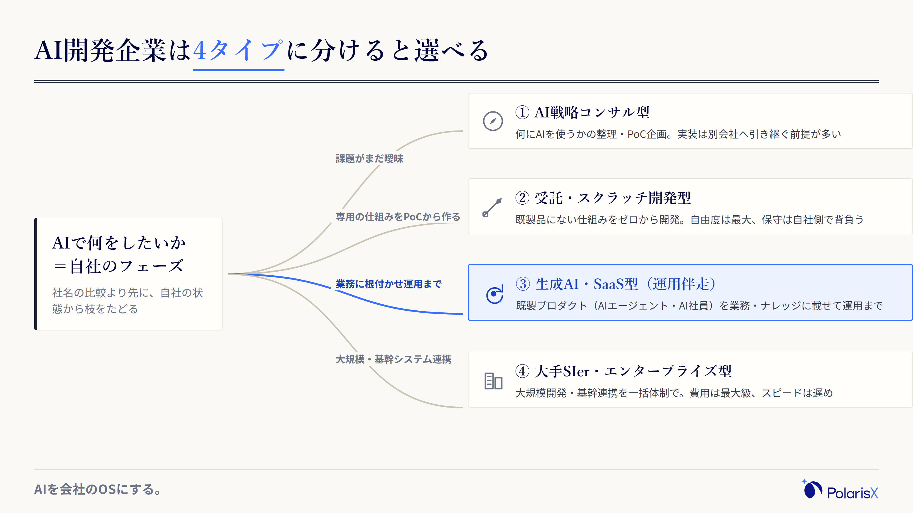
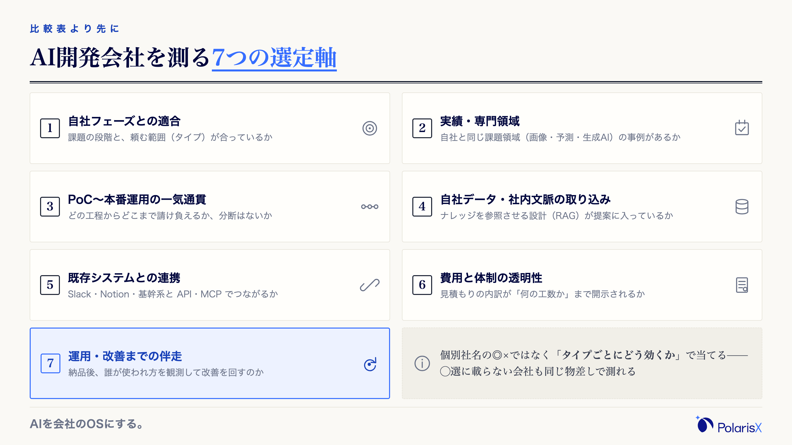
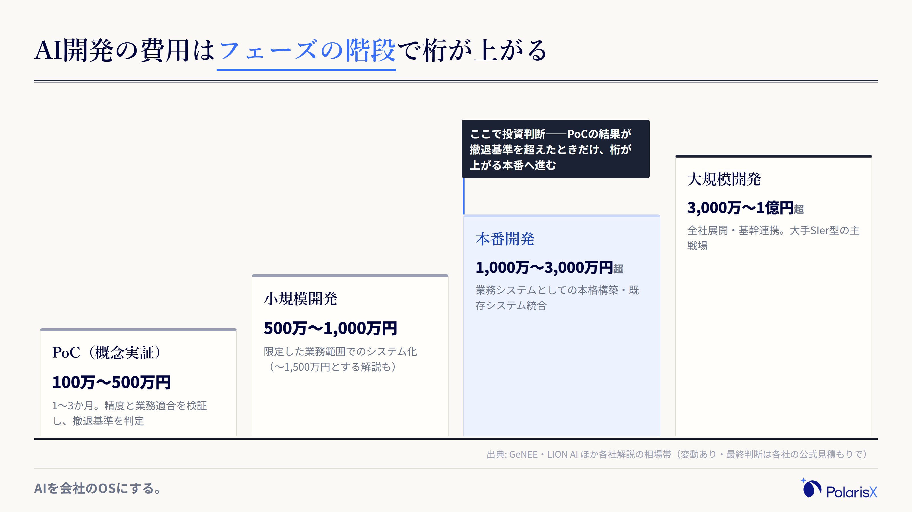
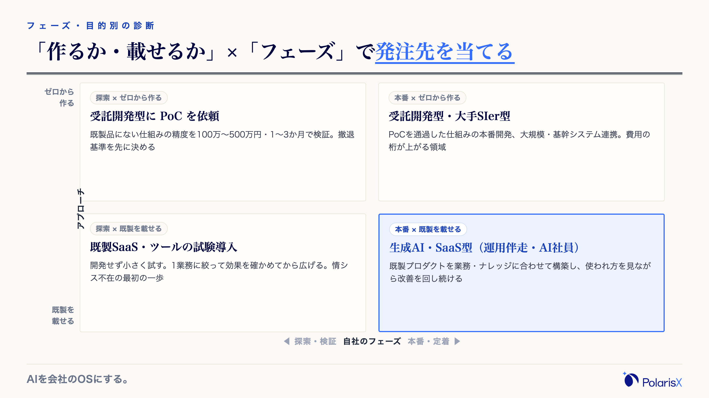
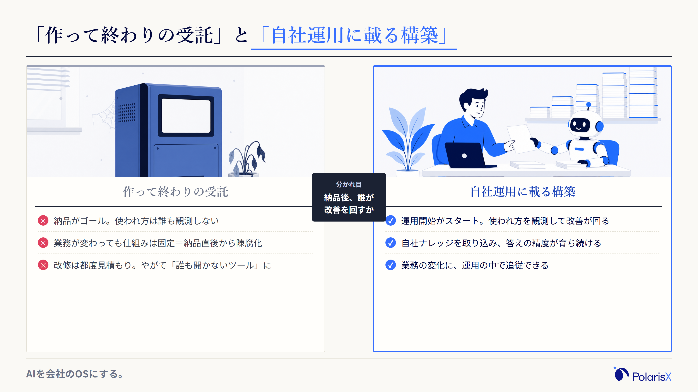
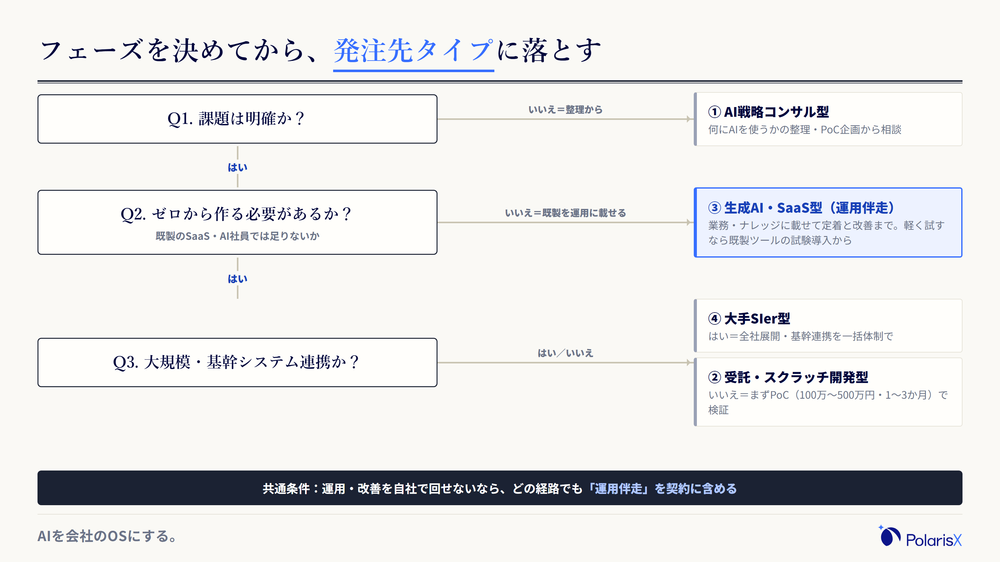

AI開発企業（AI開発会社）選びで最初に決めるべきは、「どの会社に頼むか」ではなく「どのタイプの発注先に頼むか」です。「AI開発会社おすすめ◯選」の記事は、載っている会社の顔ぶれも分類も記事ごとにバラバラで、読み込むほど決められなくなります。しかも見積もりは数百万〜数千万円。その妥当性を判断する物差しを、初めて発注する会社は社内に持っていません。この記事は、乱立する分類を実務で使える発注先4タイプに正規化し、選定軸とフェーズ別の費用相場、そして◯選記事には出てこない「作って終わりの受託」を避ける見極めまでを、1本の選定フローに落とし込みます。

**見積もりを取る前に、自社について決める3つ**

1. **いま、どのフェーズにいるか** — 課題がまだ曖昧なのか、PoC（概念実証）で精度を確かめたい段階なのか、本番運用まで作り切る段階なのか。フェーズが決まると、頼むべき発注先タイプはほぼ決まります。
2. **ゼロから「作る」のか、既製のSaaS・AI社員を「運用に載せる」のか** — スクラッチ開発だけがAI開発ではありません。既製プロダクトを自社の業務・ナレッジに合わせて構築するだけで足りるケースは、想像以上に多くあります。
3. **納品されて終わりでよいか、運用・改善まで伴走してもらうか** — AI開発の失敗の多くは、技術ではなく「納品後」に起きます。ここを決めていないと、比較表のどの列を見るべきかも定まりません。

**執筆**: PolarisX 編集部（AI活用の実務者チーム）— 法人向けAIエージェントの開発を手がけ、複数部門で約20のAIエージェントからなるAI社員組織を自社運用するメンバーが執筆しています。

## AI開発企業とは — 発注先を「4タイプ」で地図にする

AI開発企業（AI開発会社）とは、AIを使ったシステム・サービスの企画・要件定義から、データ整備、モデルやアプリケーションの開発、既存システムとの統合、納品後の運用・保守までを請け負う会社の総称です。ただし、この全部を1社で担うわけではありません。戦略立案だけを支援する会社、開発工程だけを受託する会社、自社プロダクトの導入から運用伴走まで請け負う会社——依頼できる範囲は会社によって大きく違います。だからこそ、社名の比較より先に、発注先を〔AI戦略コンサル型／受託・スクラッチ開発型／生成AI・SaaS型／大手SIer型〕の4タイプに分けて地図にするのが近道です。解説記事ごとに3〜4タイプへ分類がバラつくのは粒度の違いにすぎず、「何を作るか」と「どこまで請け負うか」の2軸で見れば、実務ではこの4タイプに収れんします。

外部のAI開発企業に頼むメリットは明確で、AI人材を自前で採用・育成しなくても、企画からモデル開発・システム統合までを一気に進められることです。生成AIの技術は数か月単位で世代交代しており、その追従を専門家に任せられる価値は年々大きくなっています。一方で、どのタイプに頼むかを間違えると、金額の大小にかかわらず「高い勉強代」になります。まずは地図から見ていきます。

### 実務で使う4タイプ（戦略コンサル／受託開発／生成AI・SaaS／大手SIer）

- **①AI戦略コンサル型** — AI活用の戦略立案・課題の棚卸し・PoC企画を支援する型。「何にAIを使えばいいか」から相談したい企業に向きます。実装は別会社（または同じ会社の開発部門）へ引き継ぐ前提が多く、費用はコンサルティングフィー型。課題が固まっていない段階の最初の相談先です。
- **②受託・スクラッチ開発型** — 要件に合わせて機械学習モデルやAIシステムをゼロから開発する型。画像認識・需要予測・独自の生成AIアプリなど、既製品にない仕組みを作りたい場合に向きます。自社専用の資産を持てる一方、開発費の振れ幅は4タイプで最大で、完成後の保守・改修も自社側で背負う覚悟が要ります。
- **③生成AI・SaaS型（プロダクト提供＋運用伴走）** — 既製のAIプロダクト（RAG・AIエージェント・AI社員など）を自社の業務・ナレッジに合わせて構築し、運用まで伴走する型。ゼロから作らないぶん初期費用と期間を抑えやすく、「業務にAIを根付かせること」自体が目的の企業に向きます。なお総務省・経済産業省の「[AI事業者ガイドライン（第1.2版）](https://www.meti.go.jp/shingikai/mono_info_service/ai_shakai_jisso/20260331_report.html)」は、特定の目標を達成するために環境を感知し自律的に行動するAIシステムを「AIエージェント」と定義しており、この型の中心プロダクトになりつつあります。
- **④大手SIer・エンタープライズ型** — 基幹システムとの連携・大規模開発・全社展開を大人数の体制で束ねる型。要件定義から運用まで一括で任せられる安心感がある一方、費用は4タイプで最大級、意思決定と開発のスピードは相対的に遅くなりがちです。

### 「作って終わりの受託」と「自社運用に載る構築」の分かれ道

この4タイプの地図で見落とされやすいのが、②と③の間に走る線——「作って納品して終わり」か「自社の運用に載せて使い続ける」かの違いです。スクラッチ開発は自社専用の資産を持てる半面、納品された瞬間から陳腐化が始まります。業務の前提は変わり、AIモデルもツールも数か月単位で入れ替わるからです。一方、既製プロダクトを自社のナレッジに載せる構築は、独自性では譲るものの、提供側の改善が反映され続け、業務の変化にも運用の中で追従できます。どちらが正解かは目的次第ですが、この線を意識せず「開発力の高い会社はどこか」だけで比較すると、後述する「作って終わり」の失敗に入りやすくなります。

## AI開発会社の選び方 — 比較表より先に決める7つの選定軸

AI開発会社の選び方は、個別の会社に◯×を付ける前に、評価する「軸」を決めるほうが先です。実務で効く軸は7つ——(1)自社フェーズとの適合、(2)実績・専門領域、(3)PoCから本番運用までの一気通貫、(4)自社データ・社内文脈を取り込む前提か、(5)既存システムとの連携、(6)費用と体制の透明性、(7)運用・改善までの伴走。ポイントは、これらを「A社は◎、B社は△」ではなく「タイプごとにどう効くか」で見ることです。個別企業の体制・料金・得意領域は変動が激しく、固有名詞の比較表は公開直後から古くなります。軸をタイプに当てて見る習慣を付ければ、◯選記事に載っていない会社が候補に挙がっても、同じ物差しで評価できます。

1. **自社フェーズとの適合** — 課題が曖昧なら戦略コンサル型、既製品にない仕組みの検証なら受託開発型、業務への定着が目的なら生成AI・SaaS型、大規模・基幹連携なら大手SIer型が起点。フェーズと合わない発注は、会社の優劣以前に失敗します。
2. **実績・専門領域** — ひと口にAIといっても、画像認識・需要予測・自然言語処理・生成AI/LLMでは必要な技術も体制も別物です。自社の課題と同じ領域の実績を、事例ページと担当者の経歴で確認します。
3. **PoC〜本番運用の一気通貫** — PoCだけ、開発だけ、と工程が分断されると、引き継ぎのたびにコストと文脈が失われます。どの工程からどの工程まで請け負えるかを最初に確認します。
4. **自社データ・社内文脈を取り込む前提か** — AIの精度は、モデルの賢さ以上に「自社のデータ・ナレッジをどれだけ渡せるか」で決まる場面が多くあります。社内文書・過去のやり取りを参照させる設計（RAGなど）が提案に含まれるかを見ます。
5. **既存システムとの連携（API・MCP）** — Slack・Notion・基幹システムなど、いま使っているツールと接続できるか。連携できないAIは、使うための手作業が増えて定着しません。
6. **費用と体制の透明性** — 見積もりの内訳が「何の工数か」まで開示されるか、担当者は誰か。内訳のない一式見積もりは、後の増額・スコープ齟齬の火種です。
7. **運用・改善までの伴走** — 納品後、誰が使われ方を観測し、改善を回すのか。この欄が空白の提案が「作って終わり」の入り口です。

### 費用相場の見方 — フェーズ別の「幅」で捉える

AI開発の費用は、「いくらですか」に単一の答えを持ちません。開発会社各社の解説では、PoC（概念実証）100万〜500万円、小規模開発 500万〜1,000万円、本番開発 1,000万〜3,000万円以上、大規模開発 3,000万〜1億円以上という相場帯が示されています（[GeNEE](https://genee.jp/contents/recommended-ai-development-companies/)）。小〜中規模を500万〜1,500万円とする解説（[LION AI](https://www.lion-ai.co.jp/articles/ai-contract-development)）や、チャットボット200万〜500万円・需要予測300万〜1,500万円のように「作るものの種類別」に幅を示す解説（[Probel](https://probel.jp/promaga/b/1379/)）もあり、出典によって帯そのものがズレます。幅がこれほど広いのは、費用の主因がモデル開発とデータ準備の工数（＝人件費）で、自社のデータの状態と依頼範囲によって工数が大きく動くためです。相場帯は「見積もりの桁が妥当か」を判断する物差しとして使い、金額の確定は必ず複数社の公式見積もりを内訳まで比較して行ってください。

## 発注先4タイプ×選定軸の早見表と費用相場

発注先4タイプに選定軸を当てると、下の早見表になります。読み方は1つだけ——自社が重視する軸の列を縦に見て、強みが並ぶタイプに当たりを付ける。この表に個別の社名は載せていません。各社の体制・料金は変動が激しく、固有名詞で固定した瞬間から表が古くなるためです。タイプで当たりを付けたら、候補企業の一次情報（公式サイトの事例・体制・見積もり）で必ず裏を取ってください。費用の傾向は、前節の各社解説が示す相場帯をタイプ別に読み替えたものです。

| タイプ | 向くフェーズ・目的 | カスタムの自由度 | 自社文脈の取り込み | 運用伴走 | 費用の傾向 |
|---|---|---|---|---|---|
| ①AI戦略コンサル型 | 課題の整理・AI戦略の立案 | −（実装は別） | △（診断の範囲） | △（契約次第） | コンサルフィー型 |
| ②受託・スクラッチ開発型 | 既製品にない仕組みのPoC〜開発 | ◎ | ○（設計次第） | △（保守契約の範囲） | PoC 100万〜／本番1,000万円超の幅 |
| ③生成AI・SaaS型（運用伴走） | 業務への定着・継続運用 | ○（プロダクト＋個社設定） | ◎（ナレッジ接続が前提） | ◎ | 初期を抑えた月額型が中心 |
| ④大手SIer型 | 大規模開発・基幹システム連携 | ◎ | ○ | ○（大規模契約前提） | 4タイプで最大級 |

早見表で注目してほしいのは、「カスタムの自由度」と「運用伴走」が両立しにくいことです。自由度の高いスクラッチ開発ほど、納品後の運用は自社（または追加の保守契約）に委ねられ、運用伴走を標準に組み込むのは既製プロダクトを持つ型になります。どちらを取るかが、まさに冒頭の判断軸3（納品されて終わりでよいか）です。

## 自社に合う発注先の診断 — フェーズ・目的別にタイプを当てる

「うちはどこに頼めばいいのか」への答えは、会社のランキングではなく「条件→タイプ」の対応で決まります。目安はこうです。何にAIを使うかから相談したいなら**AI戦略コンサル型**。作りたいものが明確で、既製品にない仕組みをPoCから検証したいなら**受託・スクラッチ開発型**。業務にAIを根付かせ、社内ナレッジを活かして運用まで回したいなら**生成AI・SaaS型（運用伴走）**。基幹システムと連携する大規模開発なら**大手SIer型**。そしてもう1つ、その手前の分岐として「そもそも開発が必要か」があります。既製のAIツールをそのまま導入して足りる業務なら、開発会社に頼むより導入・活用の設計に進むほうが早くて安く済みます。

この地図で言えば、私たちPolarisXは③生成AI・SaaS型に位置する会社です。司令塔AI社員「Polaris AI」を顧客企業の業務・ナレッジに合わせて構築し、運用まで伴走します。だからこそ断っておくと、③がつねに正解ではありません。独自のアルゴリズムが競争力の核になる事業なら②で作り込むべきですし、全社基幹連携なら④の体制が必要です。大事なのは、自社の条件から逆算してタイプを選ぶことです。

### 中小企業・情シス不在なら「小さく検証して運用に載せる」から

従業員30〜100名で専任の情シスがいない会社が、最初の発注でいきなり数千万円のスクラッチ開発に踏み切るのは、勝率の低い賭けです。この規模の会社では、開発したシステムを保守・改善し続ける人員を確保しにくく、「作り込みの自由度」より「運用のしやすさ」が投資対効果を左右します。現実的な進め方は、(1)課題が明確ならPoC（100万〜500万円・1〜3か月が目安）で精度と業務適合を検証する、(2)既製のSaaS・AI社員を1業務に絞って運用に載せ、手応えを確かめてから広げる——のどちらかから始めることです。内製か外注かの判断も同じ軸で決まります。分岐は「AI人材を採用できるか」ではなく「作った後、運用を回せる体制を社内に維持できるか」。維持できないなら、内製でも外注スクラッチでも結末は同じで、運用伴走を含む形の発注が安全です。

## 「作って終わり」で失敗しない — 比較表に出ない発注の落とし穴

AI開発の発注でいちばん多い失敗は、「悪い会社を選んでしまった」ではありません。「まっとうな会社に作ってもらったのに、現場で使われないまま陳腐化した」です。私たちPolarisXは、法人向けAIエージェントの開発と社内ナレッジベースの構築を事業とする——つまりこの記事の地図では発注を「受ける側」の会社です。同時に、複数部門で約20のAIエージェントからなるAI社員組織を自社でも運用しています。作る側と運用する側の両方を日常的にやっている立場から、比較表には出てこない落とし穴を3つ挙げます。

1. **スクラッチで作り込むほど、陳腐化が速い** — 開発に半年〜1年かけるあいだに、業務の前提もAIモデルの世代も変わります。納品時にはすでに「発注時点の業務」に最適化された仕組みになっていることがある。私たち自身、自社のAIエージェントを運用する中で、数か月前の設計が現在のモデル性能では過剰な作り込みになっていた、という経験を繰り返しています。作り込みは「変化に追従する仕組み」とセットでないと資産になりません。
2. **「納品して終わり」の開発は、現場で使われない** — AIの仕組みは、納品された瞬間がゴールではなくスタートです。誰も使われ方を観測せず、改善を回す人もいなければ、数か月で「存在は知られているが誰も開かないツール」になります。発注段階で「納品後、誰が・何を見て・どう改善するか」に具体的に答えられない提案は、金額が安くても選ばないほうが安全です。
3. **自社データ・社内文脈を渡さないと、精度が出ない** — どれほど高性能なモデルでも、自社の業務ルール・過去のやり取り・ナレッジを参照できなければ一般論しか答えられません。「AIに渡せる社内データがどこに・どんな状態であるか」を発注前に確認しておくことが、開発会社の見積もり精度も、完成後の回答精度も左右します。

私たちが現場で使う見極めを1つ挙げます。**初回の提案が数千万円のスクラッチ開発一択で、PoCでの検証や納品後の運用改善の話が出てこないなら、それは「作って終わり」のサインです**。逆に、金額が大きくても、フェーズを刻み、各フェーズの撤退基準——どんな結果なら次へ進まないか——を先に示してくる会社は、発注側のリスクを設計に織り込んでいます。この1点を確認するだけで、発注の失敗確率は大きく下がります。

### 発注前に自社で準備する3点（目的・データ・意思決定）

発注前の準備は、開発会社の選定と同じくらい結果を左右します。開発会社側の解説でも共通して挙がるのは次の3点です（[GeNEE](https://genee.jp/contents/recommended-ai-development-companies/)）。(1)**目的とKPIの整理**——「AIで何を・どれだけ改善したいか」を測定可能な形にする。ここが曖昧だと、PoCの成否すら判定できません。(2)**データ状況の確認**——AIに学習・参照させるデータの量・種類・形式、欠損の有無。データが散在・未整備なら、その整備自体を依頼範囲に含めるかを先に決めます。(3)**意思決定フローの整理**——責任者は誰か、どの結果が出たら本番投資を承認するのか。この3点を1枚にまとめて相談に行くだけで、見積もりの精度と提案の質は目に見えて変わります。

「作って終わり」にしたくない——業務・ナレッジに載せて運用まで回す形の構築を検討している場合は、AI社員組織を自社運用しながら顧客のAI社員構築を手がけるPolarisXにもご相談いただけます（[contact@polarisx.ltd](mailto:contact@polarisx.ltd)）。発注先タイプの整理からで構いません。

## 選定フロー｜フェーズを決めてから発注する

最後に、ここまでの判断を1本の選定フローに落とします。**(1)課題は明確か**——曖昧なら、AI戦略コンサル型（または導入支援サービス）に課題の整理から相談します。**(2)既製のSaaS・AIプロダクトで足りないか**——足りるなら開発は不要で、既製ツールの導入・活用設計に進むほうが早く安い。業務への定着まで求めるなら生成AI・SaaS型（運用伴走）が受け皿です。**(3)ゼロから作る必要があるか**——独自のモデル・仕組みが競争力になるなら受託開発型にPoCから、基幹連携の大規模開発なら大手SIer型に。**(4)納品後の運用・改善は誰が回すか**——自社で回せないなら、どのタイプを選ぶ場合でも運用伴走を契約に含めます。この順で辿れば、◯選記事を開かなくても自社の発注先タイプに行き着きます。

発注の進め方の全体像も添えておきます。目的・KPIの整理 → データ状況の確認 → 発注先タイプの決定と複数社への相談 → PoC（1〜3か月・精度と業務適合の検証）→ 本番構築 → 運用・改善、という流れが標準形です。PoCを飛ばして本番投資へ進むと、相場の桁が1つ上がる段階で検証なしのリスクを取ることになります。急がば回れ、が費用面でも成立する領域です。

## よくある質問

**Q. AI開発の費用相場はいくらですか？**
開発会社各社の解説では、PoC 100万〜500万円、小規模開発 500万〜1,000万円（〜1,500万円とする解説もあります）、本番開発 1,000万〜3,000万円以上、大規模開発 3,000万〜1億円以上という幅が示されています。作るものの種類・データの状態・依頼範囲で大きく変動するため、単一の相場額では判断せず、複数社の見積もりを「何の工数か」の内訳まで比較してください。

**Q. 中小企業はどのタイプのAI開発会社に頼めばいいですか？**
課題がまだ曖昧ならAI戦略コンサル型か導入支援に相談し、目的が明確なら「ゼロから作るか、既製を運用に載せるか」で分けます。従業員30〜100名で情シスが不在なら、いきなりのスクラッチ開発は避け、PoCで小さく検証するか、既製のSaaS・AI社員を1業務に絞って運用に載せる形から始めるのが安全です。運用を回す人員を確保しにくい規模ほど、運用伴走を含む発注が向きます。

**Q. AI開発の外注でよくある失敗は何ですか？**
代表的なのは、(1)納品されたのに現場で使われない、(2)スクラッチの作り込みが業務やモデルの変化で陳腐化する、(3)自社データを渡せず精度が出ない、の3つです。いずれも会社選びの巧拙より「納品後の運用を設計したか」で決まります。発注前に「誰が使われ方を見て、改善を回すか」への答えを用意し、提案側にも同じ問いを投げてください。

**Q. PoCから始めるべきですか？いきなり本番開発を頼んでもよいですか？**
原則はPoCからです。100万〜500万円・1〜3か月の検証で精度と業務適合を確かめ、「どんな結果なら本番へ進まないか」の撤退基準を先に決めておきます。例外は、既製プロダクトの導入で小さく試せる場合で、この場合はPoC自体が軽くなります。検証なしで数千万円規模の本番開発に進むのは、費用面で最もリスクの高い発注の仕方です。

**Q. 開発後の運用サポートは受けられますか？**
会社と契約によります。受託開発の保守契約は、バグ対応・稼働監視が中心で、「業務に定着させる」「使われ方を見て改善する」ところまでは含まれないことが多くあります。運用伴走を求めるなら、契約前に、サポートの範囲（技術保守か、活用改善までか）・体制・費用を確認してください。生成AI・SaaS型は運用伴走を標準に組み込んでいることが多い型です。

---

**発注先タイプの整理から相談したい方へ** — PolarisXは、司令塔AI社員「Polaris AI」の構築と社内ナレッジベースの整備を通じて、「自社運用に載るAI構築」を伴走する会社です。自社のフェーズ診断・渡せる社内データの見極めからご一緒します。まずは無料相談として [contact@polarisx.ltd](mailto:contact@polarisx.ltd) へ。サービスの考え方は [polarisx.ltd](https://polarisx.ltd/) をご覧ください。

### この記事について

PolarisX編集部（AI活用の実務者チーム）は、法人向けAIエージェントの開発と社内ナレッジベースの構築を手がけ、複数部門で約20のAIエージェントからなるAI社員組織を自社運用するメンバーで構成しています。本記事は、AI開発を「受ける側」と「自社で運用する側」の両方の現場から、発注先選びの判断基準をまとめました。内容のご指摘・ご相談は [contact@polarisx.ltd](mailto:contact@polarisx.ltd) へ。

## 参考文献

- [AI開発企業9選｜選び方・費用相場・依頼のポイントを企業向けに解説（GeNEE）](https://genee.jp/contents/recommended-ai-development-companies/) — フェーズ別の費用相場・依頼前に準備すべきこと
- [【2026年】AI受託開発会社おすすめ25選！費用相場から選び方まで（LION AI）](https://www.lion-ai.co.jp/articles/ai-contract-development) — 費用相場と費用を左右する要因（開発・データ準備の工数）
- [AI受託開発会社おすすめ16社をプロが厳選！費用や技術力を徹底比較（Probel）](https://probel.jp/promaga/b/1379/) — 種類別の費用相場・選定の確認ポイント
- [AI事業者ガイドライン（第1.2版）（総務省・経済産業省、2026年）](https://www.meti.go.jp/shingikai/mono_info_service/ai_shakai_jisso/20260331_report.html) — AIエージェントの定義
- 個別のAI開発企業の体制・料金は変動します。本文の相場帯は各社解説記事の目安であり、最終判断は各社の公式見積もりでご確認ください。
