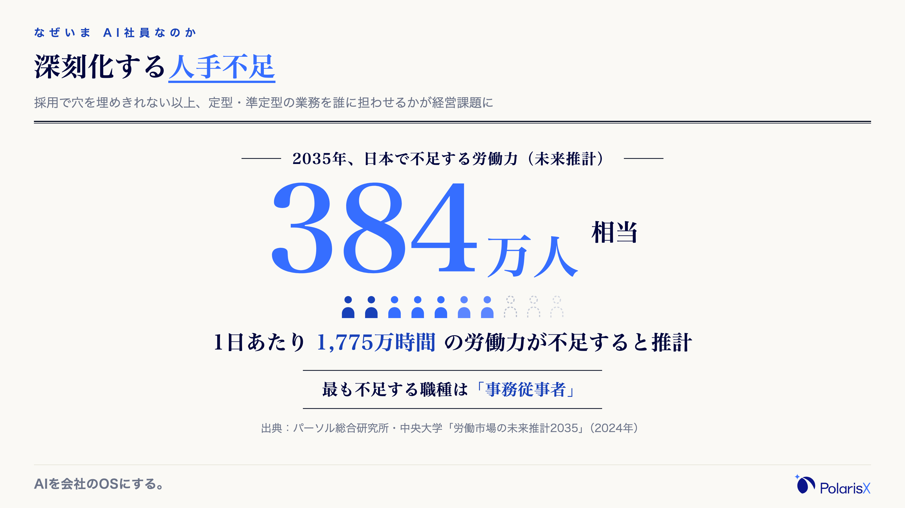
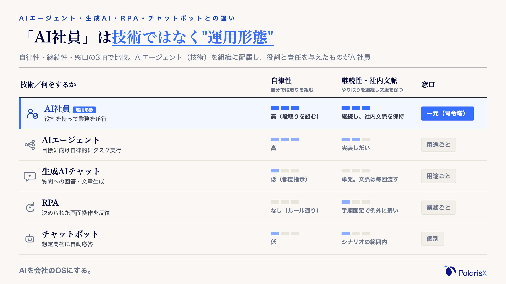
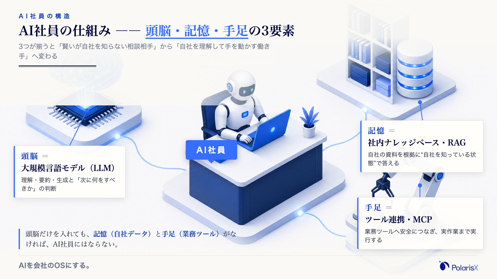
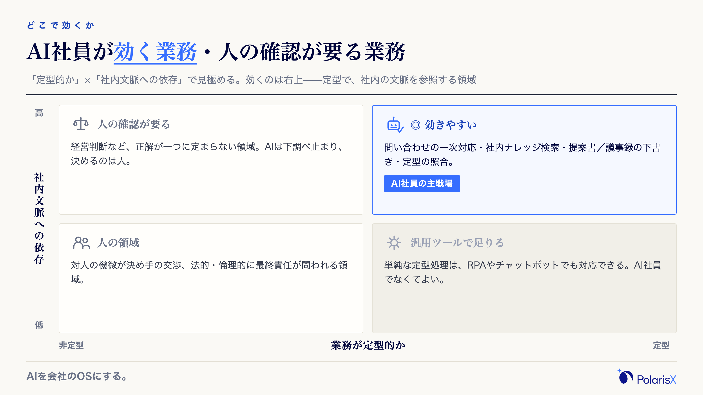
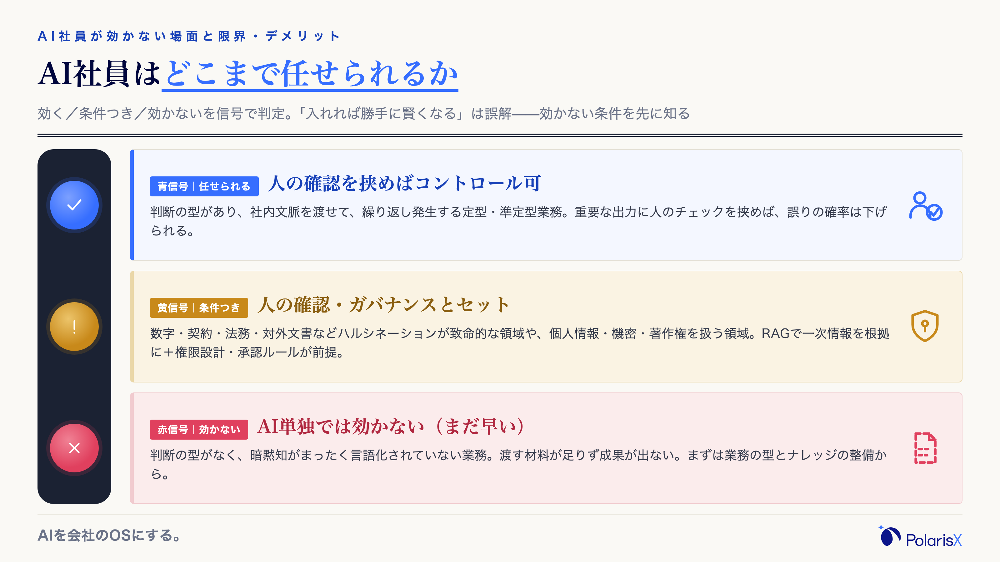
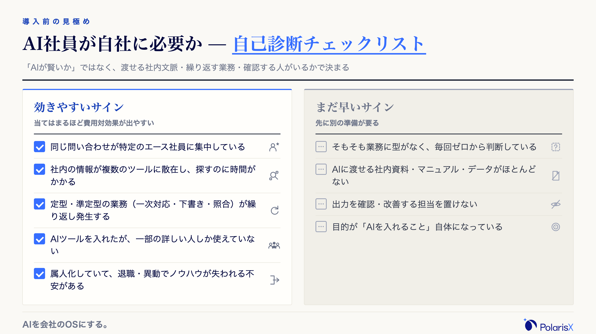

AI社員とは、実在の組織に配属され、社内の文脈を理解したうえで継続的に業務を担うAIのことです。人が新しいメンバーを採用して自社に配属するのと同じように、AIに役割と責任を割り当て、自社を"知っている状態"で働かせる——それがAI社員の考え方です。

この言葉が誤解されやすいのは、実態がさまざまなまま広まったからです。チャットボットやRPAの言い換えのこともあれば、「業務ごとに専用ツールを何体も月額で採用する」というサービス形態を指すことも、「一人社長がAIだけで仮想の組織をつくる」という文脈で語られることもあります。「デジタル従業員」「AI従業員」「デジタルワーカー」も同じものを指す呼び名として使われます。どれも"AI社員"と名乗りますが、期待できる成果も向いている会社も違います。まずは定義を揃えましょう。

> **一言でいうと**：AI社員とは、採用して自社に配属し、社内の文脈を覚えさせたうえで継続的に働かせるAIです。単発で質問に答えるツールではなく、役割と責任を割り当てて運用する「働き手」を指します。
>
> **AI社員をめぐる3つの誤解**
> 1. チャットボットやRPAの言い換えにすぎない — 実際は「自分で段取りを組む・継続する・改善する」かどうかで別物です。
> 2. 業務ごとに専用ツールを何体も"採用"すること — 窓口が増えるほど、現場はかえって使いこなせなくなります。
> 3. 一人社長が仮想の組織をつくるデモと同じもの — 実在の組織に配属し、既存の人と分担してこそ成果につながります。

**執筆**: PolarisX 編集部（AI活用の実務者チーム）— AI社員「Polaris AI」の開発と、自社のAI社員組織（3部門・約20のAIエージェント）の運用に携わるメンバーが執筆しています。

## AI社員とは — 実在の組織に配属され、社内文脈を理解して継続的に働くAI

AI社員とは、実在の組織に配属され、社内の文脈を理解したうえで継続的に業務を担うAIを指します。特徴は3つです。第一に、汎用の生成AIと違って"自社を知っている"状態で動くこと。第二に、単発の応答で終わらず、同じ役割を継続して受け持ち、やり取りを通じて精度を上げていくこと。第三に、利用者が多くのツールを覚える必要がなく、一つの窓口（司令塔）に頼めば、裏側で必要な処理が組み立てられること。つまりAI社員とは特定の製品名ではなく、AIに組織上の役割と責任を持たせた"運用のかたち"を指す言葉です。だからこそ「どんなAIを使うか」より「どう配属し、どう運用するか」が価値を決めます。

### なぜいま注目されるのか

背景には、深刻化する人手不足と、生成AIが"会話"から"業務遂行"へと進んだフェーズ転換があります。パーソル総合研究所と中央大学の「労働市場の未来推計2035」によれば、2035年には1日あたり1,775万時間（384万人相当）の労働力が不足し、最も不足するのは「事務従事者」だと推計されています（[パーソル総合研究所](https://rc.persol-group.co.jp/news/202410171000.html)）。採用で穴を埋めきれない以上、定型・準定型の業務をどう担わせるかが経営課題になりました。この変化は制度の側にも表れています。総務省・経済産業省の「AI事業者ガイドライン」は2026年3月の第1.2版で、目的を与えると自律的にタスクを連鎖実行するAIシステムを「AIエージェント」として新たに定義し、複数のAIエージェントが連携して動く「エージェンティックAI」という関連概念にも触れました（[AI事業者ガイドライン](https://www.meti.go.jp/shingikai/mono_info_service/ai_shakai_jisso/20260331_report.html)）。生成AIは「質問に答える」段階から「ツールを操作して仕事を進める」段階へ進み、AIに"社員のように"役割を持たせる発想が現実味を帯びています。

## AIエージェント・生成AI・RPA・チャットボットとの違い

AI社員と混同されやすいのが、AIエージェント・生成AIチャット・RPA・チャットボットです。違いの軸は「自分で段取りを組むか（自律性）」「継続して社内文脈を保つか」「窓口が一つか」の3つです。生成AIチャットは都度指示が要り、文脈は毎回渡す必要があります。RPAは決められた画面操作を反復するだけで例外に弱く、チャットボットは想定問答の範囲でしか答えられません。AIエージェントは自律的にタスクを実行する"技術概念"で、AI社員はそれを組織に配属し役割と責任を与えた"運用形態"——ここが最大の違いです。整理すると次の表になります。

| | 何をするか | 自律性 | 継続性・社内文脈 | 窓口 |
|---|---|---|---|---|
| AI社員 | 役割を持って業務を遂行 | 高（自分で段取りを組む） | 継続し、社内文脈を保持 | 一元（司令塔に頼む） |
| AIエージェント | 目標に向け自律的にタスク実行 | 高 | 実装しだい | 用途ごと |
| 生成AIチャット | 質問への回答・文章生成 | 低（都度指示） | 単発。文脈は毎回渡す | 用途ごと |
| RPA | 決められた画面操作を反復 | なし（ルール通り） | 手順固定で例外に弱い | 業務ごと |
| チャットボット | 想定問答に自動応答 | 低 | シナリオの範囲内 | 個別 |

### AIエージェントとの違い（技術概念 vs 運用形態）

AIエージェントは「AIが自律的に計画を立て、ツールを使ってタスクを遂行する」技術上の仕組みを指す言葉です。一方、AI社員はその仕組みを"実在の組織に配属し、営業・経理といった役割と責任を割り当てて運用する"ことを指します。同じ技術でも、誰の業務を、どこまで、どんな責任分界で任せるかを決めて初めてAI社員になります。逆に言えば、優れたAIエージェント技術を導入しても、役割と運用が設計されていなければ、それは"高機能なツール"のままで、社員のようには機能しません。

### 生成AI・チャットボット・RPAとの違い

生成AIチャット（ChatGPTなど汎用ツール）は賢い相談相手ですが、自社を知らないため使うたびに背景をコピペで教える必要があります。RPAは決まった手順を正確に反復できても判断や例外処理はできず、チャットボットは用意した問答の範囲でしか答えられません。これらが「決められたことを、都度・部分的に」担うのに対し、AI社員は「役割の範囲を、自律判断しながら継続的に」担い、やり取りを通じて改善していく点が異なります。

### 「1体=1業務を何体も雇う型」と「司令塔一人窓口型」の違い

ここがPolarisXの考えるAI社員の核心です。市場には「1体＝1業務のデジタルワーカーを、業務ごとに何体も月額で採用する」タイプのサービスが多くあります（「デジタル従業員」「AI従業員」もこの文脈の呼び名です）。しかしこの形は、現場から見ると窓口が増えるだけで、「どのAIに何を頼むか」を人間が覚え直すことになりがちです。私たちが提唱するのは、利用者は司令塔となるAI社員一人に普段の言葉で話しかけるだけで、裏側で必要な専門AI社員が自律的に呼び出されて仕事を進める「司令塔一人窓口型」です。この"裏側で複数の専門AIが連携する"構図は、前述の「AI事業者ガイドライン」第1.2版が「エージェンティックAI」という概念で触れた、複数のAIエージェントが連携して動く方向性とも重なります。窓口を一元化することで、AIに詳しくない現場のメンバーでも成果を出せる状態をつくる——これが私たちPolarisXの司令塔AI社員「Polaris AI」の立ち位置です。

## AI社員の仕組み — 頭脳・記憶・手足

AI社員は「頭脳・記憶・手足」の3要素で成り立ちます。頭脳は判断や文章生成を担う大規模言語モデル、記憶は自社の情報を参照する社内ナレッジベース、手足は実際に作業を行うツール連携です。この3つが揃うと、AIは「賢いが自社を知らない相談相手」から「自社を理解して手を動かす働き手」へ変わります。逆に言えば、頭脳（モデル）だけを導入しても、記憶（自社データへの接続）と手足（業務ツールへの接続）がなければ、AI社員としては機能しません。導入の成否は、この3要素をどう自社に接続するかで決まります。

### 頭脳＝大規模言語モデル（ChatGPT／Claude／Gemini を使い分け）

頭脳にあたるのが、ChatGPT・Claude・Geminiに代表される大規模言語モデル（LLM）です。文章の理解・要約・生成や、次に何をすべきかの判断を担います。モデルごとに得意分野やコストが異なるため、特定の1モデルに固定せず用途で使い分けられる設計が柔軟です。ただしモデルは"汎用的に賢い"だけで、そのままでは自社のことを何も知りません。だからこそ次の「記憶」が要になります。

### 記憶＝社内ナレッジベース・RAG（"自社を知っている状態"を作る）

記憶にあたるのが、社内の情報とAIをつなぐ社内ナレッジベースと、RAG（検索拡張生成）という技術です。RAGは、質問に応じて社内の資料やデータから関連情報を検索し、それを根拠にAIが回答する仕組みで、これによりAIは"自社を知っている状態"で答えられるようになります。Notion・Slack・Google Drive・社内データベースなど、情報のある場所と接続しておけば、利用者が背景をコピペで渡さなくても、AIが必要な情報を自ら取りに行きます。<!-- 将来内部リンク: /blogs/knowledge-management-tools（社内ナレッジ・RAGの深掘り） -->

### 手足＝ツール連携・MCP（Slack／Notion／Google Drive等へ接続）

手足にあたるのが、業務ツールとの連携です。近年はMCP（Model Context Protocol）のような標準的な接続の仕組みが整い、SlackやNotion、Google Driveへ安全につないで「議事録をまとめる」「資料の下書きを作る」といった実作業までAIが担えるようになりました。頭脳で判断し、記憶で自社文脈を参照し、手足で実行する——この一連が回って初めて、AI社員は"任せられる"存在になります。<!-- 将来内部リンク: /blogs/multi-ai-agent, /blogs/ai-agent-chatgpt -->

## AI社員はどこで効くか — 向く業務・向く企業

AI社員が効くのは、「判断の型がある程度決まっていて、社内の文脈を参照する必要があり、繰り返し発生する」業務です。具体的には、営業の下調べや提案書のたたき作成、問い合わせ・ヘルプデスクの一次対応、経理・人事などバックオフィスの定型処理、そして「あの資料どこ？」に代表される社内ナレッジ検索が典型例です。逆に、正解が一つに定まらない経営判断や、対人の機微が決め手になる交渉、法的・倫理的に最終責任が問われる領域は、AI単独ではなく人の確認とセットにすべき領域です。効く業務を見極めることが、費用対効果を左右します。

### 効きやすい業務（営業・CS・バックオフィス・社内ナレッジ検索）

効きやすいのは、質問が集中して属人化しやすい領域です。ヘルプデスクや社内問い合わせは過去の対応やマニュアルを参照して一次対応を任せやすく、営業では提案書や議事録の下書き、バックオフィスでは申請内容の整理や定型の照合が向きます。特に「社内の誰かの頭の中にしかない情報」を探す時間は多くの企業で見えないコストになっており、ここをAI社員が肩代わりすると効果が体感されやすいのが実感です。

規模の大きい会社では、こうした業務にAIを当てた効果が数字で公表されています。パナソニック コネクトは、社内文脈を参照する自社向けAIアシスタント「ConnectAI」を全社（約11,600名）へ展開し、導入から1年（2023年6月〜2024年5月）で社員の労働時間を約18.6万時間削減したと公表しています（[パナソニック コネクト](https://news.panasonic.com/jp/press/jn240625-1)）。ここで自社に移植できるのは"1万人規模"ではなく、「社内の情報をAIに参照させ、定型業務にかかる時間を削る」という型のほうです。従業員30〜100名でも、同じ型を問い合わせ対応やバックオフィスに当てれば、規模に応じた時間が返ってきます。<!-- 将来内部リンク: /blogs/ai-helpdesk（問い合わせ自動化）, /blogs/ai-agent-x-operation（自社運用の実録） -->

### 向いている企業の条件（従業員30〜100名・情シス不在・属人化・エース依存）

向いているのは、従業員30〜100名規模で、専任の情シス部門がなく、業務が属人化し、特定のエース社員に問い合わせが集中している企業です。この規模帯は、大企業のように大規模なシステム投資はできない一方、人手不足と属人化の痛みが最も鋭く出ます。「エース社員が辞めたら回らない」「新人の立ち上がりに時間がかかる」「AIを入れたのに一部の人しか使っていない」——こうした課題を抱える会社ほど、社内文脈を保持し窓口を一元化するAI社員の効果が出やすい傾向があります。

## AI社員が効かない場面と限界・デメリット

AI社員は万能ではありません。主な限界は3つです。第一に、事実に基づかない回答を生成するハルシネーション（もっともらしい誤り）があり、最終的な正誤判断が必要な領域では人の確認が欠かせません。第二に、個人情報・機密・著作権の扱いや、AIの出力に対する責任の所在といったガバナンスの設計が必要です。第三に、そもそも判断の型がなく、暗黙知がまったく言語化されていない業務では、AIに渡す材料が足りず成果が出ません。これらを踏まえずに「入れれば勝手に賢くなる」と期待すると、投資が無駄になります。効かない条件を先に知ることが、失敗を避ける近道です。

### ハルシネーション・品質のばらつき（人の確認が要る領域）

ハルシネーションとは、生成AIが事実に基づかない情報をもっともらしく出力してしまう現象です。仕組み上ゼロにはできず、AIが生成した誤情報を確認せずに社外文書へ使ってしまう事故は国内外で報告されています。RAGで自社の一次情報を根拠にさせたり、重要な出力に人のチェックを挟めば確率は下げられますが、「数字・契約・法務・対外文書」など誤りが致命的になる領域では、AI単独で完結させない運用が前提です。品質のばらつきも同様で、同じ問いでも渡す文脈と指示の精度で出力が変わるため、"任せる範囲"と"確認する範囲"を業務ごとに線引きしておく必要があります。

### セキュリティ・責任の所在・法的リスク（個人情報／著作権／ガイドライン）

業務データを扱う以上、個人情報保護・機密管理・著作権、そしてAIの出力に対する責任の所在を整理しておく必要があります。国内では総務省・経済産業省が「AI事業者ガイドライン」（2026年3月に第1.2版へ改定）を公表しており、AIを利用する事業者にも、十分なAIリテラシーの確保やセキュリティ対策、そして"AIに任せきりにしない"人間中心の考え方といった留意事項が示されています（[AI事業者ガイドライン](https://www.meti.go.jp/shingikai/mono_info_service/ai_shakai_jisso/20260331_report.html)）。導入時は、誰がどのデータにアクセスできるかの権限設計と、出力を誰が確認・承認するかの運用ルールを、業務ごとに決めておくことが欠かせません。<!-- 将来内部リンク: /blogs/ai-agent-security（セキュリティ深掘り） -->

### 現場でよく見る「誤った期待」

私たちPolarisX自身が、マーケティング・財務・営業の3部門・約20のAIエージェントからなるAI社員組織を自社で運用しています。その現場で繰り返し見るのが、「AIを配属しさえすれば成果が出る」という誤った期待です。実際にうまくいかない典型は、(1) 参照させる社内ナレッジが整っておらず、AIが根拠なく答えてしまう、(2) 窓口や役割の分担があいまいで、誰も使わなくなる、(3) 出力を確認・改善する人がおらず、精度が上がらない——の3つに集約されます。私たちが使う見極めはシンプルで、**導入から1か月たっても「AIに聞くより自分でやったほうが早い」と現場が言うなら、それは失敗のサインです**。原因はたいていAIの賢さではなく、ナレッジ整備・役割設計・運用体制のいずれかにあります。

## 導入前の見極め — 自社に必要かの自己診断チェックリスト

AI社員が自社に必要かは、症状で見極められます。まずは次のチェックリストで、自社がどちら側かを確認してください。効く条件と効かない条件は表裏で、当てはまる項目が多いほど費用対効果が出やすくなります。ここで見るべきは「AIが賢いか」ではなく、「渡せる社内文脈があるか」「任せる業務が繰り返し起きるか」「出力を確認・改善する人がいるか」です。逆に、業務がその場限りで型がなく、渡せるナレッジもない段階なら、AI社員より先にやるべきことがあります。

**AI社員が効きやすいサイン（当てはまるほど向く）**

- 同じ問い合わせが特定のエース社員に集中している
- 社内の情報が複数のツールに散在し、探すのに時間がかかる
- 定型・準定型の業務（一次対応・下書き・照合）が繰り返し発生する
- AIツールを入れたが、一部の詳しい人しか使えていない
- 属人化していて、退職・異動でノウハウが失われる不安がある

**まだ早いサイン（先に別の準備が要る）**

- そもそも業務に型がなく、毎回ゼロから判断している
- AIに渡せる社内資料・マニュアル・データがほとんどない
- 出力を確認・改善する担当を置けない
- 目的が「AIを入れること」自体になっている

### 費用の考え方（TCOで見る）

費用は「ツールの月額」だけで判断すると読み違えます。総保有コスト（TCO）は、①AI・ライセンス費、②社内ナレッジの整備費、③権限設計・セキュリティ、④運用・監視の4レイヤーで構成されます。公表されている料金プランやベンダーの見積もりを見ると、月額数万円台から始められるSaaS型と、初期数十万〜数百万円規模で業務に合わせて作り込むカスタム開発型に大きく分かれますが、いずれの場合も②〜④は別に見込む必要があります。重要なのは、ツール費用の内側に隠れる②〜④を見落とさないことです。安いSaaSでも、ナレッジ整備と運用体制がなければ成果は出ず、結局"使われないライセンス費"になります。

### 次の一歩

見極めの結果に応じて、進み方は分かれます。比較して選びたいなら、AI社員はサービス形態が幅広いため、選定軸の整理が先です（比較記事を準備中）。自分たちで小さく試したいなら、まず1業務・1窓口から始めるのが現実的です（作り方記事を準備中）。**自社に合うか相談したいなら、AI社員組織を自社で運用する私たちPolarisXに、まずは無料相談としてお問い合わせください（[contact@polarisx.ltd](mailto:contact@polarisx.ltd)）。「効く業務があるか」「渡せるナレッジがあるか」の診断からご一緒します。**<!-- 将来内部リンク: /blogs/ai-agent-comparison（比較）, /blogs/ai-agent-diy（作り方）, /blogs/ai-consulting, /blogs/sme-ai-efficiency（導入相談） -->

## 用語の要点

- **AI社員とは**、実在の組織に配属され、社内文脈を理解して継続的に業務を担うAI。単発のツールではなく「役割と責任を持たせた運用のかたち」を指す。
- **違いの軸は3つ**：自分で段取りを組むか（自律性）／社内文脈を保つか（継続性）／窓口が一つか。AIエージェントは技術、AI社員はそれを配属した運用形態。
- **効くかは症状で決まる**：属人化・問い合わせ集中・ナレッジ散在があれば向く。渡せるナレッジと確認体制がなければ、まだ早い。

## よくある質問

**Q. AI社員とAIエージェントの違いは何ですか？**
AIエージェントは「AIが自律的に計画を立ててタスクを遂行する」技術概念、AI社員はその技術を実在の組織に配属し、役割と責任を与えて運用する形態を指します。同じ技術でも、業務・責任分界・運用を設計して初めてAI社員になります。技術を入れただけでは"高機能なツール"にとどまります。

**Q. AI社員の導入にはどのくらい費用がかかりますか？**
大きく、月額数万円台から始められるSaaS型と、初期数十万〜数百万円規模のカスタム開発型に分かれます。ただし費用はツールの月額だけでなく、ナレッジ整備・権限設計・運用監視まで含めた総保有コスト（TCO）で見る必要があります。安いツールでも、整備と運用がなければ成果は出ません。

**Q. AI社員を導入すると人間の仕事はなくなりますか？**
基本は「置き換え」ではなく「肩代わりと底上げ」です。効くのは定型・準定型の繰り返し業務で、経営判断や対人交渉、最終責任が問われる領域は人が担い続けます。実際の運用では、AIが下調べや下書きを担い、人が確認・意思決定に集中する分担が現実的です。

**Q. AI社員の責任の所在や法的リスク（個人情報・著作権）はどうなりますか？**
AIの出力の最終責任は、導入・利用する企業側にあります。個人情報保護・機密管理・著作権への配慮が必要で、国内では総務省・経済産業省の「AI事業者ガイドライン」（第1.2版）に利用事業者の留意事項が示されています。誰がどのデータにアクセスし、誰が出力を承認するかを、業務ごとに決めておくことが前提です。

**Q. AI社員にはどんなデメリット・懸念点がありますか？**
主な懸念は、事実に基づかない回答を生むハルシネーション、セキュリティと責任の所在、そして"型のない業務・渡せるナレッジがない状態"では成果が出ないことです。重要な出力に人の確認を挟み、社内ナレッジを整え、運用体制を用意すれば、多くはコントロールできます。

**AI社員が自社に効くかを確かめる** — PolarisXは、AI社員「Polaris AI」の開発と自社AI社員組織の運用を手がける当事者として、「効く業務があるか」「渡せるナレッジがあるか」の見極めからご一緒します。まずは無料相談として [contact@polarisx.ltd](mailto:contact@polarisx.ltd) へご連絡ください。サービスの考え方は [polarisx.ltd](https://polarisx.ltd/) をご覧いただけます。

### この記事について

PolarisX編集部（AI活用の実務者チーム）は、司令塔AI社員「Polaris AI」の開発と、自社のAI社員組織（マーケティング・財務・営業の3部門・約20のAIエージェント）の運用実務に携わるメンバーで構成しています。本記事は、AI導入・社内ナレッジ整備・AIエージェント構築の現場で得た判断基準を、教科書的な定義解説に加えてまとめました。内容のご指摘・ご相談は [contact@polarisx.ltd](mailto:contact@polarisx.ltd) へ。

## 参考文献

- [労働市場の未来推計2035（パーソル総合研究所・中央大学、2024年）](https://rc.persol-group.co.jp/news/202410171000.html)
- [AI事業者ガイドライン（第1.2版）（総務省・経済産業省、2026年）](https://www.meti.go.jp/shingikai/mono_info_service/ai_shakai_jisso/20260331_report.html)
- [生成AI導入1年の実績と今後の活用構想（パナソニック コネクト、2024年）](https://news.panasonic.com/jp/press/jn240625-1)

<!--
image-director への図解指示（figure-patterns.md の型IDを使用・本文の参照名と完全一致させること）
アーキタイプ: A. 定義解説型。配色/フォント/brandbarは figure-patterns.md 共通デザインシステムに従う。ロゴは ../../../brand/PolarisX_wordmark.svg。サイズは本文図=1600×900@2x、cover=1200×630@2x。

- cover.png … シンプル明色。タイトル全文「AI社員とは？意味・違い・費用と中小企業の導入判断を解説」を手動改行で2〜3行。「AI社員」を .em（--accent #366EFF）。装飾・カテゴリチップ・タグラインは付けない。正本テンプレは ai-ready-data-platform/assets/cover.html を複製して文言差し替え。

- fig1-anatomy-brain-memory-hands.png（型ID: anatomy／構造・関係）… H2「AI社員の仕組み」。中心にAI社員、引き出し線で3パーツ: 【頭脳＝大規模言語モデル（ChatGPT/Claude/Gemini）】【記憶＝社内ナレッジベース・RAG＝"自社を知っている状態"】【手足＝ツール連携・MCP（Slack/Notion/Google Drive）】。1図1メッセージ、盛らない。

- fig2-matrix-fit.png（型ID: matrix／比較・位置づけ）… H2「どこで効くか」。4象限。横軸=業務が定型的か（左:非定型／右:定型）、縦軸=社内文脈への依存（下:低／上:高）。右上（定型×文脈依存・高）に「効きやすい：問い合わせ一次対応・社内ナレッジ検索・提案書/議事録の下書き・照合」。左上/左下(非定型)に「人の確認が要る：経営判断・対人交渉・最終責任が問われる領域」。効く領域を --accent、人の確認領域を --muted で。否定色は使いすぎない。

- fig3-checklist-self-diagnosis.png（型ID: checklist／文書・人）… H2「自己診断チェックリスト」。2カラムのカード。左「効きやすいサイン」（問い合わせがエースに集中／ナレッジが散在／定型業務が多い／一部の人しか使えていない／属人化）にチェックボックス。右「まだ早いサイン」（業務に型がない／渡せる資料がない／確認担当がいない／目的がAI導入自体）。左=--accent系、右=--muted系。

- fig4-bignumber-labor-shortage.png（型ID: bignumber／量・基準）… H2「AI社員とは」の"なぜいま"。主役の巨大数字「384万人相当／1日1,775万時間」＋一行「2035年の労働力不足（最も不足する職種＝事務従事者）」。出典キャプション「パーソル総合研究所『労働市場の未来推計2035』」を小さく。1数字1メッセージ。

型カテゴリ充足: anatomy(構造・関係)／matrix(比較・位置づけ)／checklist(文書・人)／bignumber(量・基準)＝4カテゴリ・型重複なし（seo-lint準拠）。
-->
