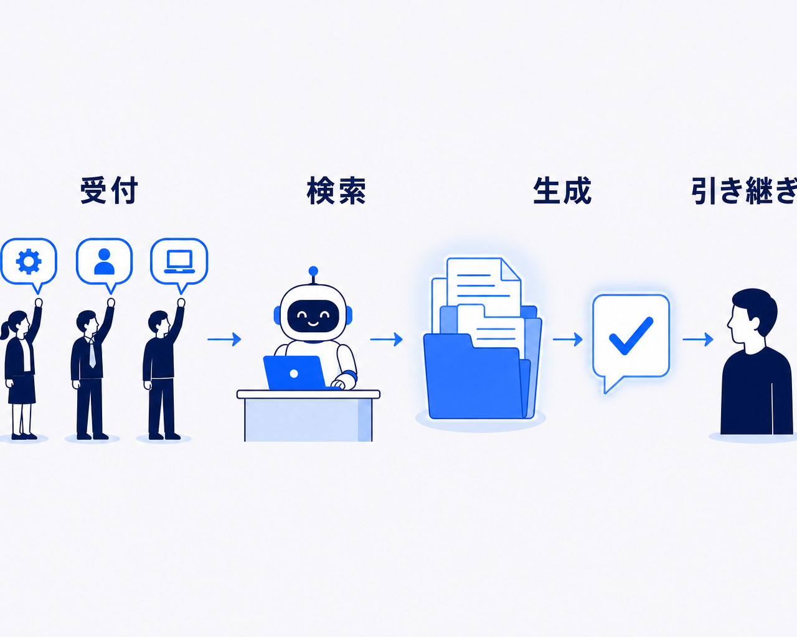
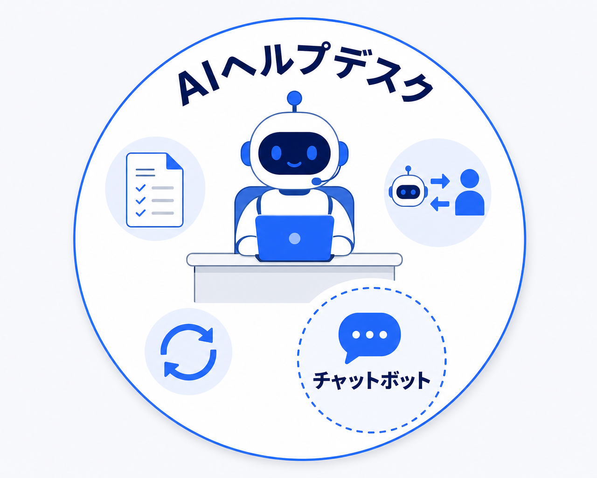
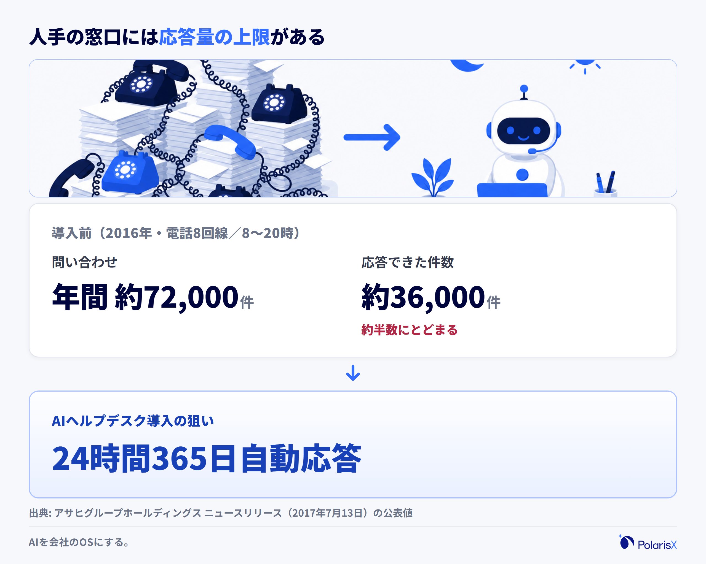
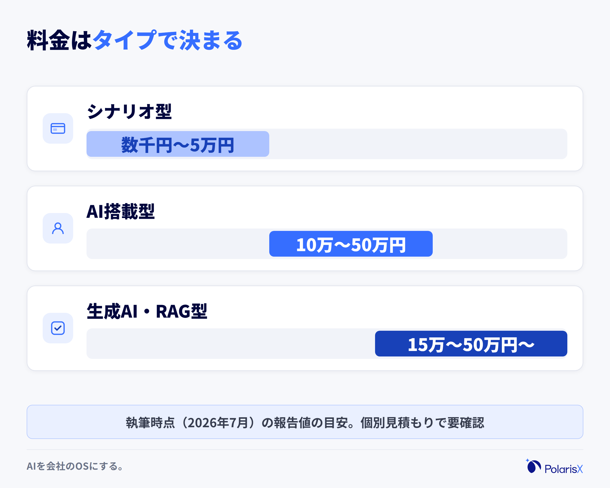
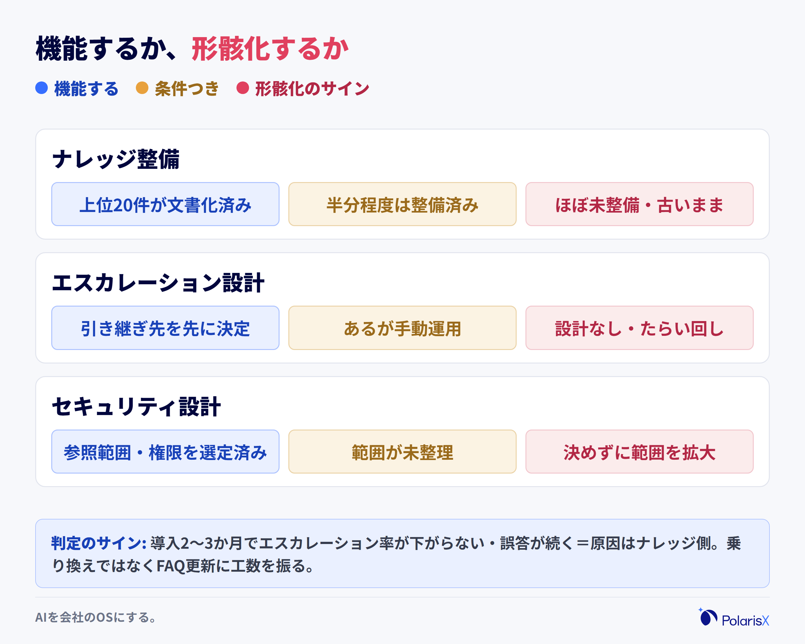
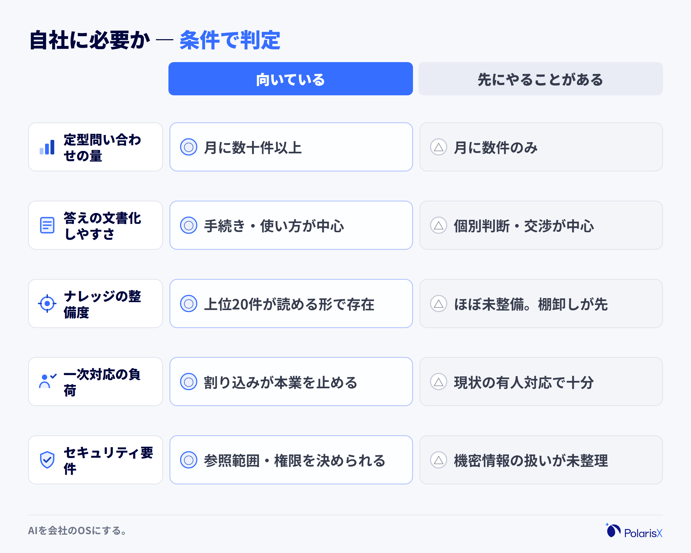

AIヘルプデスクとは、社内外からの問い合わせ対応の一次窓口をAIが担う仕組みのことです。従業員や顧客からの「パスワードを忘れた」「この手続きはどこに申請するのか」といった質問に、AIがFAQ・マニュアルなどの社内ナレッジをもとに自動で答え、答えきれないものだけを人へ引き継ぎます。

なお、この記事は「AIヘルプデスク」という仕組み・カテゴリ全体を扱う定義記事です。社内チャットボットやFAQボットといった個別チャネルの構築手順、具体的なツール・ベンダーの比較は、それぞれ別の記事に譲ります。

この言葉が分かりにくいのは、「チャットボット」や「FAQシステム」と重なって見えるからです。しかも検索で出てくる記事の多くはベンダーが書く「おすすめ◯選」で、仕組みの説明はそこそこに製品紹介へ進みます。その結果、「チャットボットと何が違うのか」「入れれば本当に問い合わせは減るのか」という肝心の疑問が残ったままになりがちです。そこでこの記事は、仕組み（RAG）・チャットボットとの違いと種類・効果・費用相場・効かない場面までを一続きで整理し、読み終わった時点で「自社に必要か」を自分で判断できる状態を目指します。

> **一言でいうと**：AIヘルプデスクとは、FAQ・マニュアルといった社内ナレッジをAIが参照し、問い合わせ対応の一次窓口を務める仕組みです。成否を分けるのはツールの性能よりも、「AIが参照するナレッジが整っているか」です。
>
> **先に正しておきたい誤解3つ**
> 1. **チャットボットを入れることと同じ** — チャットボットは、AIヘルプデスクを構成する部品の一つです。仕組み全体には、ナレッジの整備・有人への引き継ぎ・運用改善までが含まれます。
> 2. **導入すれば問い合わせがすぐゼロになる** — AIが担えるのは定型的・反復的な問い合わせの一次対応です。複雑な個別対応は人に残り、ゼロにはなりません。
> 3. **FAQやマニュアルがなくてもAIが何でも答えてくれる** — 生成AIは「参照できる情報」の範囲でしか正確に答えられません。ナレッジが未整備のままでは、誤答が増えるだけです。

**執筆**: PolarisX 編集部（AI活用の実務者チーム）— 社内ナレッジベースとRAGで接続する司令塔AI社員「Polaris AI」を開発し、自社でも3部門・約20のAIエージェントからなるAI社員組織を内製運用するメンバーが執筆しています。

## AIヘルプデスクとは — AIが問い合わせの一次対応を担う仕組み

AIヘルプデスクとは、社内外からの問い合わせに対して、AIが一次対応を自動で担う仕組みです。具体的には、①従業員・顧客からの質問を受け付ける ②FAQ・マニュアル・社内文書といったナレッジをAIが検索する ③見つけた情報を根拠に回答を生成して返す ④AIで解決できない質問は担当者へ引き継ぐ（エスカレーション）——という4つの動きで構成されます。対象になるのは、情報システム部門への社内問い合わせ（パスワード再設定・ツールの使い方）から、人事・総務への手続き確認、顧客からのカスタマーサポートまで幅広く、24時間365日対応できることと、回答が担当者個人に依存しないことが、人手のヘルプデスクとの大きな違いです。

### 仕組みの中核はRAG — 社内文書を「検索してから」答えるAI

多くのAIヘルプデスクの中核にあるのが、RAG（Retrieval-Augmented Generation：検索拡張生成）と呼ばれる仕組みです。RAGとは、生成AIが回答を作る前に、外部のナレッジ（社内文書・FAQ・マニュアル）を検索し、見つかった記述を根拠として回答を組み立てる技術で、原典は[Lewis らの2020年の論文](https://arxiv.org/abs/2005.11401)、平易な解説は[AWSの公式ドキュメント](https://aws.amazon.com/jp/what-is/retrieval-augmented-generation/)にあります。ChatGPTのような生成AIは、そのままでは自社の規程・手順・製品仕様を知りません。RAGを挟むことで「自社の文書に書いてあること」を根拠に答えられるようになり、根拠のない、もっともらしい誤答（ハルシネーション）を抑えられます。

従来のシナリオ型チャットボット（あらかじめ用意した分岐やQ&Aへの一致で答えるタイプ）との違いも、このナレッジ参照の有無にあります。シナリオ型は想定質問から外れると答えられませんが、RAG型は言い回しが違っても文書から該当箇所を探して答えられます。ここから、この記事全体を貫く重要な含意が導けます。**RAG型AIヘルプデスクの賢さは、AIモデルの性能よりも、参照できるナレッジの質と量で決まる**ということです（詳しくは後述の「効かない場面・限界」で扱います）。

### なぜいま需要が増えているのか

背景の一つは、ヘルプデスク業務の負荷が定量的に裏づけられてきたことです。キヤノンマーケティングジャパンが情報システム部門の担当者100名（従業員300〜1,000名未満の企業）を対象に実施した[2025年版の実態調査](https://prtimes.jp/main/html/rd/p/000001291.000013943.html)では、**77.0%が社内ヘルプデスク業務に課題を実感**（前年比12.2ポイント増）し、**74.0%がヘルプデスク業務を外部に委託している**（前年比28.6ポイント増）と報告されています。同調査では、効率化のために生成AIを活用・検討する担当者が約4人に1人いる一方、その約6割が「どのサービスが良いのかわからない」と答えたことも報告されており、関心と判断基準のギャップがうかがえます。

もう一つの背景は、生成AI・RAGの実用化で「言い換えに強い自動応答」が現実的な価格帯まで降りてきたことです。従業員数十名の会社では、専任の情シスがおらず、総務やITに詳しいメンバーが兼任で一次対応を担っているケースが多くあります。その割り込み対応が本来業務を止めているなら、規模の大小にかかわらず検討する意味のある仕組みになっています。

## AIヘルプデスクとチャットボットは何が違うのか — 混同されがちな概念の整理

AIヘルプデスクとチャットボットの関係は、「業務全体の仕組み」と「それを構成する自動応答ツール」の関係です。AIヘルプデスクは、問い合わせの受付からナレッジの参照・回答の生成・有人への引き継ぎ・回答ログをもとにしたナレッジの更新までを含む、問い合わせ対応業務の仕組み全体を指します。一方チャットボットは、その入口に置かれる自動応答の部品の一つで、チャット形式で質問に答える機能を担います。したがって実務での問いは「チャットボットかAIヘルプデスクか」の二者択一ではなく、「自動応答の部品だけを置くのか、引き継ぎと運用改善まで含む仕組みとして組むのか」です。部品だけを置いた導入が形骸化しやすい理由も、この差にあります。

なお、チャットボットという技術そのもの（種類・作り方・活用範囲）の深掘りは、ヘルプデスク文脈に限らない大きなテーマなので別記事に譲ります。

### タイプで分ける — 誰向けか × どの形式か

AIヘルプデスクは「誰の問い合わせに答えるか」と「どんな形式で答えるか」の2軸で整理すると選びやすくなります。

| 分類軸 | タイプ | 主な用途 |
|---|---|---|
| 誰向けか | **社内向け（従業員向け）** | 情シス・人事・総務への問い合わせ対応。SlackやTeamsに組み込む形が多い |
| 誰向けか | **社外向け（顧客向け）** | Webサイトのサポート窓口・カスタマーサポートの一次対応 |
| 形式 | FAQ検索特化型 | 整備済みFAQの検索・提示に強い。回答の正確性を重視する場面向き |
| 形式 | 会話型（チャットボット型） | チャットで対話的に答える。言い換えに強い生成AI型が主流に |
| 形式 | 音声対応型 | 電話の自動応答。コールセンター文脈で使われる |
| 形式 | 専門領域特化型 | 経理・労務・ITなど特定領域の規程や手続きに特化 |

最初の一巡目でおすすめしやすいのは、**社内向け×定型の多い領域**からのスモールスタートです。社外向け（顧客対応）は誤答の影響が売上・信頼に直結するため、社内で精度と運用の勘所をつかんでから広げるほうが安全です。各タイプの具体的な構築・選定は、それぞれの深掘り記事で扱います。

## 導入するとどんな効果があるか — 活用シーンと報告されている数字

AIヘルプデスクを導入した企業からは、大きく4種類の効果が報告されています。①定型問い合わせの一次対応が自動化され、担当者の対応件数・対応時間が減る ②24時間365日応答できるため、利用者の「解決までの待ち時間」が短くなる ③回答が文書ベースになり、担当者ごとの品質差がなくなる ④問い合わせログが蓄積され、FAQ・マニュアルの改善点が見えるようになる——の4つです。ただし効果の大きさは、問い合わせに占める定型的な質問の割合と、参照するナレッジの整備度で大きく変わります。「導入すれば一律◯%削減できる」という数字は存在しないため、公開事例の数字は「その会社の条件での報告値」として読むのが正確です。

### 公開されている事例 — アサヒグループHDの例（2017年）

早い時期の公開事例として、アサヒグループホールディングスは2017年7月、社内のOAヘルプデスク業務にAIを活用したシステムを導入すると[ニュースリリースで発表](https://www.asahigroup-holdings.com/newsroom/detail/20170713-0102.html)しています。発表によると、当時グループで使われていたシステム・ITツールは約300、関連する問い合わせは年間約72,000件にのぼる一方、電話8回線・オペレーター交代制（8時〜20時）での2016年の応答は半数の約36,000件にとどまっていました。AI導入の狙いは、24時間365日の自動応答による応答率の向上と、ヘルプデスク業務の効率化です。9年前の事例ですが、「人手の窓口は物理的に応答しきれる量に上限がある」「その上限をAIの一次対応で外す」という構図は、現在の生成AI型ヘルプデスクでもそのまま通用します。

近年もベンダー各社の導入事例ページでは、社内問い合わせの相当な割合をAIの一次対応で解決できた、有人対応の稼働を大きく減らせたといった報告が公開されています。ただしいずれも各社の問い合わせ構成・ナレッジ整備度という条件のうえでの報告値であり、削減率をそのまま自社に当てはめることはできません。見るべきは数字の大小よりも「どんな種類の問い合わせをAIに任せて、その数字に至ったか」です。

### 効果が出やすい問い合わせ・出にくい問い合わせ

効果が出やすいのは、**定型的・反復的で、答えを文書化できる問い合わせ**です。パスワード再設定、経費精算・勤怠の手続き、社内ツールの初歩的な使い方、製品の仕様・料金に関する定番の質問などが典型で、この種の質問は「同じ答えを何度も人が繰り返している」状態なので、AIの一次対応に置き換える効果がそのまま出ます。逆に効果が出にくいのは、個別の状況判断や交渉を伴う問い合わせ、感情面のケアが重要なクレーム対応、前例のない障害対応です。これらは最初から人が受ける設計にし、AIには「どこへ引き継ぐか」の交通整理だけを任せるほうが、利用者の体験を損ないません。

## AIヘルプデスクの費用相場【執筆時点の目安】

AIヘルプデスクの費用は、仕組みのタイプで水準が変わります。執筆時点（2026年7月）で複数の比較メディアが報告しているレンジを突き合わせると、シナリオ型は月額数千円〜5万円程度、AI搭載型（FAQ学習型）は月額10万〜50万円程度、生成AI・RAG型は月額15万〜50万円程度から——というのが一つの目安です。ただし料金は問い合わせ件数・利用人数・設置チャネル数・オプションで大きく動くため、「AIヘルプデスクの相場は◯円」という単一の答えは存在しません。見積もりで確認すべきは金額そのものよりも、「その金額に何が含まれ、何が含まれないか」、特にナレッジ整備の支援が範囲に入っているかどうかです。

### タイプ別の料金レンジ

| タイプ | 仕組み | 月額の報告レンジ（執筆時点の目安） |
|---|---|---|
| シナリオ型 | 事前に用意した分岐・一問一答で応答 | 数千円〜5万円程度 |
| AI搭載型（FAQ学習型） | 登録したFAQをAIが照合・検索して提示 | 10万〜50万円程度 |
| 生成AI・RAG型 | 社内文書を検索し、根拠つきで回答を生成 | 15万〜50万円程度から |

このレンジは、[NTT東日本のチャットボット費用解説](https://business.ntt-east.co.jp/content/cloudsolution/column-724.html)や[Tayoriの料金相場記事](https://tayori.com/blog/ai-chatbot-pricing/)など複数メディアの報告値を突き合わせた目安です。初期費用も無料〜100万円以上と幅が大きく、いずれも改定・条件で動くため、契約時は必ず個別見積もりで確認してください。

### 費用に影響する要因と、費用対効果の考え方

月額を動かす主な要因は、①問い合わせ件数・利用ユーザー数 ②有人チャット（オペレーター引き継ぎ）機能の有無 ③設置チャネル数（Webサイト・Slack・Teams・電話など）④生成AIの利用量に応じた従量課金 ⑤初期のFAQ整備・チューニング支援の有無——の5つです。特に生成AI・RAG型は、回答のたびにAIの処理コストがかかるため、問い合わせ量が多いほど従量部分が効いてきます。

費用対効果は「置き換えられる対応時間」で見積もるのが実務的です。たとえば月200件の定型問い合わせに1件平均10分かかっているなら、月約33時間の対応工数が置き換え候補です。その工数の人件費と、対応が翌営業日に持ち越されることによる業務の停滞まで含めて、月額と比べます。この計算で月額に届かないなら、導入を急ぐ段階ではありません。

## 導入しても効かない場面・限界 — ナレッジの整備度が成否を分ける

AIヘルプデスクが効かない場面には、はっきりした共通点があります。AIが参照するナレッジ（FAQ・マニュアル・社内文書）が「ない」「古い」「AIから読めない形になっている」ことです。RAGの仕組み上、AIは参照できた情報の範囲でしか正確に答えられません。ナレッジが未整備のまま導入すると、誤答や「分かりません」が増え、利用者がAIを信用しなくなって使われなくなり、結局もとの属人対応へ戻る——という形骸化をたどります。そしてこの失敗は、ツールを乗り換えても解決しません。原因がツール側ではなくナレッジ側にあるからです。この章では、限界が生まれる理由と、私たちが現場で使っている見極めの基準を示します。

### 回答精度は、ナレッジの質と量に依存する

生成AI・RAG型の回答品質は「検索で正しい文書が見つかるか」「その文書に正しい答えが書いてあるか」の2段階で決まります。つまり、FAQが少ない・マニュアルが数年前のまま・情報がスキャンPDFやスクリーンショット、個人のチャットログに散在している——という状態では、どれほど高性能なツールを入れても、検索の段階で答えの材料が見つかりません。また、参照できる根拠がないときに生成AIがもっともらしい誤答（ハルシネーション）を返すリスクは、ナレッジが薄いほど高まります。AIヘルプデスクの検討は、ツール選定の前に「AIが読めるテキストとして答えが存在するか」の確認から始まります。ナレッジを貯める・整える仕組みづくりそのものは、ナレッジマネジメントの記事で深掘りします。

### 現場でよく見る失敗と、私たちの見極め

私たちPolarisXは、司令塔AI社員「Polaris AI」を提供する側であると同時に、自社でも3部門・約20のAIエージェントに業務を任せ、社内ナレッジベースをその共有脳として運用しています。この運用で繰り返し確認しているのは、**AIの回答品質が目に見えて変わる瞬間は「モデルを替えたとき」ではなく「ナレッジを直したとき」だ**という事実です。エージェントが的外れな出力をしたときに原因をさかのぼると、行き着く先はほとんどの場合、参照先のドキュメントが古い・曖昧・そもそも書かれていない、のいずれかでした。

だから、導入前の見極めとして私たちが使う基準はシンプルです。「**候補ツールの比較表を眺める前に、よくある問い合わせ上位20件の答えが、AIから読めるテキストとしてすでに存在するかを数える**」。半分も存在しないなら、先にやるべきはツール選定ではなくナレッジの棚卸しです。

導入後の判定基準も先に決めておきましょう。導入から2〜3か月たっても、①有人への引き継ぎ（エスカレーション）率が下がらない ②同じ質問に対する誤答・的外れな回答が繰り返される——のであれば、それはツールの失敗ではなく、ナレッジ側が原因のサインです。このときの正しい打ち手は乗り換えの検討ではなく、問い合わせログを見てFAQを追記・更新することです。問い合わせが減らない原因の切り分けは、症状別の診断記事として別途詳しく扱います。

### エスカレーションとセキュリティは「最初に」決める

限界を踏まえた設計として、導入時に必ず決めておくべきことが2つあります。1つ目はエスカレーション設計です。AIに答えさせない領域（人事評価・懲戒・機密性の高い契約など）と、AIで解決しなかったときの引き継ぎ先・引き継ぎ方法を先に決めます。ここが曖昧だと、利用者は「AIに聞いても結局たらい回しになる」と感じ、利用が定着しません。2つ目はセキュリティです。個人情報・機密情報を含む文書をAIの参照範囲に入れるか、入れる場合は誰の質問にどこまで答えてよいか（権限に応じた参照範囲）、入力内容がAIの学習に使われない設定・契約になっているかを確認します。この2つは後から直すほど手戻りが大きいため、ツール選定の要件として最初から含めることをおすすめします。

## 実務での見極め — 自社に必要か、どこから始めるか

AIヘルプデスクが向いているのは、「同じ質問が繰り返し届いていて、その答えを文書化できる」組織です。見極めは、①問い合わせの量と内訳を把握する（月に何件・どんな内容か）②そのうち定型的な質問の割合を見る ③定型質問の答えになるナレッジの整備度を確認する——の3段階で行います。月に数十件以上の定型問い合わせがあり、FAQ・マニュアルがある程度存在するなら、効果が見込める段階です。逆に、問い合わせが少量で内容が毎回異なるなら、仕組みを作って維持する手間が効果を上回りやすいため、有人対応の改善や文書整備を先に進めるほうが合理的です。

### 向いている企業・部署／急がなくてよい企業

部署の単位で見ると、効果が出やすいのは情報システム・人事・総務・経理といった「社内から手続きの質問が集まる管理部門」と、定番の質問が多いカスタマーサポートです。会社の単位で見ると、従業員30〜100名で専任の情シスがいない会社は、実は有力な候補です。この規模では、ITに詳しいメンバーや総務が兼任で一次対応を担っており、割り込み対応が本来業務を止めているからです。一方で、問い合わせが月に数件しかない、内容のほとんどが個別判断を要する、そもそも答えを文書化する時間が取れない——という状態なら、導入を急ぐ必要はありません。その場合は、まず問い合わせの記録とFAQの文書化という「前工程」から始めるのが、遠回りに見えて確実です。

### 導入の一歩目は、FAQ・マニュアルの棚卸しから

ここまでの内容から、導入の初手はツール選定ではないことが分かります。順序は、①よくある問い合わせの上位20〜30件を洗い出す ②その答えをAIが読めるテキストとして整備・更新する ③対象範囲を絞って（たとえば社内のIT・総務の定型質問だけ）スモールスタートする ④問い合わせログを見てFAQを追記し、範囲を広げる——です。導入までの期間はナレッジの整備度でほぼ決まります。FAQが整っていればSaaS型ツールの設定自体は短期間で済みますが、整備から始める場合は棚卸しに相応の期間を見込んでください。なお、この具体的な進め方（各ステップの実務）は、別途手順記事として深掘り予定です。

もう一つ、視点として持っておきたいのは、**AIヘルプデスクのために整えたナレッジは、問い合わせ対応の専用資産ではない**ということです。AIが読める形に整えたFAQ・マニュアル・業務文書は、資料作成・引き継ぎ・オンボーディングなど、他の業務を担うAIの共有脳としてそのまま使い回せます。問い合わせ自動化を単発のツール導入で終わらせず、社内ナレッジ基盤への入口と位置づけると、投資の回収先が一気に広がります。私たちが「AI社員」と呼ぶ働き方——複数のAIエージェントが同じナレッジベースを参照して部門業務を分担する形——も、この延長線上にあります。

**「自社のナレッジは、AIヘルプデスクに耐えられる状態か」から確認したい方へ** — PolarisXは、社内ナレッジベースの構築と、それを参照して働く司令塔AI社員「Polaris AI」を提供しています。問い合わせ自動化を、ツール選定からではなくナレッジの棚卸しから一緒に設計します。無料相談は [contact@polarisx.ltd](mailto:contact@polarisx.ltd) へどうぞ。

## 用語の要点

- **AIヘルプデスク**：社内外からの問い合わせの一次対応をAIが担う仕組み。受付→ナレッジ検索（RAG）→回答生成→エスカレーションの流れで動き、チャットボットはこの仕組みを構成する部品の一つ。
- **費用相場（執筆時点の報告値）**：シナリオ型は月額数千円〜5万円程度、AI搭載型は月額10万〜50万円程度、生成AI・RAG型は月額15万〜50万円程度から。単一の相場はなく、金額より「ナレッジ整備支援まで含むか」で見る。
- **成否の分かれ目**：AIの回答精度は参照するナレッジの質と量で決まる。導入前に「よくある問い合わせ上位20件の答えがAIから読めるテキストで存在するか」を確認し、なければツール選定よりナレッジの棚卸しが先。

## よくある質問

**Q. AIヘルプデスクとは何ですか？どんな仕組みで動きますか？**
社内外からの問い合わせの一次対応をAIが担う仕組みです。従業員・顧客からの質問を受け付け、FAQ・マニュアルなどの社内ナレッジをAIが検索し（RAG）、見つけた根拠をもとに回答を生成し、解決できない質問だけを担当者へ引き継ぎます。24時間365日応答でき、回答が担当者個人に依存しない点が人手の窓口との違いです。

**Q. AIヘルプデスクとチャットボットは何が違いますか？**
チャットボットは自動応答を行うツール（部品）で、AIヘルプデスクはそれを含む問い合わせ対応業務全体の仕組みです。AIヘルプデスクには、チャットボットのような応答部品に加えて、参照するナレッジの整備、有人への引き継ぎ（エスカレーション）、問い合わせログをもとにした運用改善までが含まれます。部品だけを置いて仕組みを作らない導入は形骸化しやすくなります。

**Q. AIヘルプデスクを導入するとどんな効果がありますか？**
定型問い合わせの一次対応の自動化による対応工数の削減、24時間365日対応による解決までの時間短縮、回答品質の均一化、問い合わせログの蓄積によるFAQ改善——の4つが代表的です。効果の大きさは定型質問の割合とナレッジの整備度に依存し、公開事例の削減率は各社の条件下での報告値のため、そのまま自社に当てはめず「どんな質問をAIに任せたか」を読み取るのが実務的です。

**Q. AIヘルプデスクの費用相場はいくらですか？**
執筆時点（2026年7月）の複数メディアの報告値を突き合わせると、シナリオ型で月額数千円〜5万円程度、AI搭載型（FAQ学習型）で月額10万〜50万円程度、生成AI・RAG型で月額15万〜50万円程度からが目安です。問い合わせ件数・設置チャネル数・従量課金・初期のナレッジ整備支援の有無で大きく変わるため、複数社の見積もりで「金額に何が含まれるか」を比べてください。

**Q. AIヘルプデスク導入のデメリット・失敗パターンは何ですか？**
最大の失敗パターンは、FAQ・マニュアルが未整備のまま導入し、誤答や「分かりません」が続いて使われなくなる形骸化です。AIの回答精度は参照するナレッジの質と量に依存するため、ツールの乗り換えでは解決しません。ほかに、エスカレーション設計の欠如によるたらい回し、個人情報・機密情報の扱いを決めずに参照範囲を広げてしまうセキュリティ上の問題が典型的なつまずきです。

**Q. AIヘルプデスクはどんな企業・部署に向いていますか？**
同じ質問が繰り返し届き、答えを文書化できる組織に向いています。部署では情シス・人事・総務・経理などの管理部門とカスタマーサポート、会社の規模では専任情シスのいない従業員30〜100名の企業も有力な候補です。逆に問い合わせが少量で内容が毎回異なる場合は、まず問い合わせの記録とFAQの文書化から始めるほうが効果的です。

**問い合わせ対応の自動化を「自社に残る形」で進めたい方へ** — PolarisXは、①法人向けAIエージェントの開発 ②社内ナレッジベースの構築 ③AIコンサルティングサービスを提供する会社です。自社でも3部門・約20のAIエージェントを内製運用する当事者として、ナレッジの整備からAIヘルプデスクの定着までをご一緒します。ご相談は [contact@polarisx.ltd](mailto:contact@polarisx.ltd) へ。サービスの考え方は [polarisx.ltd](https://polarisx.ltd/) をご覧ください。

### この記事について

PolarisX編集部（AI活用の実務者チーム）は、司令塔AI社員「Polaris AI」の開発と、自社AI社員組織（3部門・約20のAIエージェント）の運用実務に携わるメンバーで構成しています。社内ナレッジベースをAIの共有脳として日々運用する立場から、本記事は教科書的な解説に「ナレッジの整備度が成否を分ける」という実務の判断基準を加えてまとめました。内容のご指摘・ご相談は [contact@polarisx.ltd](mailto:contact@polarisx.ltd) へ。

## 参考文献

- [「社内ヘルプデスク業務」の外部委託率が74%に急増 情報システム部門のヘルプデスク運用課題と生成AI活用の実態調査（キヤノンマーケティングジャパン株式会社・2025年）](https://prtimes.jp/main/html/rd/p/000001291.000013943.html)
- [社内のOAヘルプデスク業務に『AIヘルプデスク』導入（アサヒグループホールディングス ニュースルーム・2017年）](https://www.asahigroup-holdings.com/newsroom/detail/20170713-0102.html)
- [Retrieval-Augmented Generation for Knowledge-Intensive NLP Tasks（Lewis et al., 2020）](https://arxiv.org/abs/2005.11401)
- [RAG（検索拡張生成）とは何ですか？（AWS 公式ドキュメント）](https://aws.amazon.com/jp/what-is/retrieval-augmented-generation/)
- [チャットボットの費用はいくら？初期費用・月額料金の相場から費用対効果の算出方法まで徹底解説（NTT東日本）](https://business.ntt-east.co.jp/content/cloudsolution/column-724.html)
- [AIチャットボットの料金相場は？初期費用・月額費用・タイプ別比較を徹底解説【2026年版】（Tayori Blog・2026年）](https://tayori.com/blog/ai-chatbot-pricing/)

