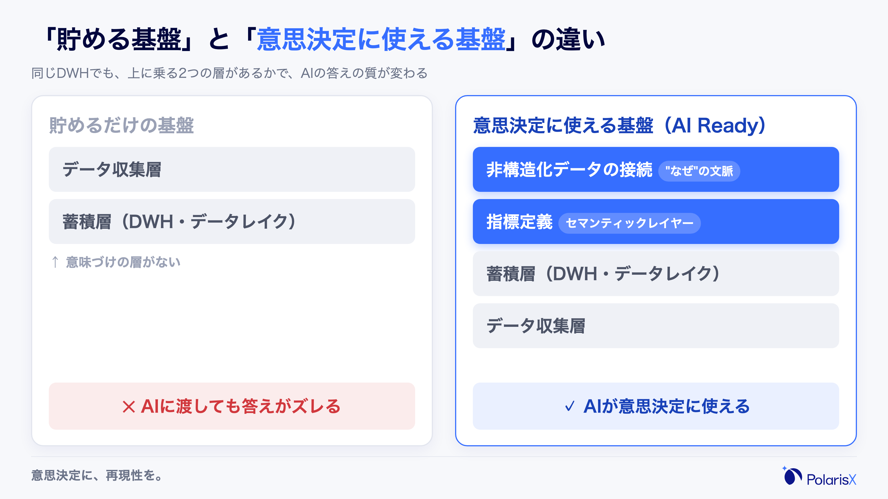
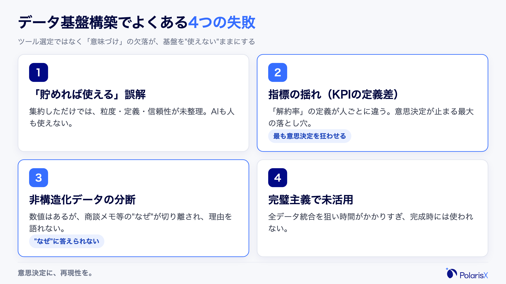
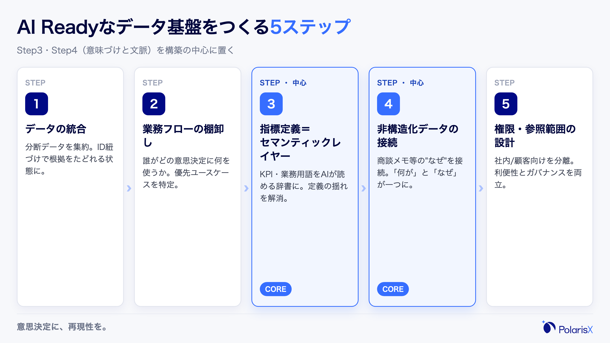
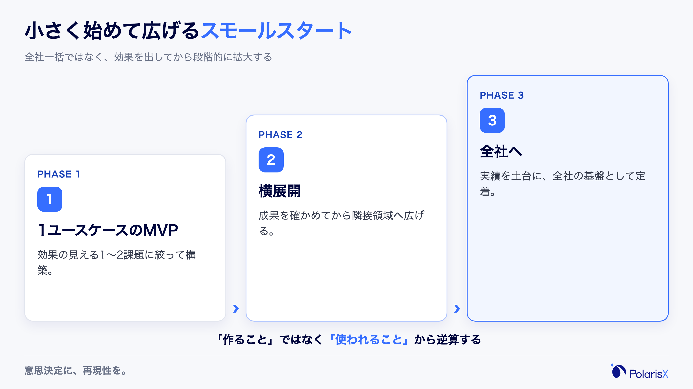
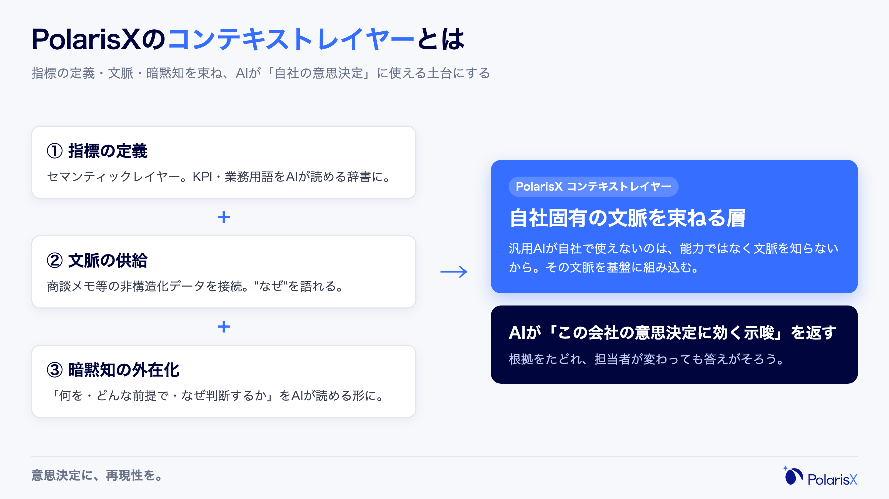

「BigQueryもDWHも入れた。データはちゃんと貯まっている。なのに、AIに分析させても意思決定に使える答えが返ってこない」——これは、データ基盤を整えたはずの成長企業で最もよく聞く声です。

結論から言えば、その原因の多くは基盤の「容量」や「ツール選定」ではありません。**「貯める基盤」を作っただけで、「意思決定に使える基盤」を作っていない**ことが原因です。本記事では、データ分析の当事者として数字で事業を動かしてきた視点から、AIが意思決定に使えるデータ基盤を構築する進め方を、失敗パターンと判断基準つきで5ステップに整理します。

> **この記事の要点（先に3つ）**
> - データ基盤構築のゴールは「データを貯める」ことではなく、**AIと人が意思決定に使える状態**にすること。
> - 失敗の大半は、ツールではなく**指標定義（セマンティックレイヤー）の欠落と、非構造化データの分断**が原因。
> - 最初から完璧を狙わず、**1〜2ユースケースで効果を出すスモールスタート**が成功の近道。

## データ基盤構築とは｜「AI Ready」が前提になった理由

### データ基盤・データ分析基盤・DWH／データレイクの違い

最初に用語を1段落で整理します。**データ基盤**は、社内に散らばるデータを集めて使える状態にする仕組みの総称です。その中で、**データレイク**は加工前の生データ（構造化・非構造化を問わず）をそのまま貯める場所、**DWH（データウェアハウス）**は分析しやすいように整えた構造化データの倉庫、**ETL／ELT**はデータを抽出・変換・格納する処理を指します。これらを束ねて「分析・意思決定に使えるように」整えたものが**データ分析基盤**です。つまり、データ基盤構築とは「ツールを並べること」ではなく、**集めたデータを判断に使える形に整える設計**そのものを指します。

### なぜ今「AI Readyなデータ基盤」なのか

ここ数年で前提が変わりました。これまでデータ基盤の出口は人間が読むダッシュボードでしたが、いまは生成AIや分析AIエージェントがデータを直接読み、集計し、示唆を出す時代になっています。

問題は、**人間なら文脈で補えていた曖昧さを、AIは補えない**点です。「アクティブユーザー」が部署によって違う定義で使われていても、ベテラン担当者なら「この会議でのアクティブはログイン基準だな」と察します。しかしAIは、定義が外在化されていなければ、もっともらしいけれど誤った数字を平然と返します。

だからこそ「AI Ready（AIが使える状態）」が、データ基盤構築の前提条件になりました。AI Readyとは、単にデータが大量にあることではなく、**データの意味・文脈・根拠がAIにも読める形で揃っている**状態を指します。ここが、これからのデータ基盤構築の分岐点です。

データドリブンな意思決定を組織に根づかせる全体像は、[データドリブン経営とは何か](/blogs/data-driven-management)の記事も併せてご覧ください。本記事はその「土台」にあたるデータ基盤づくりに焦点を当てます。

## データ基盤構築でよくある失敗パターン

解決策の前に、なぜ多くの企業が「基盤はあるのに使えない」状態に陥るのかを押さえます。数多くの現場を見てきたPolarisXの整理では、データ基盤構築の失敗は次の4つのパターンに集約されます。当事者視点で、特に意思決定に効くものに絞って解説します。

### 「貯めれば使える」という誤解

最も多いのが、データを集約しさえすれば分析できると考えてしまうケースです。実際には、集まったデータがどの粒度で、どの定義で、どこまで信頼できるかが整理されていないと、AIも人も使えません。**基盤の完成＝データが入った状態、ではない**ということです。

### 指標の定義が人によって違う（KPIの揺れ）

これは現場で最も意思決定を狂わせる落とし穴です。たとえば「解約率」一つとっても、「当月解約数 ÷ 月初契約数」なのか「直近12ヶ月の累積」なのか、無料トライアル解約を含むのか——定義が揃っていないと、同じ問いに対して人によって、ツールによって、別の数字が出ます。

筆者がアナリスト時代に経験したのは、経営会議で営業とマーケが「同じKPI」を別定義で持ち寄り、施策の良し悪しの議論が30分まるごと「どっちの数字が正しいか」に費やされた場面です。**指標の揺れは、分析の精度以前に、意思決定そのものを止めます。**そしてAIにこの状態のデータを渡せば、AIはどちらの定義かを知らないまま、自信ありげに片方の数字を返します。

### 数値データだけ／非構造化データが分断されている

DWHには売上・KPIなどの数値（構造化データ）はありますが、「なぜその数字になったか」を説明する情報——商談メモ、問い合わせ履歴、解約理由のフリーコメント、社内ドキュメント——は別のSaaSやスプレッドシートに散らばっています。これら**非構造化データが基盤から切り離されていると、AIは「何が起きたか」は言えても「なぜか」に答えられません**。意思決定に効く分析は、たいてい「なぜ」の側にあります。

### 計画先行で完璧を狙い、現場で使われない

全社の全データを完璧に統合してから運用開始、という設計は一見正しく見えますが、構築に時間がかかりすぎて、完成する頃には現場の関心が冷め、結局使われない基盤になりがちです。**「作ること」が目的化し、「使われること」を後回しにした**典型例です。

## AI Readyなデータ基盤を構築する5ステップ（進め方）

ここからが本題です。重要なのは、世の中の一般的な手順（収集→蓄積→加工→可視化）をなぞることではなく、**指標定義と非構造化データ接続を構築の中心に据える**ことです。AIが意思決定に使える基盤は、この順で作ります。

### Step1 信頼できる整備済みデータの統合

まず、プロダクトDB・CRM・問い合わせ履歴など分断されたデータを一箇所に集約します。ここでのポイントは「全部集める」ことではなく、**顧客ID・企業ID・契約IDの紐づけを設計し、回答の根拠をたどれる状態にする**ことです。AIが出した数字を「どのデータから来たか」追跡できなければ、意思決定では信用できません。最初の統合対象は、後述する優先ユースケースに必要なデータに絞ります。

### Step2 分析・意思決定フローの棚卸し

次に、技術ではなく業務から入ります。**誰が、どの意思決定のために、どのデータを、どう使っているか**を洗い出します。「週次の経営会議でこのKPIを見て予算配分を決めている」「カスタマーサクセスは解約予兆を見て介入している」——この棚卸しをせずに基盤を作ると、誰も使わない指標を量産します。ここで、最初に効果を出すべき1〜2のユースケースが見えてきます。

### Step3 KPI・業務用語の定義＝セマンティックレイヤー化

ここが本記事で最も強調したいステップです。**「アクティブユーザー」「解約率」「商談化」といった指標と業務ルールを、一元的に定義してAIが読める辞書にする**——これがセマンティックレイヤー（意味層）です。

セマンティックレイヤーでは、「メジャー（売上などの集計値）」と「ディメンション（顧客・製品などの切り口）」を事前に定義しておきます。指標の定義を一元管理しておくと、LLMがText2SQL（自然言語からのSQL生成）で集計するときの**定義の揺れやハルシネーション（もっともらしい誤答）を構造的に抑制できる**と説明されています。実際、dbt Labsが2026年に公開したベンチマークでは、同じ業務質問に対して、セマンティックレイヤー経由はText2SQL直接生成より正答率が高く（一例としてGPT-5.3 Codexで84.1%→100.0%、Claude Sonnet 4.6で90.0%→98.2%）、さらにText2SQLが「もっともらしい誤答」を黙って返すのに対し、セマンティックレイヤーは答えられない場合にエラーを返すという**失敗の仕方の違い**が報告されています。複数部門が同じ定義を参照するため、「同じ指標なのに数値が違う」問題が構造的に解消されます。

言い換えれば、セマンティックレイヤーは**人間の暗黙の前提を、AIが誤解しない形で外在化する作業**です。先ほどの「経営会議で30分が消えた」失敗は、このレイヤーがあれば起きません。

### Step4 構造化×非構造化データの接続

Step3で数値の意味が揃ったら、**DWHの数値に、商談メモ・問い合わせ履歴・社内ドキュメントといった非構造化データを文脈ごと接続**します。これにより、AIは「解約率が上がった」という事実に、「直近の問い合わせで料金改定への不満が増えていた」という理由を結びつけて説明できるようになります。「何が」と「なぜ」が一つの基盤でつながる——ここが、ただのDWHとAI Readyな基盤の決定的な差です。

### Step5 権限管理と参照範囲の設計

最後に、利便性とガバナンスを両立させます。社内向け／顧客向けで参照できるデータを分離し、機密情報がAIの回答に意図せず混ざらないよう参照範囲を制御します。**ここを後回しにすると、便利になるほどリスクが増す**という構造になるため、運用開始前に設計に組み込みます。

## 構築の費用・期間・内製と外注の判断基準

比較検討段階で必ず気になる、お金と体制の話です。

### 費用・期間の目安とスモールスタート

外部の解説では、データ基盤構築は規模によって**数百万円〜数千万円規模の初期費用**がかかるケースがあると説明されており、多くがクラウド活用による**スモールスタート**を推奨しています（出典は本文末尾。あくまで一般的な目安で、要件により変動します）。

重要なのは金額そのものより**始め方**です。全社一括ではなく、Step2で特定した1〜2のユースケース（例：解約予兆の説明、施策のKPI影響の可視化）に絞ったMVP（最小構成）から始め、そこで効果を出してから広げる。これが、前述の「完璧主義で未活用」を避ける唯一の現実解です。

参考までに、PolarisXの場合は初期導入（アセスメント＋コンテキストレイヤー構築＋導入設定）が**一括100万〜300万円**、運用・定義チューニングの月次伴走が**月20万〜80万円**を基本としています。DWH／DBがまだない企業向けのデータ基盤コンサルは別途のご相談です。

### 内製か外注か

判断基準はシンプルです。**データ専門人材を採用・維持できる体力があり、基盤を継続的に育てられる**なら内製が合います。一方、専門人材の人件費と立ち上げ〜運用の時間を考えると、外部の伴走を選ぶ企業が多いのが実情です。

外注を選ぶ場合に見るべきは「作って終わり」ではなく、**ナレッジが自社に残るか**です。セマンティックレイヤーや業務定義は、外部に依存したままだと担当者が変わった瞬間にブラックボックス化します。**伴走しながら定義と運用を自社の資産として残してくれるか**を、見積もりの安さ以上に重視してください。

## 「AIが意思決定に使える」基盤にするには（PolarisXの実務視点）

ここまでの5ステップを貫く一つの考え方が、PolarisXが「コンテキストレイヤー」と呼んでいるものです。

### コンテキストレイヤーという考え方

セマンティックレイヤー（指標の定義）と非構造化データ接続（文脈の供給）を組み合わせ、さらに**「この会社では何を、どういう前提で、なぜそう判断するか」という暗黙知まで含めてAIが読める形に外在化したもの**——これをコンテキストレイヤーと呼んでいます。

汎用的なAIが意思決定に使えないのは、能力が低いからではなく、**あなたの会社固有の文脈（コンテキスト）を知らないから**です。指標の定義、過去の判断の理由、現場のルール——これらを基盤に組み込んで初めて、AIは「それっぽい一般論」ではなく「この会社の意思決定に効く示唆」を返せるようになります。データ基盤構築の本当のゴールは、ここにあります。

### まとめ：データ基盤構築は「再現性のある意思決定」への投資

データ基盤構築は、ストレージの増設ではありません。**勘と経験に頼ってきた良い判断を、誰もが・何度でも再現できる仕組みに変えるための投資**です。そのために、

1. 「貯める基盤」で止めず「使える基盤」を目指す
2. 指標定義（セマンティックレイヤー）と非構造化データ接続を構築の中心に置く
3. 1ユースケースのスモールスタートで効果を出してから広げる

この3点を外さなければ、「AIを入れたのに効果が出ない」状態を越えられます。

PolarisXは、分析の当事者として数字で事業を動かしてきたチームが、AI Readyなデータ基盤の構築からコンテキストレイヤーの整備、AI分析の運用までを一気通貫で伴走します。「自社の基盤は本当にAIで使える状態か」を確かめたい方は、無料相談（30分）やホワイトペーパーをご用意しています。まずは [contact@polarisx.ltd](mailto:contact@polarisx.ltd) までお気軽にご連絡ください。現状のデータ基盤を一緒に棚卸しするところから始められます。

---

### 出典・参考

- AI-Readyなデータ基盤の定義・構成: Reckoner「AI-Readyとは？」／ZEAL「AI-Ready Dataとは？」／CTC「どう築く？『AI-Ready』なデータ基盤」
- 構築手順（5ステップ型の一般的な型）: データビズラボ「データ分析基盤とは？」／クリエイティブホープ「データ基盤とは？」
- 失敗事例の参考（4分類はPolarisXの実務上の整理）: GENIEE「AI READYなデータ基盤導入で失敗する企業の共通パターン」／Hakky「データ基盤構築の失敗事例」
- セマンティックレイヤー（指標定義・ハルシネーション抑止）: NTTデータ「LLM×Text2SQL×セマンティックレイヤー」／Qubio「セマンティックレイヤーとは」
- セマンティックレイヤー経由とText2SQL直接生成の正答率比較ベンチマーク: dbt Labs「Semantic Layer vs. Text-to-SQL: 2026 Benchmark Update」（docs.getdbt.com/blog/semantic-layer-vs-text-to-sql-2026）
- 費用・期間・スモールスタート: Hakky「データ基盤構築の費用」／クリエイティブホープ「データ基盤構築の費用」
- PolarisXの価格・サービス内容は自社情報に基づきます。費用・期間の外部目安は一般的な参考値で、要件により変動します。
