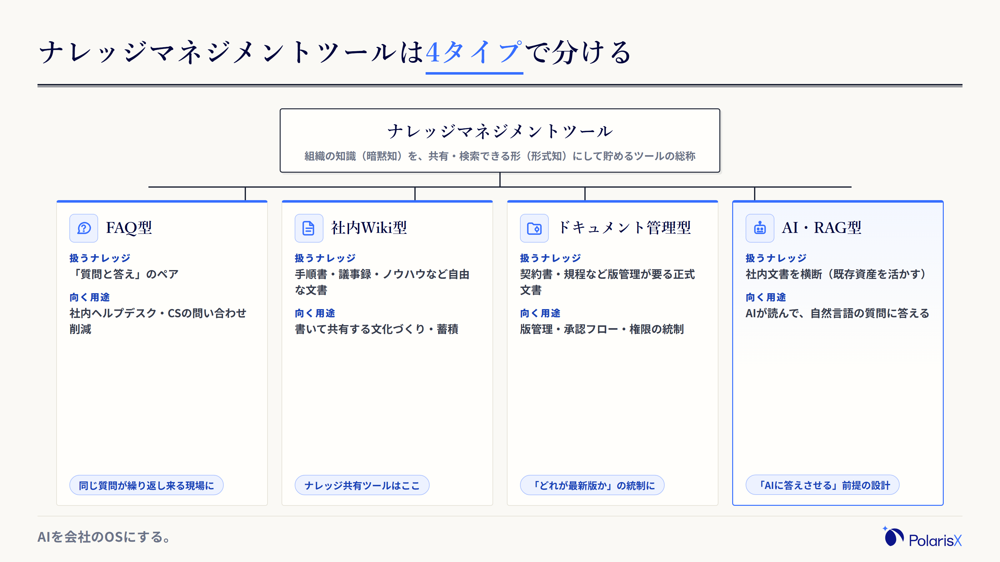
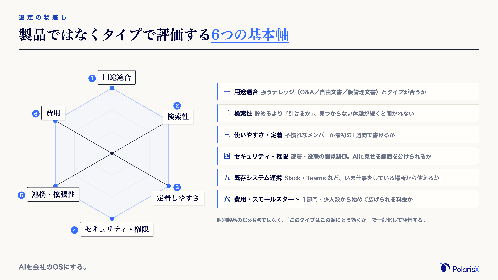
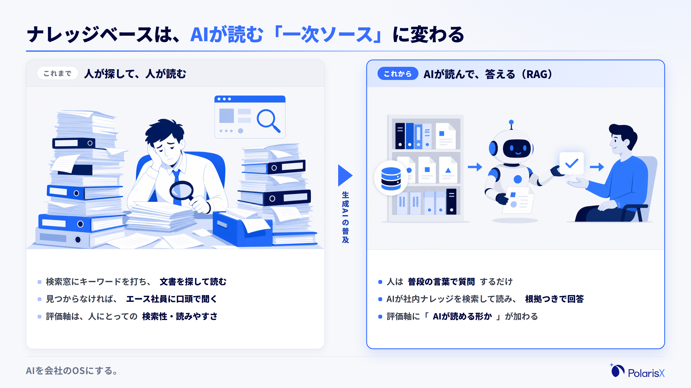
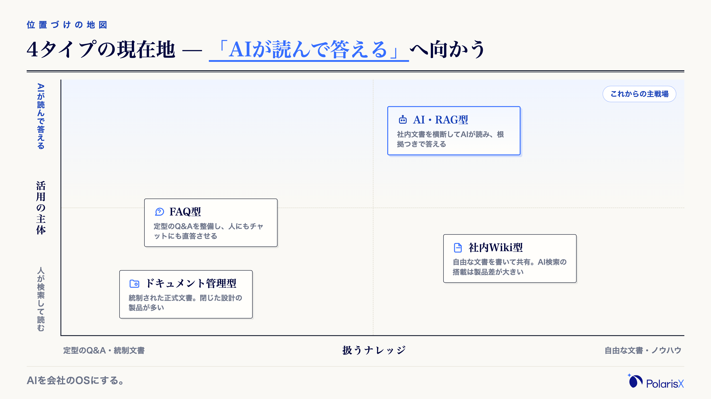
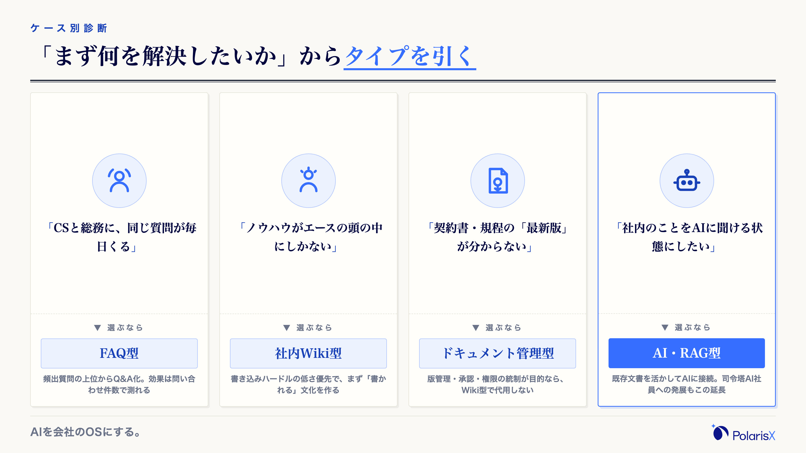
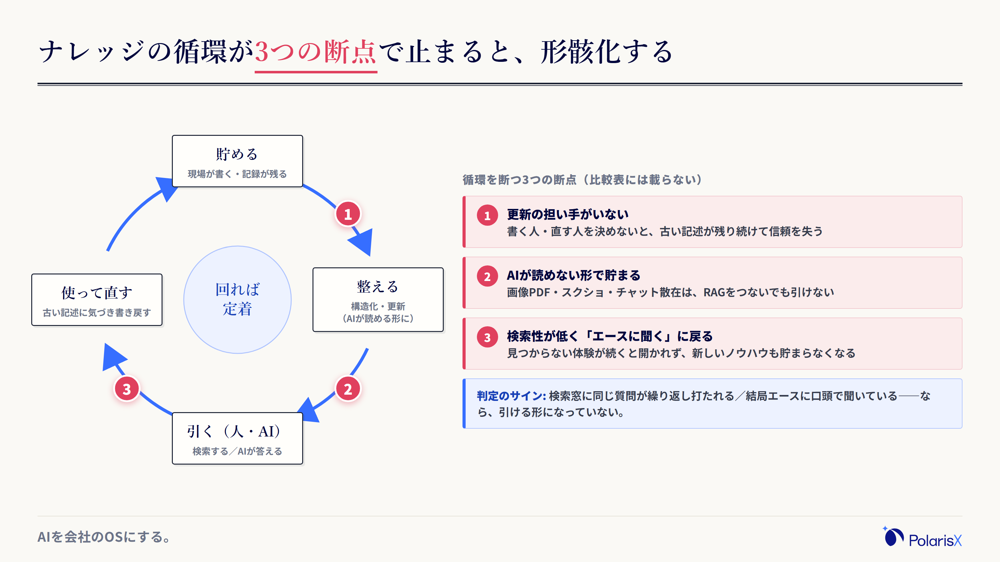
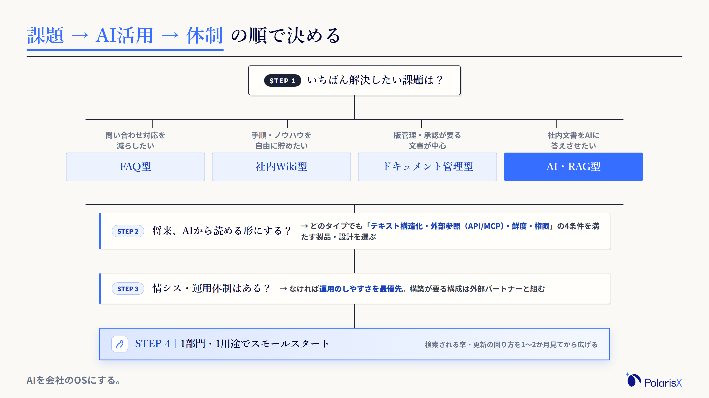

ナレッジマネジメントツールの比較は、「おすすめ◯選」の製品一覧を開く前に、タイプと選定軸を先に決めるほうが早く、確実に決まります。比較記事は、載っている製品も種類の分け方（3〜5タイプ）も記事ごとにバラバラで、機能の◯×表を眺めるほど決め手を見失うからです。

検討のきっかけは、多くの場合こうです——業務知識がエース社員の頭の中にしかない。退職や異動のたびにノウハウが消える。マニュアルはあるが更新されず、実態と乖離している。そして今は、もう一つの要件が加わりました。せっかく整備するなら、人だけでなく生成AI・社内AIからも参照できる形にしたい、という要件です。この記事は、乱立する種類の分類を実務で使える4タイプに正規化し、比較表を見る前に決めるべき選定軸——従来の6軸に加えて「AIが読める一次ソースになるか」という新しい軸——を、約20のAIエージェントと社内ナレッジを自社で運用する当事者の立場から整理します。

**製品を比較する前に決める3つの軸**

- **タイプ適合** — ナレッジマネジメントツールは〔FAQ型／社内Wiki型／ドキュメント管理型／AI・RAG型〕の4タイプに整理できます。まず自社の用途がどのタイプに当たるかを決めます。
- **載せ切れるか・回り続けるか** — 社内の暗黙知・文書を実際に貯められるか。検索性と更新のしやすさが、導入後に「使われ続けるか、形骸化するか」を分けます。
- **AIが読めるか** — 人が検索して読むだけでなく、生成AI・社内AI（RAG）が答えの根拠として参照できる形にするか。従来の比較表にはない、これからの選定軸です。

**執筆**: PolarisX 編集部（AI活用の実務者チーム）— AI社員「Polaris AI」の開発と、自社のAI社員組織（複数部門で約20のAIエージェント）の運用に携わるメンバーが執筆しています。

## ナレッジマネジメントツールとは｜まず4タイプで全体像をつかむ

ナレッジマネジメントツールとは、社員それぞれの頭の中にある知識・ノウハウ（暗黙知）を、文書やQ&Aなど組織で共有・検索できる形（形式知）に変えて蓄積し、必要な人が必要なときに引き出せるようにするソフトウェアの総称です。社内Wiki・FAQシステム・文書管理システム・AI検索と呼び名はさまざまですが、実務では〔FAQ型／社内Wiki型／ドキュメント管理型／AI・RAG型〕の4タイプに分けて考えると、自社に必要なものが最短で見えます。導入の主目的は、属人化の解消・情報を探す時間の削減・引き継ぎと新人育成の高速化の3つに集約されます。

いま検討が増えている背景は、属人化への危機感です。経営学者・野中郁次郎氏らの知識創造理論（SECIモデル）が示したように、組織の競争力は、個人の経験に根ざした暗黙知を、共有できる形式知へ変換して組織全体で増幅するプロセスから生まれます（[The Knowledge-Creating Company（Harvard Business Review）](https://hbr.org/2007/07/the-knowledge-creating-company)）。逆にいえば、変換の仕組みがない会社では、エース社員の退職がそのまま組織能力の喪失になります。加えて「探す時間」も無視できません。米McKinsey Global Instituteの調査では、知識労働者は週の労働時間の約19%を情報の検索・収集に費やしていると推計されています（[The social economy（McKinsey Global Institute, 2012）](https://www.mckinsey.com/industries/technology-media-and-telecommunications/our-insights/the-social-economy)）。週5日勤務なら、およそ1日分が「探す」に消えている計算です。

### 実務で使う4タイプ（FAQ型・社内Wiki型・ドキュメント管理型・AI・RAG型）

比較記事のタイプ分類が3〜5型でバラつくのは、粒度と呼び方が違うだけで、中身は次の4つにおおむね収れんします（検索特化の「エンタープライズサーチ型」は、生成AI搭載が標準になった現在はAI・RAG型に含めて考えるのが実務的です）。

- **FAQ型** — 「質問と答え」のペアでナレッジを整備するタイプ。社内ヘルプデスク・カスタマーサポートなど、同じ質問が繰り返し発生する現場に向きます。問い合わせ対応の削減が主目的なら、まずこのタイプです。
- **社内Wiki型** — 手順書・議事録・営業ノウハウなどを自由な形式で書いて共有するタイプ。「社内Wikiツール」「社内ナレッジ共有ツール」「ナレッジベースツール」と呼ばれる製品は、おおむねここに入ります。ナレッジマネジメントツールはこれらを含む上位の総称——つまり社内Wikiは「種類の一つ」です。
- **ドキュメント管理型** — 契約書・規程・設計書など、版管理・承認フロー・アクセス権限が必要な「正式な文書」を管理するタイプ。マニュアルの作成・教育に特化した製品もこの系統に含まれます。
- **AI・RAG型** — 貯めたナレッジを生成AIが読み、自然言語の質問に社内文書に基づいて答えるタイプ。社内に散らばる情報を横断検索するエンタープライズサーチの発展形で、「AIに答えさせる」ことを前提に設計します。

### 「1つのツールに貯めれば終わり」ではない

タイプを選ぶ前に、押さえておきたい前提が一つあります。ナレッジは「貯めること」と「使われること」が別問題だということです。どのタイプのツールも、貯める箱は提供してくれますが、書く人・直す人・引く人を作ってはくれません。検索されないナレッジは、無いのと同じです。導入がうまくいかないケースの大半は、機能の不足ではなく「貯まらない」か「引かれない」のどちらかで起きます（この構造は後半の「形骸化する落とし穴」で当事者の経験から詳しく述べます）。そしていま、この「引く主体」に人だけでなくAIが加わりました。AIが引けない形で貯めたナレッジは、これからの数年で「使われないナレッジ」になっていきます。次章からの選定軸は、この前提の上に組み立てます。

## ツール選定の6つの基本軸｜製品ではなくタイプで評価する

ナレッジマネジメントツールの選び方は、①用途適合、②検索性、③使いやすさ・定着、④セキュリティ・アクセス権限、⑤既存システム連携・拡張性、⑥費用・スモールスタート——の6軸で評価するのが基本です。ポイントは、これらを「製品Aは◎、製品Bは△」ではなく「このタイプはこの軸にどう効くか」で一般化して見ることです。個別製品の機能・料金は変動が激しく、◯×の比較表は公開された瞬間から古くなります。タイプ単位で軸の効き方を押さえ、候補を2〜3製品に絞ってから公式サイトで最終確認する——この順番が、結果的に最も速い選び方です。

- **①用途適合** — 扱うナレッジの種類（Q&A／自由な文書／版管理が要る文書）と、タイプが合っているか。ここのミスマッチは、あとから機能の追加では埋められません。
- **②検索性** — 貯めることより「引けること」。全文検索・タグ・表記ゆれへの強さ、AI・RAG型なら自然言語で質問できるか。探して見つからない体験が続くと、ツールは開かれなくなります。
- **③使いやすさ・定着** — 書き込みのハードルが低いか。体裁のルールや承認が重いと、現場は書かなくなります。ITに不慣れなメンバーが最初の1週間で使えるかを目安にします。
- **④セキュリティ・アクセス権限** — 部署・役職単位の閲覧制御、操作ログ。AIに読ませる場合は「AIに見せる範囲」を分けられるかも確認します（次章）。
- **⑤既存システム連携・拡張性** — Slack・Teams・Google Workspace・Microsoft 365 など、いま仕事をしている場所から使えるか。使う場所の近くにないツールは使われません。
- **⑥費用・スモールスタート** — 1部門・少人数から始めて広げられる料金体系か。最初から全社一斉は、定着リスクが最も高い進め方です。

### 費用の見方｜初期費用＋月額（人数課金）＋オプションで読む

費用相場は「月額いくら」の一点では語れません。1ユーザーあたり月数百円で始められる社内Wiki型のプランから、全社横断の検索基盤やAI・RAG型の構築を伴う月数十万円規模まで、タイプと構成によって桁が変わるからです（執筆時点）。実務では、(1)初期費用（設定・データ移行・構築）、(2)月額（1ユーザーあたりの人数課金が主流。最低利用人数の設定に注意）、(3)オプション（AI機能・SSO・監査ログは上位プラン限定のことが多い）——の3点で読みます。無料プラン・無料ツールは人数・容量・機能・サポートに制限があるのが基本で、「1部門で試す」段階には十分ですが、権限管理や監査が必要な本格運用では有償が前提です。個別の金額は変動が激しいため、この記事では断定せず、候補を絞った段階で各社の公式料金ページを確認することをおすすめします。

## 「AIが読める一次ソース」になるか｜生成AI時代の第7の選定軸

前章の6軸は、いずれも「人が検索して、人が読む」前提で作られてきた軸です。生成AIの業務利用が当たり前になった今、ナレッジベースにはもう一つの役割が生まれています——AIが答えの根拠として読みに行く「一次ソース」になる、という役割です。「うちの経費精算のルールは？」とAIに聞いて正しく答えさせるには、AIが読める形で整備された社内ナレッジが先に必要です。この観点は従来の比較記事にはほとんど登場しませんが、これから数年のツール選定で最も差がつく軸だと私たちは考えています。

その中核にあるのが RAG（Retrieval-Augmented Generation・検索拡張生成）です。RAGとは、AIが回答を作る前に社内文書などの情報源を検索して読み、その内容に基づいて答える仕組みのこと（原典は [Lewis et al., 2020](https://arxiv.org/abs/2005.11401)）。ChatGPTのような汎用AIが自社の質問に答えられないのは能力不足ではなく、自社の文脈を知らないからです。RAGで社内ナレッジを接続すると、AIは一般論ではなく「自社のルール・過去の経緯」を根拠に答えられるようになります。つまり、ナレッジベースの品質がそのままAIの回答品質の上限になる——だからツール選定の段階で「AIが読めるか」を見ておく必要があるのです（RAGの実装方法や特化サービスの比較は、本記事の範囲を超えるため別記事で扱います）。

### AIから読める設計の4つの条件

「AIが読める一次ソース」になれるかは、次の4条件で見極めます。

1. **テキストで構造化されているか** — 画像だけのPDF・スクリーンショット・口頭伝承は、AIがそのままでは読めません。見出しと箇条書きで構造化されたテキストが基本形です。スキャン文書や図表が中心の会社は、読める形への変換を導入計画に含めます。
2. **外部のAIから参照できるか** — API・コネクタに加えて、近年は MCP（Model Context Protocol）——AIアプリと外部ツール・データ源を標準的な方法でつなぐオープンな共通規格（[Anthropic, 2024](https://www.anthropic.com/news/model-context-protocol)）——への対応が広がっています。ツール内蔵のAIしか使えないのか、ChatGPT・Claude・自社のAIエージェントなど外部のAIからも読めるのかで、将来の選択肢が大きく変わります。
3. **鮮度を保てるか** — AIは、古い規程でももっともらしく断定して答えます。人が古い文書を開くより始末が悪い誤答になるため、更新が回る運用（更新担当・レビューの仕組み）とセットで考えます。
4. **AIに見せる範囲を分けられるか** — 人事評価・個人情報など、AIに読ませるべきでない領域を権限で分離できるか。個人情報保護委員会は、生成AIサービスへ個人データを入力する際の確認事項を注意喚起しており（[個人情報保護委員会, 2023](https://www.ppc.go.jp/files/pdf/230602_alert_generative_AI_service.pdf)）、総務省・経済産業省の[AI事業者ガイドライン](https://www.meti.go.jp/shingikai/mono_info_service/ai_shakai_jisso/20260331_report.html)もAI利用時のリスク管理を求めています。「全部読ませる」を前提にしない設計が安全です。

### 「AI機能あり」表記の落とし穴｜AI要約とRAGは別物

カタログの「AI搭載」には2段階あります。1つめは、検索結果の要約・タグの自動付与・文章の下書き支援といった「編集や検索を手伝うAI」。社内Wiki型やFAQ型の製品にAI検索・AI要約として搭載が広がっているのは、主にこちらです。2つめは、社内文書を根拠に、出典を示しながら質問に答える「RAG型のAI」。「AIに聞けば社内のことが分かる」状態を作るのは後者です。両者はカタログ上どちらも「AI機能あり」と書かれるため、表記だけでは見分けられません。見極め方は一つ——デモやトライアルで自社の実文書を数点入れ、「この規程では◯◯はどう定められていますか」と聞いて、根拠箇所を示して答えられるかを確認することです。

## タイプ×選定軸の早見表（強み・弱みの目安）

4タイプを主要軸で並べると、下表のようになります。◎○△は製品の優劣ではなく「そのタイプの設計思想が、その軸にどれだけ向いているか」の目安です。同じタイプでも製品によって差があるため、この表でタイプを絞り、個別の確認は各社の公式サイトで行ってください（機能・料金の変動が激しいため、本記事では個別製品の評価をしません）。

| 軸 | FAQ型 | 社内Wiki型 | ドキュメント管理型 | AI・RAG型 |
|---|---|---|---|---|
| 向く用途 | 問い合わせ削減 | 手順・議事録の蓄積 | 版管理・承認が要る文書 | AIに答えさせる・横断検索 |
| 検索性 | ◎ Q&Aで直答 | ○ 全文検索・タグ | ○ 属性・版で絞り込み | ◎ 自然言語で質問 |
| 書き込み・定着 | △ Q&Aの整備が必要 | ◎ 自由に書ける | △ 承認フローが前提 | ○ 既存文書を活かせる |
| 連携・AI適合 | ○ チャット連携が中心 | ○〜△ 製品差が大きい | △ 閉じた設計が多い | ◎ RAG・API前提の設計 |
| 費用感 | 中 | 小さく始めやすい | 中〜大 | 構成しだい（初期の作り込みが要る） |

もう一つの見方として、「扱うナレッジの定型度」と「AI活用の深さ」の2軸で4タイプを配置すると、自社の現在地と目指す方向が地図として見えます。いま定型的なQ&Aの整備が急務ならFAQ型から、自由な文書を貯める文化づくりからなら社内Wiki型から始め、将来AIに答えさせる構想があるなら、どのタイプを選ぶ場合でも前章の4条件（テキスト構造化・外部参照・鮮度・権限）を満たす製品・設計を選んでおく——これが遠回りしない進み方です。

## ケース別の推奨｜「まず何を解決したいか」からタイプを引く

自社に合うタイプは、ランキングではなく「いちばん解決したい課題」から引くのが確実です。典型的な4ケースで整理します。

- **問い合わせ対応を減らしたい** → **FAQ型**。社内ヘルプデスクやCS部門に同じ質問が集中しているなら、頻出質問の上位から Q&A化するだけで効果が見えます。効果測定も「問い合わせ件数の増減」で明確です。
- **手順・議事録・ノウハウを自由に貯めたい** → **社内Wiki型**。書く文化を作る段階の会社に向きます。体裁より「書かれること」を優先し、書き込みハードルの低い製品を選びます。
- **契約書・規程など、版管理・承認が要る文書が中心** → **ドキュメント管理型**。「どれが最新版か」「誰が承認したか」の統制が目的なら、Wiki型で代用せずこのタイプを選びます。
- **社内文書をAIに答えさせたい・複数部門で長く使いたい** → **AI・RAG型**。既存の文書資産を活かしながら、質問の窓口をAIに集約します。司令塔となるAI社員（AIエージェント）にナレッジベースを接続し、社員は一つの窓口に聞くだけ、という構成もこの延長にあります。

### 中小企業・情シス不在ならどこから始めるか

従業員30〜100名で専任の情報システム担当がいない会社なら、判断の優先順位は「機能の多さ」より「運用のしやすさ」です。私たちが現場で使う進め方の目安はこうです——(1)対象を1部門・1用途に絞る（例: CSの頻出質問、営業の提案ノウハウ）。(2)そこで書く・引くが回るかを1〜2か月見る。(3)回り始めてから隣の部門・別の用途に広げる。最初から全社導入・全文書移行を狙うと、書き手が付いてこず形骸化リスクが最も高くなります。また、AI・RAG型を自社だけで作り込むのが難しい場合は、ナレッジ基盤の構築から伴走する外部パートナー（AI開発会社・コンサルティング）と組む選択肢もあります。自社の人員を張り付けられないことは、諦める理由ではなく構成を選ぶ条件です。

## 導入して形骸化する落とし穴｜比較表では見えない運用の論点

どのタイプを選んでも、運用の設計がなければナレッジは形骸化します。ここは一次情報で書きます。PolarisXは複数の部門にまたがる約20のAIエージェントを自社で運用しており、社内ナレッジをすべてのAIが参照する共有の「脳」（RAGソース）として毎日読み書きしています。その運用で繰り返しぶつかったのが、機能の比較表には決して載らない、次の3つの論点でした。

**①更新の担い手を決めないと、貯まらず・古びる。** ツールは貯める箱を用意するだけで、書く人・直す人を作ってはくれません。私たちの運用でも、各エージェントの学びをナレッジに書き戻す整理担当（ナレッジの管理人役）を明示的に置くまでは、古い記述が残り続け、新しい決定が反映されないことが起きました。人間の組織でいえば、推進担当者の任命と「書くことが評価される仕組み」に当たります。ここを「導入すれば自然に貯まる」と期待するのが、最も多い失敗です。

**②AIから読めない形で貯めると、あとでAIをつないでも精度が出ない。** 画像だけのPDF、スクリーンショット、チャットに散らばった決定事項は、RAGを導入してもAIが引けません。私たちは、全ナレッジを「見出しと箇条書きで構造化したテキスト＋ファイル間リンク」の形式に統一してから、AIの回答が目に見えて安定しました。逆に、形式がバラバラなままAIだけ載せた状態では、もっともらしい誤答が混ざります。あとから全文書を直すのは大変なので、「AIが読める形で貯める」ルールを初日から入れることをおすすめします（画像・図表を多く含む文書の扱いは、それ自体が一つの論点です）。

**③検索性が低いと、結局「エースに聞く」に戻る。** 探して見つからない体験が数回続くと、人はツールを開かなくなり、以前と同じようにエース社員へ口頭で聞きに行きます。すると新しいノウハウもツールに貯まらなくなり、ますます引けなくなる——形骸化はこの悪循環で完成します。属人化を解消するはずのツールが、検索性の低さ一つで属人化を温存する側に回るのです。

うまくいっているかどうかは、次のサインで判定できます。**検索窓に同じ質問が繰り返し打ち込まれている、あるいは社員が結局エース社員に口頭で聞き直しているなら、ナレッジが（他人からもAIからも）引ける形になっていない**ということです。逆に、「聞かれる前に検索やAIで自己解決した」場面が増えていれば、投資は機能しています。導入の失敗が判る指標を、導入の日に決めておいてください。

## 選定フロー｜課題→AI活用→体制の順で決める

最後に、ここまでの判断を一本の流れに落とします。**(1)いちばん解決したい課題は何か**（問い合わせ削減→FAQ型／手順・ノウハウの蓄積→社内Wiki型／版管理が要る文書→ドキュメント管理型／AIに答えさせる→AI・RAG型）→ **(2)将来、AIから読める形にするか**（するなら、どのタイプを選ぶ場合も「テキスト構造化・外部参照・鮮度・権限」の4条件を満たす製品・設計を選ぶ）→ **(3)情シス・運用体制はあるか**（なければ運用のしやすさを最優先し、構築が要る構成は外部と組む）→ **(4)1部門・1用途で小さく始める**（検索される率と更新の回り方を1〜2か月見てから広げる）。この順で辿れば、◯選の比較表を眺めなくても自社のタイプにたどり着きます。

導入までの期間感も押さえておきましょう。クラウド型のツール自体は、申し込みから数日〜数週間で使い始められます。時間がかかるのはツールの設定ではなく、初期ナレッジの整備・運用ルール作り・定着で、一般には1〜3か月程度を見込むのが現実的です。AI・RAG型で構築を伴う場合は、現状の文書資産の診断→ナレッジ基盤の整備→AI接続、と段階を踏みます。また「SaaSを買うか、自社で作るか」は、要件が標準的ならSaaS、社内システムとの深い連携や独自の権限設計が要るなら構築、が大まかな分岐です。

タイプは決まったが、「AIが読める形」へのナレッジ整備や、AIへの接続・運用までは社内で回し切れない——検討がそこで止まりそうなら、外部と組む前提で構成を考えるのが早道です。PolarisXの [Polaris AI](https://polarisx.ltd/)（社内ナレッジベースの構築＋それを読んで働く司令塔AI社員）も、本記事の分類でいうAI・RAG型をカスタム構築する選択肢の一つです。自社のナレッジ運用の経験をもとに、「いまの文書はAIが読める形か」の見立てからお手伝いできます。ご相談は [contact@polarisx.ltd](mailto:contact@polarisx.ltd) へどうぞ。

## よくある質問

**Q. ナレッジマネジメントツールにAI機能（生成AI・RAG）は必要ですか？**
すべての会社に必須ではありませんが、「社内のことをAIに聞ける状態」を作りたいなら必須です。注意したいのは「AI搭載」の中身で、検索結果の要約や下書き支援といった編集を手伝うAIと、社内文書を根拠に出典つきで答えるRAGは別物です。当面AIを使わない場合でも、テキストで構造化して貯めるなど「AIが読める形」で整備しておくと、後からAI活用へ進む道が残ります。

**Q. ナレッジマネジメントツールの費用相場はいくらですか？無料で使えるツールはありますか？**
1ユーザーあたり月数百円のプランから、全社横断の検索基盤やAI・RAG型の構築を伴う月数十万円規模まで幅広く、単一の相場では語れません（執筆時点）。実務では①初期費用②月額（人数課金・最低利用人数）③オプション（AI機能・SSO等）の3点で見積もります。無料プラン・無料ツールは人数・容量・機能に制限があり、試用や小規模チームには十分ですが、本格運用では有償が前提です。正確な料金は各社の公式料金ページで確認してください。

**Q. 社内Wikiとナレッジマネジメントツールの違いは何ですか？**
社内Wikiは、ナレッジマネジメントツールの1タイプです。ナレッジマネジメントツールは「組織の知識を貯めて引き出せるようにするツール」の総称で、その中に、自由な形式で書いて共有する社内Wiki型、Q&Aで整備するFAQ型、版管理・承認を扱うドキュメント管理型、AIが読んで答えるAI・RAG型があります。「社内Wikiが欲しい」と思っていても、目的が問い合わせ削減やAI活用なら、別のタイプが合うことがあります。

**Q. GoogleドライブやMicrosoft 365で代用できますか？**
小規模のうちは代用できます。ただしフォルダ階層で貯める運用は、規模が大きくなると「どこにあるか分からない」「どれが最新か分からない」が起きやすく、検索性・版管理・構造化に限界が出ます。一方で、これらに文書がすでに集まっているなら、捨てる必要はありません。AI・RAG型のツールやAIエージェントから接続し、「AIが読む一次ソース」として活かす設計もできます。全面移行ありきではなく、今の置き場を活かす前提で考えるのが現実的です。

**Q. 導入したナレッジが更新されず形骸化する（定着しない）のを防ぐには？**
「更新の担い手」「引かれる検索性」「書くことが報われる仕組み」の3点を、導入時に設計することです。具体的には、更新担当（ナレッジの管理人役）を役割として明示する、よく聞かれる質問から優先して整備する、書き込みのハードルを下げる——そして、「同じ質問が検索窓に繰り返し打たれていないか」を形骸化のサインとして定点観測します。詳しくは本文の「導入して形骸化する落とし穴」をご覧ください。

**社内ナレッジを「AIが読める資産」にしたい方へ** — PolarisXは、社内ナレッジベースの構築と、それを読んで働く司令塔AI社員「Polaris AI」を提供しています。約20のAIエージェントと共有ナレッジを自社で毎日運用する立場から、「どのタイプが合うか」「いまの文書はAIが読める形か」の見極めからご一緒します。まずは無料相談として [contact@polarisx.ltd](mailto:contact@polarisx.ltd) へご連絡ください。サービスの考え方は [polarisx.ltd](https://polarisx.ltd/) をご覧いただけます。

### この記事について

PolarisX編集部（AI活用の実務者チーム）は、司令塔AI社員「Polaris AI」の開発と、自社のAI社員組織（複数部門で約20のAIエージェント）の運用実務に携わるメンバーで構成しています。自社の社内ナレッジを、全AIエージェントが参照する共有の一次ソース（RAGソース）として毎日運用しており、本記事はその現場で得た判断基準を、ナレッジマネジメントツールの教科書的な比較に加えてまとめました。内容のご指摘・ご相談は [contact@polarisx.ltd](mailto:contact@polarisx.ltd) へ。

## 参考文献

- [The Knowledge-Creating Company（Ikujiro Nonaka, Harvard Business Review, 2007・初出1991）](https://hbr.org/2007/07/the-knowledge-creating-company)
- [The social economy: Unlocking value and productivity through social technologies（McKinsey Global Institute, 2012）](https://www.mckinsey.com/industries/technology-media-and-telecommunications/our-insights/the-social-economy)
- [Retrieval-Augmented Generation for Knowledge-Intensive NLP Tasks（Lewis et al., 2020）](https://arxiv.org/abs/2005.11401)
- [Introducing the Model Context Protocol（Anthropic, 2024）](https://www.anthropic.com/news/model-context-protocol)
- [AI事業者ガイドライン（第1.2版）（総務省・経済産業省、2026年）](https://www.meti.go.jp/shingikai/mono_info_service/ai_shakai_jisso/20260331_report.html)
- [生成AIサービスの利用に関する注意喚起等について（個人情報保護委員会、2023年）](https://www.ppc.go.jp/files/pdf/230602_alert_generative_AI_service.pdf)
- 個別のナレッジマネジメントツールの機能・料金は変動します。本文で述べた費用・機能の一般傾向は執筆時点（2026年7月）のものです。最新情報は各社公式サイトをご確認ください。
