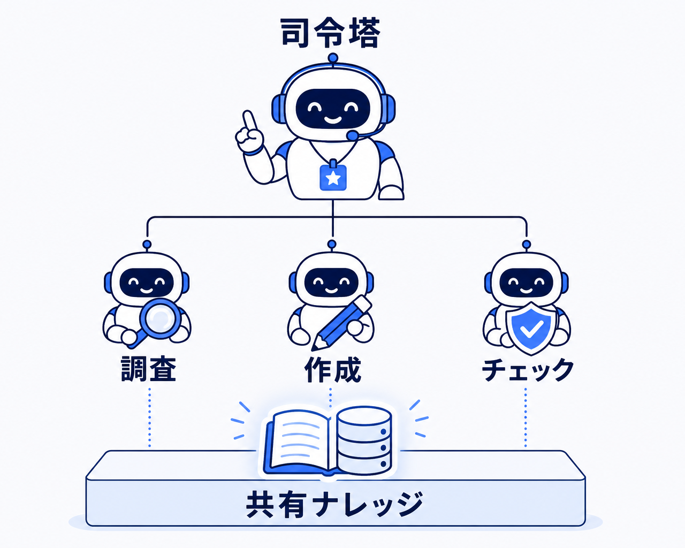
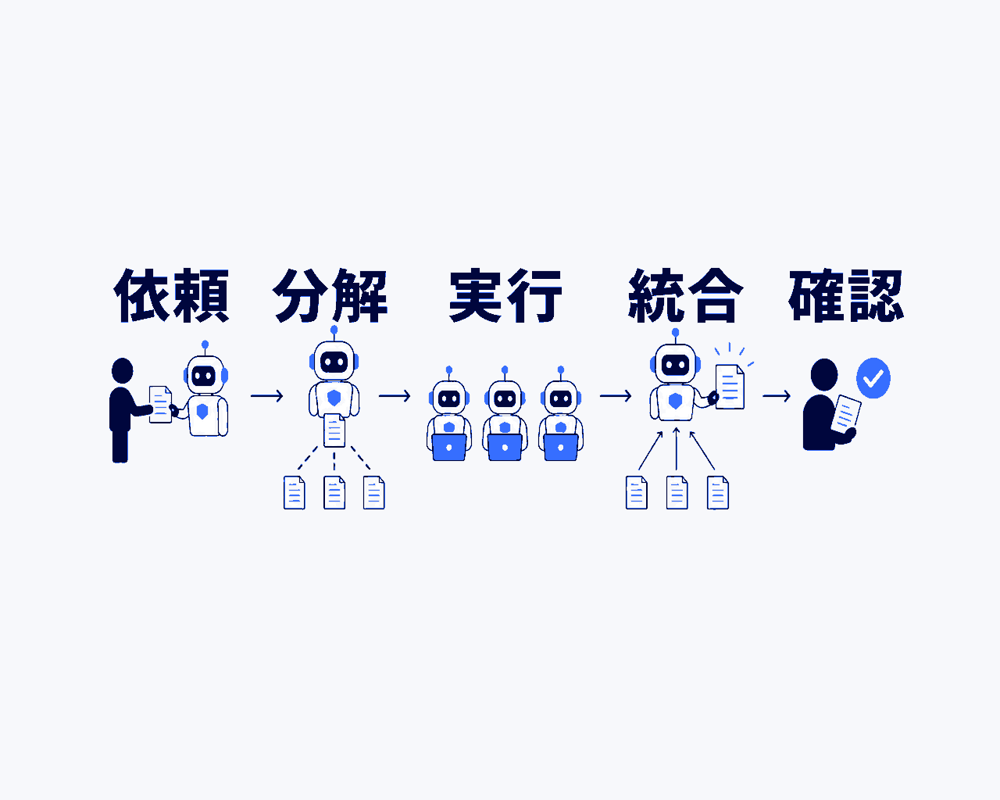
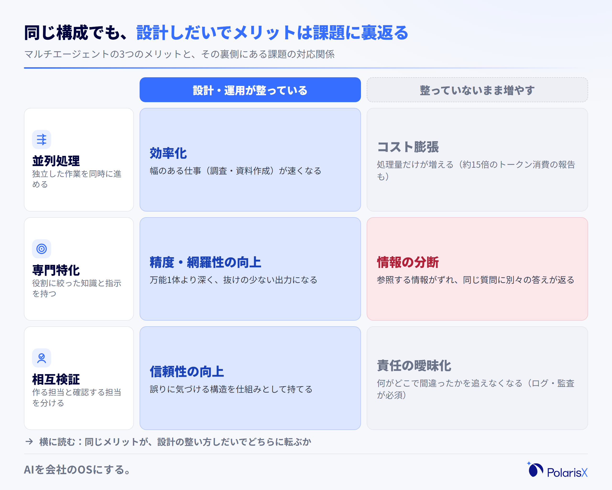
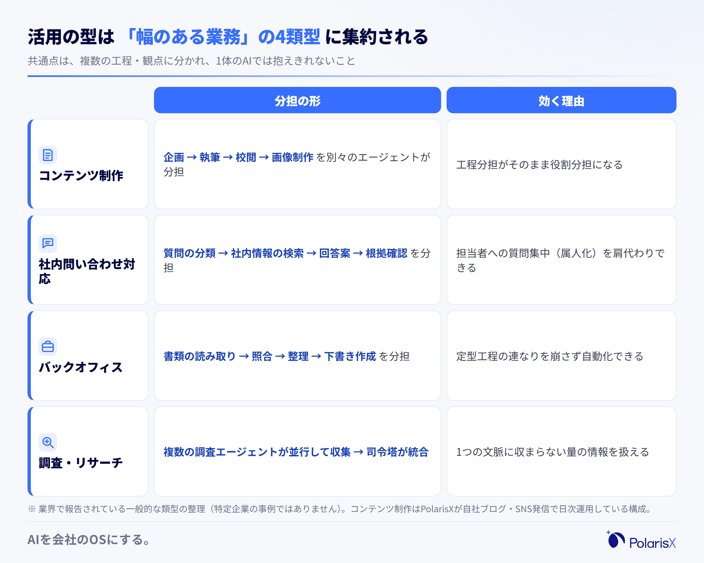
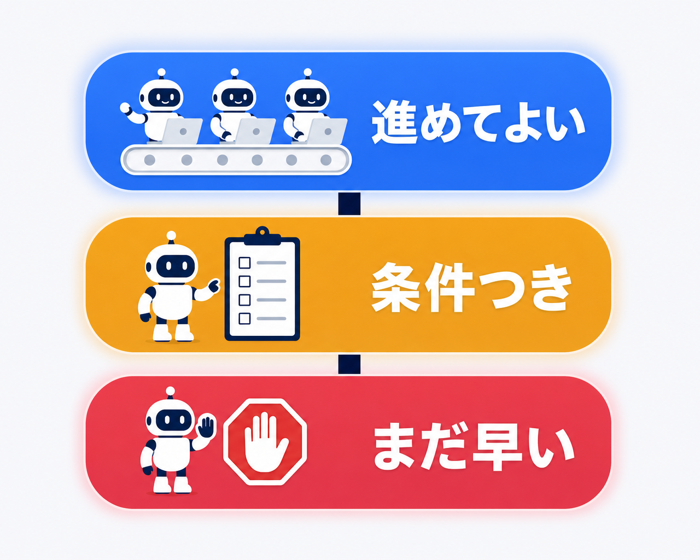

マルチAIエージェントとは、複数のAIエージェントがそれぞれ役割を分担し、司令塔（オーケストレーター）の采配のもとで連携しながら、一つの目的を遂行する仕組みのことです。人間の組織にたとえるなら、「何でもできる一人の超人」ではなく、「得意分野の違うメンバーをマネージャーが束ねるチーム」に当たります。

この言葉が分かりにくいのは、似た用語が入り乱れているからです。学術用語の「マルチエージェントシステム（MAS）」、制度文書に登場する「エージェンティックAI」、そしてAutoGenやCrewAIといったフレームワーク名——どれも同じ話の別の側面を指しています。さらに「1つのAIに複数の指示を出すこと」と混同されたり、「エージェントは多いほど良い」と誤解されたりもします。まずは定義と境界線を揃えましょう。

> **一言でいうと**：マルチAIエージェントとは、役割の違う複数のAIエージェントを、司令塔が束ねて連携させる"AIのチーム"です。1体のAIに全部を任せるのではなく、仕事を分解し、専門のAIが分担して進めます。
>
> **マルチAIエージェントをめぐる3つの誤解**
> 1. 「1つの万能AIに複数の指示を並べて出すこと」だと思われがち — 実際は指示の数ではなく、役割を持ったAI同士が連携する"構成"を指します。
> 2. 「エージェントを増やすほど成果が上がる」と思われがち — 窓口の設計とナレッジ共有が伴わなければ、複雑さだけが増えます。
> 3. 「専門の開発チームがないと作れない」と思われがち — フレームワークやサービスの成熟で、小さく始める道が広がっています。

**執筆**: PolarisX 編集部（AI活用の実務者チーム）— AI社員「Polaris AI」の開発と、自社のAI社員組織（3部門・約20のAIエージェント）の運用に携わるメンバーが執筆しています。

## マルチAIエージェントとは — 複数のAIが役割分担して連携する「チーム」

マルチAIエージェントとは、複数のAIエージェントが役割を分担し、連携しながら一つの目的を遂行する仕組みです。学術的には「マルチエージェントシステム（MAS）」と呼ばれてきた考え方を、大規模言語モデル（LLM）ベースのAIエージェントで実現したものを指します。構成の基本は、依頼を受けて仕事を分解し各エージェントに割り振る**オーケストレーター（司令塔）**と、割り振られた仕事を実行する**ワーカー（実行担当）**の組み合わせです。たとえば「競合を調べて提案書のたたきを作る」という依頼なら、調査担当・執筆担当・チェック担当のエージェントが分担し、司令塔が結果を統合して返します。ポイントは、AIの「数」ではなく「分担と采配の構成」を指す言葉だという点です。

### シングルエージェント（単体のAIエージェント）との違い

シングルエージェントは、1体のAIが調査も作成も確認も、すべての工程を一人で担う構成です。単一の業務なら十分に機能しますが、工程が長く複雑になるほど、1体が抱える文脈（作業記憶）が膨らみ、途中の抜けや品質のばらつきが出やすくなります。マルチAIエージェントは、工程を役割に切り分けて別々のエージェントに持たせることで、それぞれが自分の専門に集中できるようにした構成です。ChatGPTのエージェントモードのような単体ツールの自律実行はシングルエージェントの代表例で、マルチはその"チーム化"に当たります。違いの本質は「AIが1体か複数か」という数ではなく、**仕事を分解して分担させる設計があるかどうか**です。だからこそ、後述するとおり「増やせば良くなる」とは限りません。

### なぜ今注目されるのか

背景は2つあります。第一に、生成AIが「質問に答える」段階から「目的を与えると自律的にタスクを連鎖実行する」段階へ進んだことです。総務省・経済産業省の「AI事業者ガイドライン」も2026年3月の第1.2版で、自律的にタスクを実行するAIシステムを「AIエージェント」と定義し、複数のAIエージェントが連携して動く「エージェンティックAI」という関連概念に言及しました（[AI事業者ガイドライン](https://www.meti.go.jp/shingikai/mono_info_service/ai_shakai_jisso/20260331_report.html)）。第二に、単体のAIエージェントを導入した企業が「1つの業務は速くなったが、業務全体はカバーできない」という壁に当たり始めたことです。Microsoftが複数エージェントのオーケストレーション設計パターンを公式ドキュメントとして整理し（[Microsoft Learn](https://learn.microsoft.com/ja-jp/azure/architecture/ai-ml/guide/ai-agent-design-patterns)）、Anthropicが自社製品のマルチエージェント構成を公開するなど、主要ベンダーの設計知見が出揃ってきたことも、実務での検討を後押ししています。

## マルチAIエージェントの仕組み — オーケストレーター・ワーカー型を中心に

マルチAIエージェントの動きは、「分解→割り当て→実行→統合」の流れで説明できます。利用者が司令塔（オーケストレーター）に依頼を出すと、司令塔は依頼をタスクに分解し、それぞれを適したワーカーエージェントへ割り当てます。ワーカーは並行して作業を進め、結果を司令塔へ返し、司令塔が統合・整形して利用者に届けます。人間はこの最終出力を確認し、必要なら修正を指示します。重要なのは、この連携が成り立つ前提として、各エージェントが同じ社内情報を参照できる**共有ナレッジ**があることです。分担の設計と情報の共有——この2つが揃って初めて、複数のAIは"バラバラのツール"ではなく"一つのチーム"として機能します。

### 代表的な構成パターン

もっともよく紹介されるのが、ここまで述べた**オーケストレーター・ワーカー型**（解説記事では「マネージャー型・ワーカー型」とも呼ばれます）です。司令塔が全体を采配するため、利用者の窓口が一つで済み、統制も取りやすい構成です。このほかMicrosoftの設計ガイドでは、工程を順番に受け渡す**逐次（シーケンシャル）型**、独立した作業を同時に走らせる**並行（コンカレント）型**、複数エージェントが議論する**グループチャット型**、担当を切り替えていく**ハンドオフ型**などのパターンが整理されています（[Microsoft Learn](https://learn.microsoft.com/ja-jp/azure/architecture/ai-ml/guide/ai-agent-design-patterns)）。実務では、これらを純粋に使い分けるというより、オーケストレーター・ワーカー型を軸に、工程の性質に応じて逐次・並行を組み合わせる形が現実的です。

### エージェント間の連携方法 — タスクの分解・統合と共有ナレッジ

連携の質を決めるのは、(1)タスクの分解と指示の明確さ、(2)結果の統合、(3)共有ナレッジの3点です。司令塔からワーカーへの指示が曖昧だと、ワーカー同士の作業が重複したり、必要な観点が抜けたりします。Anthropicは自社の調査機能をオーケストレーター・ワーカー型で構築した経験から、サブエージェントへの指示に目的・出力形式・使うツール・作業範囲を明示しないと、重複作業や抜けが起きると報告しています（[Anthropic](https://www.anthropic.com/engineering/built-multi-agent-research-system)）。そして見落とされがちなのが共有ナレッジです。各エージェントが自社の用語・製品・過去の経緯を同じ情報源から参照できないと、同じ質問に別々の答えを返す"分断"が起きます。私たちPolarisXの司令塔AI社員「Polaris AI」も、司令塔＋専門AI社員の全員が同じ社内ナレッジベースを参照する構成を前提にしています。

## マルチエージェント導入のメリットとデメリット・課題

マルチエージェント化のメリットは、業界解説で共通して「並列処理による効率化」「専門特化による精度向上」「相互検証による信頼性向上」の3点に整理されます。一方でデメリットも裏表の関係にあり、「構成が複雑になり挙動を追いにくくなる」「処理量・コストが増える」「エージェント間で情報が分断する」が代表的な課題です。つまりマルチエージェントは、効果を大きくする仕組みであると同時に、管理の難しさも大きくする仕組みです。同じ構成でも、設計と運用が整っているかどうかで、メリットにもリスクにも転びます。導入判断では「効果が出るか」だけでなく「複雑さを管理できるか」を同じ重みで見る必要があります。

### メリット — 並列処理・専門特化・相互検証

第一に**並列処理**。独立した作業を複数のエージェントが同時に進めるため、調査や資料作成のような「幅のある仕事」が速くなります。第二に**専門特化**。各エージェントが役割に絞った指示・知識を持つことで、1体の万能エージェントより深く網羅的な出力が得やすくなります。第三に**相互検証**。作る担当と確認する担当を分けることで、誤りに気づける構造を仕組みとして持てます。効果の大きさを示す一次報告としては、Anthropicが自社の調査タスク評価において、司令塔＋複数サブエージェントの構成が単体エージェント構成の性能を90.2%上回ったと公表しています（[Anthropic](https://www.anthropic.com/engineering/built-multi-agent-research-system)）。ただしこれは同社の社内評価での報告値であり、どんな業務でも同じ効果が出るという意味ではありません。効果が出るのは、後述するとおり「分担する価値のある複雑な業務」に当てたときです。

### デメリット・課題 — 複雑性・コスト・情報分断

裏返しの課題は3つです。第一に**複雑性の増大**。エージェント間のやり取りが多岐にわたるほど内部の挙動が追いにくくなり、「何がどこで間違ったか」を特定しにくくなると複数の解説で共通して指摘されています。だからこそ、各エージェントの動作ログを収集し、あとから監査できる仕組みを最初から用意することが推奨されます。第二に**コスト**。エージェントが増えるほど処理量は増えます。前述のAnthropicの報告でも、マルチエージェント構成は通常のチャット利用の約15倍のトークン（処理量）を消費したとされており、成果がコストに見合う業務を選ぶ必要があります。第三に**情報の分断**。共有ナレッジが整っていないと、エージェントごとに参照する情報がずれ、出力に矛盾が生じます。いずれも「マルチにすれば自動的に良くなる」わけではないことを示す課題です。

## マルチエージェントの活用事例と代表的なフレームワーク

マルチAIエージェントの活用は、業界の解説・事例報告では大きく「コンテンツ制作」「社内問い合わせ・ナレッジ対応」「バックオフィス業務」の3類型で語られることが多く、これに「調査・リサーチ」を加えた4つが典型です。共通するのは、複数の工程や観点に分かれ、1体のAIでは抱えきれない"幅"のある業務だという点です。ここでは特定企業の事例を断定的に紹介する代わりに、報告されている類型と、私たち自身が日次で運用している実例を紹介します。なお、この類型のどれに当たるかを見立てることが、次の章で述べる「自社に必要かどうか」の判断の入口になります。

### 活用事例の類型 — コンテンツ制作・社内問い合わせ・バックオフィス

**コンテンツ制作**は、企画→執筆→校閲→画像制作という工程分担がそのままエージェントの役割分担になる領域です。実例として私たちPolarisXは、この記事を含む自社ブログやSNS発信を「戦略担当・執筆担当・編集担当・画像担当」の専門AI社員が分担し、司令塔が束ねる形で日次運用しています。**社内問い合わせ・ナレッジ対応**は、質問の分類→社内情報の検索→回答案の作成→根拠の確認を分担する型で、問い合わせが特定の担当者に集中している会社ほど効きます。**バックオフィス**は、経理・人事などで書類の読み取り→照合→整理→下書き作成を分担する型です。**調査・リサーチ**は、Anthropicが公開した構成のように、複数の調査エージェントが並行して情報を集め、司令塔が統合する型が代表例です。

### 代表的なフレームワーク（名称の紹介まで）

開発の現場では、マルチエージェントを構築するためのフレームワークとして **AutoGen（Microsoft）・CrewAI・LangGraph・MetaGPT** などの名前がよく挙がります。動向として押さえておきたいのは、Microsoftが AutoGen と Semantic Kernel を統合した後継フレームワーク「Microsoft Agent Framework」を公式に案内しており、新規開発はそちらへ移行する流れにあることです（[Microsoft Dev Blogs](https://devblogs.microsoft.com/agent-framework/semantic-kernel-and-microsoft-agent-framework/)）。ただし、経営者・DX推進担当の意思決定として先に決めるべきは「どのフレームワークを使うか」ではありません。フレームワーク選定はエンジニアリングの各論であり、その前段の「そもそも自社の業務にマルチエージェントが必要か」「誰がどう運用するか」が決まっていなければ、どれを選んでも成果は出ません。本記事では名称の紹介にとどめ、次の章でその前段の判断を扱います。

## 「増やすほど良い」わけではない — マルチAIエージェントの限界と注意点

マルチAIエージェントが効かない場面をはっきりさせておきます。効かないのは、(1)業務が単一の定型作業で分担する価値がない場合、(2)エージェントに参照させる社内ナレッジが整っていない場合、(3)出力を確認・改善する人を置けない場合です。この3つのどれかに当てはまる状態でエージェントの数だけ増やすと、効果よりも先に複雑さとコストが増えます。マルチエージェントは「シングルの上位互換」ではなく、複雑な業務を分担で解くための構成であり、分担する価値のない業務にはシングルエージェントのほうが向きます。導入の順番としても、いきなりチームを組むのではなく、効く業務を見極めてから広げるのが安全です。

### 複雑性が増すほど運用・デバッグが難しくなる

エージェントが増えるほど、間違いの原因を特定する難易度が上がります。シングルエージェントなら「AIの回答が違う」で済んだ問題が、マルチでは「司令塔の分解が悪かったのか、ワーカーの実行が悪かったのか、統合で壊れたのか」を切り分ける必要があります。解説・設計ガイドの多くが、エージェントごとの動作ログの収集と、あとから挙動を監査できる仕組みを最初から作ることを推奨しているのはこのためです。運用面では、「どのエージェントが何を担当し、誰がその出力に責任を持つか」という分担表を人間側が持っておくことも欠かせません。ログと分担表がないままエージェントを増やすことは、記録のない組織に人を増やすことと同じで、規模が複雑さにそのまま変換されてしまいます。

### 社内ナレッジが共有されないと情報が分断する

マルチエージェントの前提は、全エージェントが同じ社内情報を参照できることです。エージェントごとに別のツール・別のデータを見ている状態では、営業担当エージェントと問い合わせ担当エージェントが同じ製品について違う説明をする、といった分断が起きます。これはエージェントの賢さの問題ではなく、参照する情報源の設計の問題です。実務的には、マルチ化の前に「社内の情報がどこにあり、AIに何を参照させるか」を整理する——つまり共有ナレッジベースの整備が先行タスクになります。逆に言えば、ナレッジ整備は1体目のエージェントから効く投資であり、ここが整っている会社ほど、あとからエージェントを増やす拡張がスムーズに進みます。

### 現場でよく見る誤解と見極め

私たちPolarisXは、マーケティング・財務・営業の3部門・約20のAIエージェントからなるAI社員組織をClaude（Anthropic）上に構築して自社で日次運用し、同じ構成を司令塔AI社員「Polaris AI」として提供もしている当事者です。その現場で繰り返し見るのが、「うまくいかないのはエージェントが足りないからだ」という誤解です。実際には逆で、うまくいっていない状態で数を増やすと、窓口が分裂し、参照する情報がずれ、確認しきれない出力が増えます。私たちが使う見極めはシンプルです——**エージェントを増やす前に、窓口設計（誰に頼めば良いかが一つに決まっているか）とナレッジ共有（全員が同じ情報を参照できるか）を先に整える**。そして反証のサインも決めています。**エージェントを増やしたのに、タスクの手戻りや二重対応がむしろ増えたなら、それは数ではなく設計を見直すべきサインです**。

**自社の業務がマルチエージェントに向くか、それとも窓口設計・ナレッジ整備が先かを見極めたい方は、AI社員組織を自社で運用するPolarisXに、まずは無料相談としてお問い合わせください（[contact@polarisx.ltd](mailto:contact@polarisx.ltd)）。**

### 中小企業・情シス不在ならどこから始めるか

従業員30〜100名で専任の情シスがいない会社なら、最初からエージェントのチームを組む必要はありません。現実的な順番は、(1)問い合わせや資料作成など、属人化して負荷が集中している1業務に1体のエージェントを当てて効果を確かめる、(2)その過程で社内ナレッジを整備する、(3)対象業務が複数部門に広がり、複数のAIツールの窓口がバラバラになってきた段階で、司令塔に束ねるマルチ構成を検討する——という3段階です。マルチエージェントは自社で一から開発する以外に、司令塔＋専門AI社員の構成をサービスとして導入する選択肢もあり、開発チームの有無だけで諦める必要はありません。大事なのは、"チームを組む価値のある複雑さ"が自社の業務に育ってから広げることです。

## 用語の要点

- **マルチAIエージェントとは**、役割の違う複数のAIエージェントを司令塔（オーケストレーター）が束ね、連携させて一つの目的を遂行させる構成。AIの「数」ではなく「分担と采配の設計」を指す。
- **メリットとデメリットは裏表**：並列処理・専門特化・相互検証で効果が大きくなる一方、複雑性・コスト・情報分断も大きくなる。設計と運用が整っているかで、どちらに転ぶかが決まる。
- **順番が肝心**：窓口設計と共有ナレッジの整備が先、エージェントを増やすのは後。手戻りや二重対応が増えたら、数ではなく設計を見直すサイン。

## よくある質問

**Q. マルチエージェントとシングルエージェント（単体のAIエージェント）は何が違いますか？**
シングルエージェントは1体のAIがすべての工程を担い、マルチエージェントは工程を役割に分けて複数のAIが分担します。違いの本質は数ではなく、「仕事を分解して割り当てる司令塔（オーケストレーター）の設計があるか」です。単一の定型業務ならシングルで十分で、複雑で幅のある業務ほどマルチの分担が効きます。

**Q. マルチAIエージェントを導入するメリットは何ですか？**
業界解説で共通して挙がるのは、(1)独立した作業を同時に進める並列処理による効率化、(2)役割に絞ることによる出力の深さ・網羅性の向上、(3)作る担当と確認する担当を分ける相互検証による信頼性向上の3点です。Anthropicは自社の調査タスク評価で、マルチ構成が単体構成を90.2%上回ったと報告しています（社内評価の報告値です）。

**Q. マルチAIエージェントのデメリット・課題は何ですか？**
代表的な課題は、(1)構成が複雑になり「何がどこで間違ったか」を追いにくくなること、(2)処理量が増えコストが膨らむこと（Anthropicは通常チャットの約15倍のトークン消費を報告）、(3)共有ナレッジが整っていないとエージェント間で情報が分断することの3つです。動作ログの収集と監査の仕組みを最初から用意することが、実運用の前提になります。

**Q. マルチAIエージェントを作るフレームワークにはどんなものがありますか？**
AutoGen（Microsoft）・CrewAI・LangGraph・MetaGPT などがよく挙げられます。なお、Microsoftは AutoGen と Semantic Kernel を統合した後継の「Microsoft Agent Framework」を公式に案内しており、新規開発はそちらへ移行する流れです。ただし経営判断としては、フレームワーク選定より先に「自社の業務にマルチエージェントが必要か」を見極めるのが順番です。

**Q. マルチAIエージェントとエージェンティックAIは同じ意味ですか？**
重なる概念ですが、視点が違います。エージェンティックAIは「AIが自律的に判断・行動する」という性質・方向性を指す広い言葉で、総務省・経済産業省の「AI事業者ガイドライン」第1.2版では複数のAIエージェントが連携して動く概念として言及されています。マルチAIエージェントは、その性質を「複数のエージェントの分担と連携」という具体的な構成で実現する仕組みを指します。

**マルチエージェントの前に、まず自社の見極めから** — PolarisXは、司令塔AI社員「Polaris AI」（オーケストレーター＋専門AI社員の構成）の開発と、自社AI社員組織の運用を手がける当事者として、「分担する価値のある業務があるか」「共有できるナレッジがあるか」の見極めからご一緒します。まずは無料相談として [contact@polarisx.ltd](mailto:contact@polarisx.ltd) へご連絡ください。サービスの考え方は [polarisx.ltd](https://polarisx.ltd/) をご覧いただけます。

### この記事について

PolarisX編集部（AI活用の実務者チーム）は、司令塔AI社員「Polaris AI」の開発と、自社のAI社員組織（マーケティング・財務・営業の3部門・約20のAIエージェント）の運用実務に携わるメンバーで構成しています。本記事は、マルチエージェント構成の設計・社内ナレッジ整備・日次運用の現場で得た判断基準を、教科書的な定義解説に加えてまとめました。内容のご指摘・ご相談は [contact@polarisx.ltd](mailto:contact@polarisx.ltd) へ。

## 参考文献

- [AI事業者ガイドライン（第1.2版）（総務省・経済産業省、2026年）](https://www.meti.go.jp/shingikai/mono_info_service/ai_shakai_jisso/20260331_report.html)
- [AI エージェント オーケストレーション パターン（Microsoft Learn / Azure Architecture Center）](https://learn.microsoft.com/ja-jp/azure/architecture/ai-ml/guide/ai-agent-design-patterns)
- [How we built our multi-agent research system（Anthropic、2025年）](https://www.anthropic.com/engineering/built-multi-agent-research-system)
- [Semantic Kernel and Microsoft Agent Framework（Microsoft Dev Blogs、2025年）](https://devblogs.microsoft.com/agent-framework/semantic-kernel-and-microsoft-agent-framework/)

