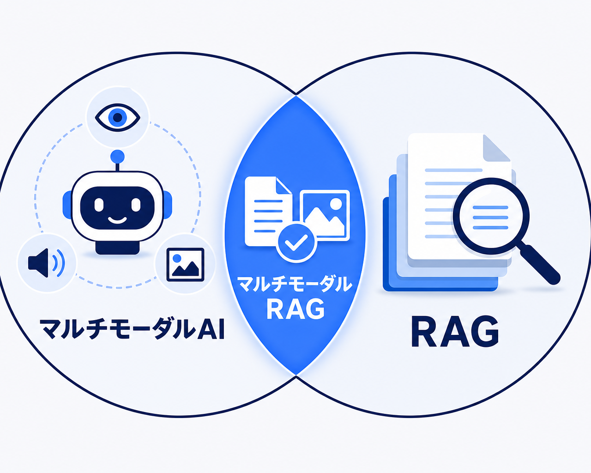
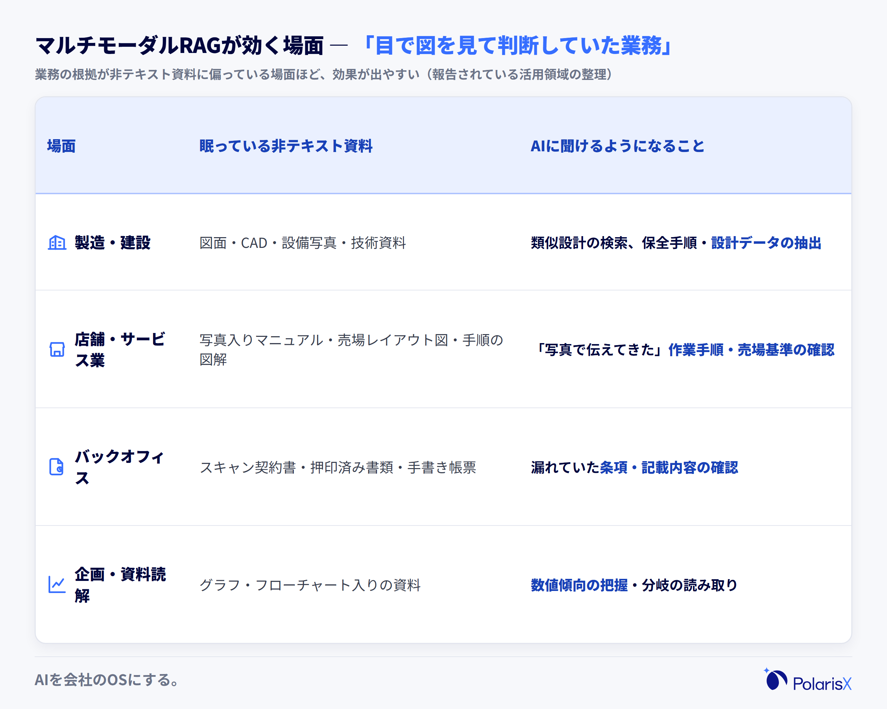
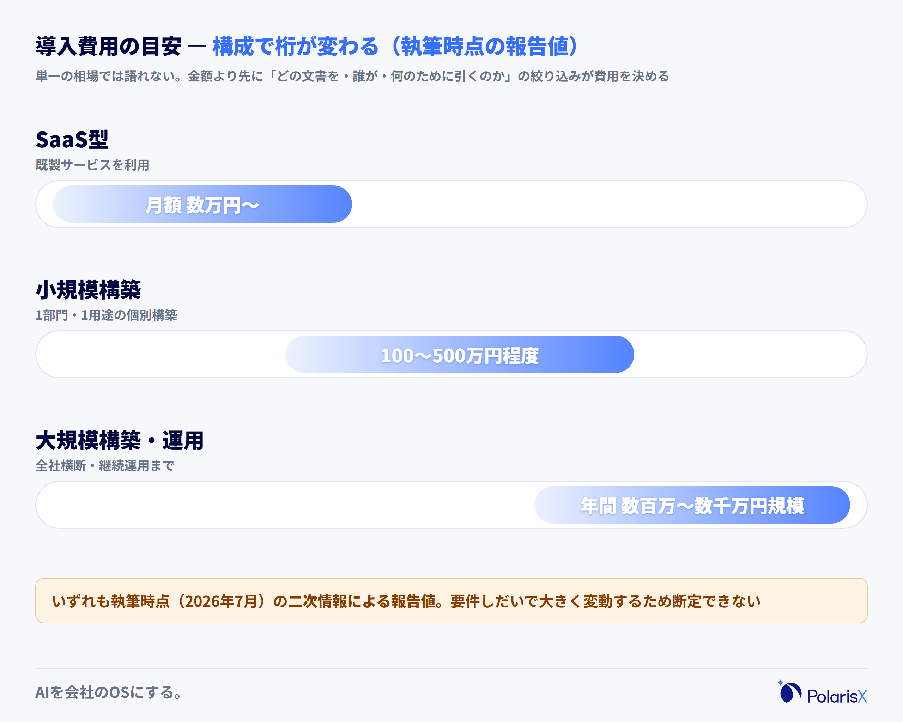
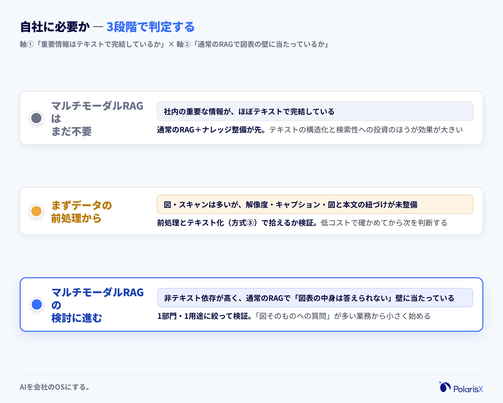

マルチモーダルRAG（Multimodal RAG）とは、テキストだけでなく画像・図表・音声・動画といった複数のデータ形式（モダリティ）を検索対象に含め、見つけた内容に基づいてAIが回答を生成する、RAG（Retrieval-Augmented Generation・検索拡張生成）の拡張手法です。

この言葉に出会うのは、多くの場合、社内ナレッジベースやRAGの検討を進めている途中です。「普通のRAGと何が違うのか」「うちは図面やスキャン書類が多いが、それもAIに読ませられるのか」——そこで調べ始めると、似た言葉（マルチモーダルAI・マルチモーダルLLM）や製品カタログの「マルチモーダル対応」表記が入り混じり、かえって分かりにくくなります。この記事は、通常のRAGとの違い→仕組み→効く場面→効かない場面・限界→自社に必要かの見極め、の順で、非エンジニアの経営者・DX推進責任者が導入判断できるレベルまで噛み砕いて整理します。

**一言でいうと** — マルチモーダルRAGは「画像・図表・音声まで"読んで"答えるRAG」です。

**よくある3つの誤解**

- **「マルチモーダルAIと同じもの」** — 別物です。マルチモーダルAI（マルチモーダルLLM）は複数のデータ形式を理解できる「モデル」そのもの。マルチモーダルRAGは、そのモデルを部品として使い、社内の資料を「検索して根拠つきで答える仕組み」です。
- **「画像認識（OCR）を足しただけのもの」** — 文字の読み取り（OCR）は手段の一つにすぎません。図や写真をどうやって「検索できる形」に索引化するかという、検索の設計レベルで通常のRAGと異なります。
- **「高性能なRAG製品を買えば自動で使える機能」** — 製品側が対応していても、元データの解像度やキャプションなど「データ側の質」が整っていなければ精度は出ません。導入とデータ整備はセットです。

**執筆**: PolarisX 編集部（AI活用の実務者チーム）— AI社員「Polaris AI」の開発と、自社のAI社員組織（複数部門で約20のAIエージェント）の運用に携わるメンバーが執筆しています。

## マルチモーダルRAGとは｜画像・図表・音声も「読んで」答えるRAG

マルチモーダルRAGとは、テキストに加えて画像・図表・音声・動画などの非テキストデータを検索対象に含め、質問に関係する箇所を見つけ出し、その内容を根拠に生成AIが回答するRAGの拡張手法です。通常のRAG（シングルモーダルRAG）が検索できるのはテキストだけなので、図面・現場写真・スキャンされた契約書・グラフ入りの資料は「そこに存在するのに、AIからは見えない」情報になります。マルチモーダルRAGは、この読み飛ばされてきた情報をAIの回答の根拠に加えるための技術です。

前提となるRAGを一言でおさらいすると、RAGは「AIが回答を作る前に、社内文書などの情報源を検索して読み、その内容に基づいて答える仕組み」です（原典は [Lewis et al., 2020](https://arxiv.org/abs/2005.11401)）。汎用の生成AIが自社の質問に答えられないのは能力不足ではなく自社の文脈を知らないからで、RAGはその文脈を検索で補います。ただし、ここで検索できるのは基本的にテキストでした。

一方で、会社の重要な情報はテキストだけで完結していません。製造業の図面、店舗の写真入りマニュアル、押印済みのスキャン契約書、ホワイトボードを撮った写真、グラフだらけの月次資料——。通常のRAGを導入した会社が「マニュアル本文は答えるのに、そこに貼られた図の中身は答えられない」「スキャンPDFを読ませたら『読めません』と返ってきた」という壁に当たるのは、この構造が原因です。マルチモーダルRAGは、まさにこの壁を埋めるために登場しました。

### 通常のRAG（シングルモーダル）との違い

両者の違いは、次の4点で整理できます。

| 比較軸 | 通常のRAG（シングルモーダル） | マルチモーダルRAG |
|---|---|---|
| 検索対象のデータ | テキスト（文書・チャットログ等） | テキスト＋画像・図表・音声・動画 |
| 索引（インデックス）の作り方 | テキストをベクトル化して登録 | 画像等もベクトル化する、またはテキストに変換して登録 |
| 使うモデル | テキスト用の埋め込みモデル＋LLM | マルチモーダル対応の埋め込みモデル＋マルチモーダルLLM |
| 答えられる質問 | 文章に書いてあること | 図表・画像・音声に含まれる内容まで |

重要なのは、これが「読めるファイル形式が増える」という話ではない点です。PDFという同じファイル形式でも、テキストが埋め込まれたPDFは通常のRAGで読めますが、スキャン画像だけのPDFは読めません。違いを生むのは形式ではなく、「中身が検索できる形に索引化されているか」です。

### 「マルチモーダルAI」「マルチモーダルLLM」との違い

マルチモーダルAI（マルチモーダルLLM）は、テキスト・画像・音声など複数のデータ形式を入力として理解・生成できるAIモデルそのものを指します。汎用AIチャットに画像を貼り付けて「この図を説明して」と頼めるのは、この能力です。一方、マルチモーダルRAGは、そのモデルを部品として組み込み、大量の社内資料の中から質問に関係する箇所を検索して答える「仕組み全体」を指します。

つまり関係は「モデル（部品）と仕組み（全体）」です。画像を1枚渡して読ませることと、何千ファイルの中から「この設備の点検手順が写っている図はどれか」を探し出して答えることの間には、検索・索引化という別の技術課題があります。マルチモーダルLLMが使えること自体は、マルチモーダルRAGが構築済みであることを意味しません。この区別が、後述の「既存ツールで使えるか」を考えるときの土台になります。

## マルチモーダルRAGの仕組み｜画像や図表を「検索できる形」にする3つの方式

マルチモーダルRAGの技術的な核心は、「画像や音声を、テキストと同じように検索できる形へ変換して索引化すること」にあります。その実現方法は、大きく3つの方式に整理して語られています。①テキストと画像を同じベクトル空間に埋め込む方式、②モダリティごとに別々の検索ストアを持つ方式、③画像をテキストに変換して1つのモダリティに統合する方式です。どの方式でも、その後の「質問→検索→回答生成」という流れは共通で、違いは「検索の入り口をどう作るか」に集約されます。コードの実装手順は本記事では扱いませんが、方式の違いを知っておくと、製品・ベンダーの説明を評価できるようになります。

- **方式① 同じベクトル空間に埋め込む** — テキストと画像を、意味が近いもの同士が近くに配置される共通の「ベクトル空間」へ変換（埋め込み・Embedding）し、1つのベクトルデータベースで横断検索します。画像とテキストを対応づける対照学習のCLIP（[Radford et al., 2021](https://arxiv.org/abs/2103.00020)）がこの系譜の代表で、文書ページを画像のまま索引化するColPali（[Faysse et al., 2024](https://arxiv.org/abs/2407.01449)）のような文書検索特化の手法も登場しています。Google Cloudの公式ドキュメントも、マルチモーダル埋め込みでは画像とテキストのベクトルが同じ意味空間に置かれ、テキストで画像を検索できると説明しています（[Vertex AI Embeddings APIs](https://cloud.google.com/vertex-ai/generative-ai/docs/embeddings/get-multimodal-embeddings)）。
- **方式② モダリティごとに別のストアを持つ** — テキストはテキスト用、画像は画像用のデータベースで別々に検索し、結果を突き合わせて回答に使います。モダリティごとに最適なモデルを選べる反面、検索結果の統合ロジックが必要になります。
- **方式③ 画像をテキストに変換して統合する** — 図や写真にマルチモーダルLLMで説明文（キャプション）を生成させ、あるいはOCRで文字を抽出し、テキストとして通常のRAGに載せる方式です。既存のテキストRAG資産をそのまま活かせるため、実務ではここから始めるケースが多く報告されています。変換時に情報が落ちる（図の位置関係やニュアンスが説明文に残らない）ことが弱点です。

### 検索から回答生成までの流れ

利用時の流れは、方式によらず次の4段階で捉えられます。

1. **取り込み（事前準備）** — 社内の文書・画像・図表を、選んだ方式で「検索できる形」（ベクトルまたはテキスト）に変換し、データベースに索引化しておく。
2. **質問の変換** — ユーザーの質問（例:「この型番の部品の取り付け向きは？」）を、同じ空間で比較できる形に変換する。
3. **検索と統合** — テキスト・画像を横断して関連する箇所を探し、回答の材料として集める。
4. **回答生成** — マルチモーダルLLMが、集めたテキストと画像を読み、根拠を添えて回答を組み立てる。

このうち導入の成否を最も左右するのは、実は最初の「取り込み」です。ここで元データの質が低いと、後段がどれだけ高性能でも精度が出ません（詳しくは「効かない場面・限界」で述べます）。

## マルチモーダルRAGが効く場面｜図面・写真・スキャン文書が多い会社

マルチモーダルRAGの効果が出やすいのは、業務の根拠となる情報が非テキスト資料に偏っている会社・部門です。逆に、社内の重要情報がほぼテキストで完結しているなら、通常のRAGとナレッジ整備で十分なことが多く、マルチモーダル化は過剰投資になりえます。報告されている活用領域は、製造・建設業の図面・CADデータの検索、現場写真やスキャン書類の活用、グラフ・フローチャート入り資料の読解などに集中しています。共通するのは「人がこれまで、目で図を見て判断していた業務」であることです。

- **製造・建設** — 過去の図面・CAD・設備写真の中から類似設計や保全手順を探す、技術資料から設計データを抽出するといった活用が報告されています。ベテランが「あの図面のあの部分」と記憶で引いていた検索を、AIに肩代わりさせる方向です。
- **店舗・サービス業** — 写真入りの業務マニュアル、売場レイアウト図、調理・接客手順の図解など、「文章より写真で伝えてきた」ナレッジを検索対象にできます。
- **バックオフィス** — スキャンでしか残っていない契約書・押印済み書類・手書き帳票。紙文化の名残が強い会社ほど、テキスト検索から漏れている資産が大きい領域です。
- **企画・資料読解** — グラフの軸や凡例を読んで数値の傾向を把握する、フローチャートの分岐から手順を読み取るなど、「図の中身」への質問に答えられるようになります。

### PolarisXが見る「効くサイン」

私たちPolarisXは、約20のAIエージェントが共有の社内ナレッジを毎日読み書きするAI社員組織を自社で運用しています。その経験から言えるのは、AIの回答精度を決めるのは第一に「ナレッジがAIの読める形になっているか」だということです。私たちは全ナレッジを見出しと箇条書きで構造化したテキストに統一することで精度を安定させましたが、この方法には限界もあります。図面・写真・手書きメモにしか残っていないノウハウは、テキスト化の網からこぼれるのです。

そこで実務での見極めとして、私たちは次のサインを見ます。**エース社員が「この図を見れば分かる」で仕事を回している。品質検査や施工の判断基準が写真ベースで共有されている。過去の見積・契約がスキャンでしか残っていない。**——こうした会社では、テキストのマニュアル整備だけでは属人化が解消されず、非テキスト資料まで検索対象に含める価値が大きくなります。逆に、これらに当てはまらないなら、マルチモーダルRAGの検討より先に、テキストナレッジの整備を進めるほうが投資対効果は高いはずです。

## マルチモーダルRAGが効かない場面・限界

マルチモーダルRAGは万能ではありません。限界は大きく3つあります。第一に、元データの質が低いと精度が出ないこと。第二に、通常のRAGより開発難易度・計算資源・運用コストが上がると報告されていること。第三に、テキストで足りる会社にとっては過剰投資になることです。導入を検討する段階では、「何ができるか」と同じ重みで「どういう条件だと効かないか」を押さえておく必要があります。この節では、私たちが現場で繰り返し見る「精度が出ない典型パターン」と、費用の考え方を整理します。

技術面の負担から見ておくと、マルチモーダルRAGは非テキストデータの解析・索引化という工程が加わるぶん、構築の難易度と計算資源の消費が通常のRAGより大きくなると各種解説で報告されています。埋め込みモデルやマルチモーダルLLMの選定肢もテキストのみの場合より複雑で、検証（本当に図表を正しく読めているかのテスト）にも手間がかかります。「対応をうたう製品を入れれば終わり」ではなく、検証と運用の工数まで含めて見積もるのが実務的です。

### 精度が出ない典型パターン

私たちが自社運用や相談の場で見るかぎり、マルチモーダルRAGの精度問題の多くは、モデルの性能ではなくデータ側の質で起きます。典型は次の4つです。

- **解像度の低いスキャン** — 文字や図の線がつぶれた状態では、どんなモデルでも読み取れません。読めないものは索引化もされません。
- **キャプション・凡例のない図** — 「何の図か」の手がかりがない画像は、人にとってもAIにとっても文脈不明です。検索でヒットしても、回答の根拠として使えません。
- **ノイズの多い手書きメモ** — 走り書き・略語・矢印だらけのメモは誤読の温床です。重要なものは清書またはキャプション付与が先です。
- **図と本文の対応が切れている** — 「どの手順に対応する図か」が紐づいていないと、検索は当たっても答えがずれます。ファイル名・配置・参照関係の整理が効きます。

反証可能性の観点で言えば、**導入後もAIが図面や図表の内容を的外れに答え続けるなら、それはツールの性能限界と断定する前に、データの前処理（解像度の確保・キャプション付与・図と本文の紐づけ）が先だという合図**です。前処理を直しても改善しない場合に初めて、方式やモデルの見直しを検討する——この順序が、原因の切り分けを速くします。

### 導入費用の考え方（執筆時点の報告値）

費用は構成による幅が非常に大きく、単一の相場では語れません。解説記事で報告されている執筆時点の目安では、RAG機能を持つSaaS型なら月額数万円程度から、小規模な個別構築で100万〜500万円程度、大規模な構築・運用では年間数百万〜数千万円規模とされています（[intra-mart, 生成AIの導入にかかる費用相場](https://www.intra-mart.jp/im-press/useful/cost-ai)）。マルチモーダル対応は非テキストデータの解析工程が増えるぶん、テキストのみの構成より費用が上振れする傾向があると報告されていますが、具体的な倍率を示す一次情報は確認できなかったため、本記事では倍率を明示しません。いずれも二次情報による報告値であり、要件しだいで大きく変わるため、本記事では断定しません。

実務でむしろ費用を決めるのは、金額の相場より「対象範囲の絞り込み」です。全文書・全モダリティを一度に対象にすれば構築も検証も高くつきます。「どの文書を・誰が・何のために引くのか」を1部門・1用途に絞って始めれば、SaaS型や方式③（テキスト化）のような軽い構成で検証でき、効果を確かめてから広げられます。

## 実務での見極め｜自社にマルチモーダルRAGは必要か

自社にマルチモーダルRAGが必要かは、2つの判断軸で見極められます。**軸①: 社内の重要な情報は、テキストだけで完結しているか。それとも図面・写真・スキャン書類に依存しているか。軸②: 通常のRAGをすでに使っていて、「図表の中身までは答えられない」という壁に実際に当たっているか。**——軸①がテキスト中心なら、通常のRAGとナレッジ整備で十分です。軸①が非テキスト依存でも、壁にまだ当たっていないなら、まずキャプション付与やテキスト化（方式③）で拾えるかを試すのが低コストです。両方に当てはまって初めて、マルチモーダルRAGの本格検討フェーズに入ります。

この順序を踏むと、判定は次の3段階に整理できます。

1. **通常のRAGで十分** — 重要情報がテキストで完結している。やるべきはマルチモーダル化ではなく、ナレッジのテキスト構造化と検索性の整備。
2. **まずデータの前処理から** — 図・スキャンは多いが、解像度やキャプションの整備が未着手。前処理とテキスト化で拾える範囲を確かめてから判断する。
3. **マルチモーダルRAGを検討** — 非テキスト資料への依存が高く、前処理やテキスト化では拾い切れない「図そのものへの質問」が業務に多い。

### Dify・ChatGPTなど既存ツールでの対応状況（執筆時点）

「自社で試せるのか」という疑問には、概念だけ整理しておきます。オープンソースのAIアプリ開発基盤Difyは、v1.11.0以降でナレッジベースのマルチモーダル対応が追加され、Vision対応の埋め込みモデルを選択して画像を含む検索ができるとリリースで報告されています（執筆時点・[Dify releases](https://github.com/langgenius/dify/releases)）。一方、ChatGPTなどの汎用AIチャットに画像を貼って読ませるのは、前述のとおりマルチモーダルLLMの機能であって、社内文書全体を検索して答えるにはRAG側の構築が別途必要です。ツールの対応状況はアップデートで頻繁に変わるため、導入判断の際は必ず各公式ドキュメントで最新の仕様を確認してください。具体的な構築手順は本記事の範囲を超えるため、別記事で扱います。

自社の文書はテキストで足りるのか、図面・スキャンまで読ませる構成が要るのか——この見立てから相談したい場合は、PolarisXにお声がけください。私たちは、自社開発の高精度RAG技術を搭載した司令塔AI社員「[Polaris AI](https://polarisx.ltd/)」を提供しており、約20のAIエージェントと共有ナレッジを自社で毎日運用する当事者として、「いまの文書構成でAIはどこまで答えられるか」「先にやるべきはデータ整備か、仕組みの導入か」の診断からお手伝いします。ご相談は [contact@polarisx.ltd](mailto:contact@polarisx.ltd) へどうぞ。

## 用語の要点

- **マルチモーダルRAG**＝画像・図表・音声まで検索対象に含め、根拠つきで答えるRAGの拡張手法。複数のデータ形式を理解できる「モデル」であるマルチモーダルAI・LLMとは別物で、そのモデルを部品として使う「仕組み」を指す。
- **効くのは、業務の根拠が図面・写真・スキャンなど非テキスト資料に偏っている会社**。重要情報がテキストで完結しているなら、通常のRAGとナレッジのテキスト構造化が先で、マルチモーダル化は過剰投資になりうる。
- **精度を決めるのはデータ側の質**（解像度・キャプション・図と本文の紐づけ）。費用やツールの対応状況は変化が速いため、執筆時点の報告値・仕様として幅で捉え、導入時に一次情報で確認する。

## よくある質問

**Q. マルチモーダルRAGとマルチモーダルAI（マルチモーダルLLM）は同じものですか？**
別物です。マルチモーダルAI・マルチモーダルLLMは、テキスト・画像・音声など複数のデータ形式を理解できるAIモデルそのものを指します。マルチモーダルRAGは、そのモデルを部品として使い、社内の大量の資料から質問に関係する箇所を検索して根拠つきで答える仕組み全体のことです。画像を1枚貼って読ませることと、何千ファイルから該当の図を探し出して答えることの間には、検索・索引化という別の技術が挟まっています。

**Q. マルチモーダルRAGのメリット・デメリットは何ですか？**
メリットは、テキスト検索では拾えなかった図面・写真・スキャン書類・図表の中身をAIの回答の根拠にできることです。デメリットは、非テキストデータの解析工程が増えるぶん、開発難易度・計算資源・費用が通常のRAGより大きくなると報告されていること、そして元データの質（解像度・キャプション）が低いと精度が出ないことです。重要情報がテキストで完結している会社には、過剰投資になる可能性があります。

**Q. マルチモーダルRAGの導入費用はどれくらいかかりますか？**
構成による幅が大きく、単一の相場はありません。執筆時点の報告値では、SaaS型で月額数万円程度から、小規模構築で100万〜500万円程度、大規模な構築・運用で年間数百万〜数千万円規模とされています。マルチモーダル対応は解析工程が増えるぶんテキストのみの構成より費用が上振れする傾向がありますが、具体的な倍率を示す一次情報は確認できていません。いずれも二次情報の目安です。費用を左右するのは対象範囲の絞り込みなので、1部門・1用途で小さく検証してから広げる進め方をおすすめします。

**Q. DifyやChatGPTでマルチモーダルRAGは使えますか？**
Difyは、v1.11.0以降でナレッジベースのマルチモーダル対応が追加され、Vision対応の埋め込みモデルを選ぶことで画像を含む検索ができると報告されています（執筆時点）。ChatGPTなどの汎用AIチャットは画像を貼れば読めますが、それはマルチモーダルLLMの機能であり、社内文書全体を検索して答えるにはRAG側の構築が別途必要です。ツールの対応状況はアップデートで変わるため、導入前に必ず公式ドキュメントで最新仕様を確認してください。

**図面・写真・スキャン文書まで含めて「AIに聞ける会社」にしたい方へ** — PolarisXは、社内ナレッジベースの構築と、それを読んで働く司令塔AI社員「Polaris AI」（自社開発の高精度RAG技術を搭載）を提供しています。約20のAIエージェントと共有ナレッジを自社で毎日運用する立場から、「いまの文書はAIが読める形か」「先に整備すべきはどこか」の見極めからご一緒します。まずは無料相談として [contact@polarisx.ltd](mailto:contact@polarisx.ltd) へご連絡ください。サービスの考え方は [polarisx.ltd](https://polarisx.ltd/) をご覧いただけます。

### この記事について

PolarisX編集部（AI活用の実務者チーム）は、司令塔AI社員「Polaris AI」の開発と、自社のAI社員組織（複数部門で約20のAIエージェント）の運用実務に携わるメンバーで構成しています。自社の社内ナレッジを、全AIエージェントが参照する共有の一次ソース（RAGソース）として毎日運用しており、本記事はその現場で得た「AIが読める形」の判断基準をもとに、マルチモーダルRAGという技術概念を導入判断の視点でまとめました。内容のご指摘・ご相談は [contact@polarisx.ltd](mailto:contact@polarisx.ltd) へ。

## 参考文献

- [Retrieval-Augmented Generation for Knowledge-Intensive NLP Tasks（Lewis et al., 2020）](https://arxiv.org/abs/2005.11401)
- [Learning Transferable Visual Models From Natural Language Supervision（CLIP・Radford et al., 2021）](https://arxiv.org/abs/2103.00020)
- [ColPali: Efficient Document Retrieval with Vision Language Models（Faysse et al., 2024）](https://arxiv.org/abs/2407.01449)
- [Get multimodal embeddings（Google Cloud Documentation）](https://cloud.google.com/vertex-ai/generative-ai/docs/embeddings/get-multimodal-embeddings) — 2026年4月のGoogleブランド再編で「Gemini Enterprise Agent Platform」表記への移行が進行中（本URLはリダイレクトで到達可）
- [Dify Releases v1.11.0（langgenius/dify・GitHub）](https://github.com/langgenius/dify/releases/tag/1.11.0) — ナレッジベースのマルチモーダル対応（"Multimodal Knowledge Base"）を一次リリースノートで確認済み
- [生成AIの導入にかかる費用相場とは？（intra-mart）](https://www.intra-mart.jp/im-press/useful/cost-ai) — 導入費用レンジの出典
- 本文の導入費用・活用事例に関する数値は、執筆時点（2026年7月）の二次情報による報告値です。個別の見積・仕様は各社公式情報をご確認ください。

